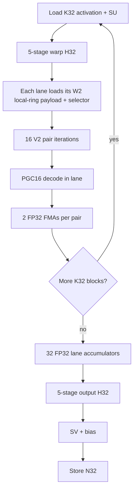

# QVQ V2B2-P32 Local-Ring (LR32) design

Status: **research design / optional format proposal**. This document does not promote or replace the existing
`qvq_v2b2_p32` format. The existing format remains the control and must retain byte-for-byte checkpoint and inference
semantics so LOCAL-RING can be A/B tested until model-quality and hardware gates justify promotion.

The proposed checkpoint format name is:

```text
qvq_v2b2_p32_lr
```

`LR32` is shorthand in this document for **LOCAL-RING, 32 weights per ring**. The format keeps the existing L16/V2
PGC16 reconstruction family and P32 bank granularity, but cuts the 128-transition tile-wide circular dependency into
eight independent 16-transition rings. The hardware-oriented logical tile is `K32 x N8`: each output column contains
one 32-weight P32 ring. This creates an execution geometry in which a 32-lane NVIDIA warp or Apple GPU SIMD-group can
consume one `K32` activation block while 32 lanes independently decode 32 P32 rings for 32 output columns.

A later optional H32 transform mode is designed alongside LR32 because the intended end state is:

```text
P32 ring length = K32 activation block = H32 block = 32 execution lanes
```

However, H32 must **not** be bundled into the first LOCAL-RING quality experiment. Local-ring topology, K-major weight
ordering, and block-Hadamard strength are separate variables and must be measured separately.

Related documents:

- [`qvq.md`](qvq.md): QVQ codec and lifecycle design.
- [`qvq_quant.md`](qvq_quant.md): quantization design.
- [`qvq_inference.md`](qvq_inference.md): native inference design.
- [`qvq_inference_mlx_mps.md`](qvq_inference_mlx_mps.md): Apple/MLX/MPS inference.
- [`qvq_llama32_1b_divergence32_2026-08-25.md`](qvq_llama32_1b_divergence32_2026-08-25.md): current flat-W2 model-quality context.

## 1. Why LOCAL-RING

The current V2B2-P32 format already has the right *rate* granularity for hardware: one bank decision covers 32 weights.
But its state path is still globally circular across all 128 V2 transitions in a 256-weight tile. At W2, each 16-bit
state remembers four 4-bit transitions, so the first states of a P32 segment can depend on transition history from the
previous P32 segment.

All 16 transitions in a current P32 segment are used. The limitation is not that only four transitions are active; the
limitation is that one W2 state has a four-transition history window. In the existing global ring, some of that history
crosses a P32 boundary:

```text
P32 A                              P32 B
... A12 A13 A14 A15 | B0 B1 B2 B3 B4 ... B15

state(B0) = A13 A14 A15 B0
state(B1) = A14 A15 B0  B1
state(B2) = A15 B0  B1  B2
state(B3) = B0  B1  B2  B3
state(B4) = B1  B2  B3  B4
...
```

LOCAL-RING keeps the same 16-bit state and transition width but makes each P32 segment self-contained:

```text
                     P32 B local ring
              +---------------------------+
              |                           |
              v                           |
             B0 B1 B2 ... B13 B14 B15 ----+

state(B0) = B13 B14 B15 B0
state(B1) = B14 B15 B0  B1
state(B2) = B15 B0  B1  B2
state(B3) = B0  B1  B2  B3
...
```

The 16 transitions are still all used. At W2 every transition appears in four consecutive state windows, but all state
history remains inside one P32 ring.

The motivation is not only decoder simplification. A hardware-oriented K-major ring groups 32 weights that contribute
to the **same output dot product**, rather than allowing local trellis history to run across several output neurons.
That may be a better error neighborhood for GEMV, but it is a hypothesis and must be measured.

## 2. What changes and what does not

| Property | Existing `qvq_v2b2_p32` | Proposed `qvq_v2b2_p32_lr` |
|---|---:|---:|
| Trellis window | L16 | L16 |
| Vector size | V2 | V2 |
| Rate range | W1-W3.5 | W1-W3.5 initially |
| Transition width | `E = 2R` | `E = 2R` |
| PGC16 level table | unchanged | unchanged |
| Bank family | canonical + one module-level alternative | unchanged |
| P32 selector | one bit per 32 weights | unchanged |
| Selectors / 256 weights | 8 | 8 |
| Selector bytes / 256 weights | 1 | 1 |
| Weight payload BPW | unchanged | unchanged |
| W2 effective payload | 2.03125 BPW | 2.03125 BPW |
| Circular dependency | one 128-step path | eight 16-step paths |
| Intended logical tile | current 16x16 organization | K32 x N8 |
| Intended small-M execution | generic tile GEMV | 32-lane LR32 kernel |

The LOCAL-RING change does **not** increase state width, transition choices, PGC16 reconstruction capacity, or payload
bits. It changes the dependency topology: which preceding transitions determine a state.

This distinction matters when interpreting model-quality results. Equal BPW and equal nominal path capacity do not
imply equal rate/distortion because K-major ordering and local circular history change which weights are coupled.

## 3. Format identity and fail-closed loading

LOCAL-RING must be a separate format identifier. A runtime boolean on the existing format is not sufficient.

The two formats can have the same tensor shapes, dtypes, and BPW while decoding those bytes with different state
history. A legacy decoder accepting an LR checkpoint could therefore produce plausible but incorrect values without a
shape failure.

Required rule:

```text
format="qvq_v2b2_p32"     -> existing global-ring semantics only
format="qvq_v2b2_p32_lr"  -> LOCAL-RING semantics only
```

A loader for either format must reject the other's serialized format ID. No heuristic detection from tensor shape is
allowed.

The existing `qvq_v2b2_p32` format remains frozen as the A/B control until LR32 passes promotion gates.

## 4. LOCAL-RING reference math

Let one P32 ring contain sixteen V2 transitions:

```text
e[0], e[1], ..., e[15]
```

Each edge contains exactly `E = 2R` bits. Define the circular ring bitstream:

```text
B = e[0] || e[1] || ... || e[15]
```

with total length:

```text
ring_bits = 16 * E
```

For transition `i`, state `s[i]` is the 16-bit circular bit window ending at `e[i]`:

```text
end_bit   = (i + 1) * E
start_bit = end_bit - 16
s[i]      = circular_bits(B, start_bit, 16)
```

Equivalently, this is the same L16 recurrence used by ordinary V2, except wraparound is resolved inside the local
16-transition ring rather than through another P32 segment.

At W2 (`E=4`):

```text
s[0]  = e[13] e[14] e[15] e[0]
s[1]  = e[14] e[15] e[0]  e[1]
s[2]  = e[15] e[0]  e[1]  e[2]
s[3]  = e[0]  e[1]  e[2]  e[3]
...
s[15] = e[12] e[13] e[14] e[15]
```

The decoder then applies the selected V2 bank exactly as existing V2B2-P32:

```text
bank = selector ? module_bank_alt_id : 0
state' = state XOR bank_mask(E, bank)
p = pgc16_mix(state')
w0 = G[p >> 8]
w1 = G[p & 255]
```

`G`, PGC16 mixer constants, FP16 bit patterns, bank masks, and scale normalization remain unchanged.

### 4.1 Rate-dependent local history

The state remains exactly 16 bits. Therefore the approximate number of prior transitions visible to one state is:

| Rate | E | P32 transitions | State history |
|---:|---:|---:|---:|
| W1 | 2 | 16 | 8 transitions |
| W1.5 | 3 | 16 | 6 transitions including a partial oldest edge |
| W2 | 4 | 16 | 4 transitions |
| W2.5 | 5 | 16 | 4 transitions including a partial oldest edge |
| W3 | 6 | 16 | 3 transitions including a partial oldest edge |
| W3.5 | 7 | 16 | 3 transitions including a partial oldest edge |

LOCAL-RING does not increase that history. It makes 100% of the history local to the P32 segment.

## 5. Payload and packing

A 256-weight LR tile still contains:

```text
8 rings * 32 weights/ring = 256 weights
8 rings * 16 transitions/ring = 128 V2 transitions
```

Weight bits are unchanged:

```text
128 transitions * E bits = 128 * (2R) = 256R bits
                         = R bits/weight
```

The eight binary bank selectors still require one byte per 256 weights.

At W2:

```text
weight stream: 256 * 2 bits = 512 bits
bank selectors:               8 bits
                               --------
                               520 bits

520 / 256 = 2.03125 BPW
```

### 5.1 Preserve planar packing first

The initial LR format should retain QVQ's planar edge packing. Do not introduce a second packing scheme until the
math/quality result is known.

Existing planar helpers operate naturally on 32-edge blocks. LR32 has 16-edge semantic rings, so pair two adjacent
rings into one physical 32-edge planar slab:

```text
physical slab 0 = ring 0 edges [0..15] || ring 1 edges [0..15]
physical slab 1 = ring 2 edges [0..15] || ring 3 edges [0..15]
physical slab 2 = ring 4 edges [0..15] || ring 5 edges [0..15]
physical slab 3 = ring 6 edges [0..15] || ring 7 edges [0..15]
```

The physical pack stays efficient while state reconstruction treats each 16-edge half as an independent circular ring.

At W2, one ring has exactly 64 payload bits. Under the existing E=4 planar decomposition, the first 16 edges occupy two
32-bit words and the next ring occupies the next two words. This gives a particularly clean W2 hot path:

```text
one W2 P32 ring = 2 x uint32 = 64 bits
```

Backends may combine those two words into `uint64` if measured faster, but the ABI should remain defined in terms of
canonical planar words. This avoids requiring efficient 64-bit integer ALU on Apple GPUs.

## 6. Hardware-oriented logical geometry

After the pure LOCAL-RING quality gate, the intended hardware layout is:

```text
logical LR tile = K32 x N8 = 256 weights
```

Each N column is one P32 ring:

```text
                         N
                  8 output columns
             +---+---+---+---+---+---+---+---+
K = 0        |   |   |   |   |   |   |   |   |
             |   |   |   |   |   |   |   |   |
             |   |   |   |   |   |   |   |   |
             |   |   |   |   |   |   |   |   |
             |   |   |   |   |   |   |   |   |
K = 31       |   |   |   |   |   |   |   |   |
             +---+---+---+---+---+---+---+---+
               ^
               one column = 32 weights
                          = one P32 local ring
```

Tile count is unchanged:

```text
(K / 32) * (N / 8) = K*N / 256
(K / 16) * (N / 16) = K*N / 256
```

So the number of 256-weight payload records remains the same even though their logical geometry changes.

## 7. Separate LOCAL-RING from H32 in experiments

The target hardware geometry eventually uses a block-diagonal normalized H32 transform because H32 can execute inside
one 32-lane warp/SIMD-group using five shuffle stages.

However, block-H32 changes the incoherence transform and may reduce outlier spreading compared with a full-width
Hadamard. At W2 this can matter more than at W4.

Therefore the first LR checkpoint should keep current QVQ transform semantics. H32 is a second experimental axis and
must be serialized explicitly if promoted because its transformed weight cannot be inferred from tensor shape.

Recommended research sequence:

| Arm | Trellis ordering | Ring topology | RHT |
|---|---|---|---|
| A | current | global | current full transform |
| B | K32 research control | global | current full transform |
| C | K32 | LOCAL-RING | current full transform |
| D | K32 | LOCAL-RING | H32 block transform |

Interpretation:

```text
A -> B : effect of weight ordering / logical tile geometry
B -> C : effect of LOCAL-RING topology
C -> D : effect of H32 rather than full-width transform
```

The B arm may remain an internal research mode and does not need to become a loadable format.

If H32 is promoted, use a separate format ID or a required versioned transform field such as:

```text
qvq_v2b2_p32_lr_h32
```

Do not silently reinterpret `qvq_v2b2_p32_lr` as H32 later.

## 8. Torch oracle first

Torch is the authority. CUDA and MLX must never be used to define the expected LR result.

Recommended readable primitives:

```text
unpack_local_ring_edges()
        |
        v
local_ring_states_from_edges()
        |
        v
decode_local_ring_states()
        |
        v
decode_local_ring_tiles()
        |
        v
reconstruct_local_ring_inner_weight()
        |
        v
qvq_local_ring_dense_oracle_forward()
```

Reference tensor shape after unpacking:

```text
edges:  [tile, 8, 16]
states: [tile, 8, 16]
values: [tile, 8, 16, 2]
```

The state builder should be a direct, readable bit-window implementation first. A faster Torch vectorization may be
added only after it is tested against the readable implementation.

### 8.1 Oracle invariants

The Torch gates must prove all of the following before a native kernel is added:

1. Pack/unpack exactness for every supported rate W1-W3.5.
2. Every recovered state satisfies the local transition recurrence.
3. Ring isolation: mutating ring `r1` cannot change any state/value in ring `r0 != r1`.
4. W2 state windows match the explicit four-nibble equations above.
5. PGC16 decoded values are bit-identical to existing V2 bank decoding for the same `(state, bank)`.
6. Selector packing uses exactly eight bits per 256 weights.
7. Raw/effective BPW matches the existing P32 control.
8. Dense reconstructed weight shape/order is correct for K32 x N8 tiling.
9. Dense FP32 forward matches a direct matrix multiply using the reconstructed LR weight.
10. Save/load/reload reproduces identical `trellis`, selectors, `SU`, `SV`, and dense oracle output.
11. Existing `qvq_v2b2_p32` rejects the LR format ID and LR rejects the old format ID.

### 8.2 Quantization oracle

The cleanest first LR quantizer treats each ring as an independent fixed-bank tail-biting problem:

```text
one target ring [16 steps, V2]
        |
        +---- search canonical bank 0 -------+
        |                                    |
        +---- search module alternate bank --+
                                             |
                                             v
                                  choose lower objective
```

Batch all eight rings for throughput:

```text
[tile, 8, 16, 2] -> [tile*8, 16, 2]
```

Keep the existing QVQ tail-biting approximation/tie policy initially. The first LR experiment should change topology,
not simultaneously introduce a different tail-biting optimizer.

The module-level `bank_alt_id` contract remains unchanged.

## 9. CUDA small-M strategy: Ampere / SM80 first

The first native target is intentionally narrow:

```text
SM80
W2 / E=4
M=1
FP16 and BF16 input
FP32 accumulation/output before the final QVQ epilogue
```

Do not template every rate, M bucket, and dtype until W2/M1 proves the architecture.

### 9.1 Better warp mapping: one lane owns one output

The natural LR32 mapping is **not** one warp per output. One warp should produce 32 outputs in parallel.

```text
lane 0  -> output N+0  -> one P32 local ring
lane 1  -> output N+1  -> one P32 local ring
...
lane 31 -> output N+31 -> one P32 local ring
```

All lanes share the same K32 activation block.

For the optional H32 path, the 32 lanes first load:

```text
lane l = x[k + l] * SU[k + l]
```

and execute the normalized H32 in five XOR-shuffle stages:

```text
mask = 1
mask = 2
mask = 4
mask = 8
mask = 16
```

Then pair iteration `p=0..15` broadcasts the two transformed activation coordinates needed by every output lane:

```text
a0 = shfl(hx, 2*p)
a1 = shfl(hx, 2*p + 1)

lane j:
    state_j = state_from_local_ring(ring_j, p)
    w0, w1 = PGC16(state_j, bank_j)
    acc_j = fma(a0, w0, acc_j)
    acc_j = fma(a1, w1, acc_j)
```

There is **no warp reduction**. Each lane owns and accumulates one output column directly.

After all K32 blocks:

```text
lane 0  contains y0
lane 1  contains y1
...
lane 31 contains y31
```

If H32 output transform is enabled, the same warp immediately performs the five H32 shuffle stages over those 32 FP32
lane accumulators, applies `SV` and bias, and stores 32 outputs.

### 9.2 CUDA flow



Without H32, B and I are omitted while the LR decode/GEMV geometry remains identical.

### 9.3 W2 state extraction

At W2 one local ring contains:

```text
16 transitions * 4 bits = 64 bits
```

Canonical packing exposes that ring as two 32-bit words. State `p` is a 16-bit circular nibble window. The SM80 hot
path should use compile-time shift/or, funnel-shift, or BFE-style extraction over the two 32-bit words. Do not require a
native 64-bit rotate in the ABI.

The performance target is to replace generic cross-segment state reconstruction with a ring-local fixed-width window.

### 9.4 CUDA W2 per-K32xN32 cost model

One warp operating on one K32 x N32 block performs the dense-equivalent 1,024 weight MACs while reading only W2
payloads.

Approximate hot-loop work/traffic:

| Item | W2 K32 x N32 cost |
|---|---:|
| Weight payload | 32 rings x 8 B = 256 B |
| Bank selectors | 32 bits = 4 B |
| Activation values | 32 x 2 B = 64 B for FP16/BF16 |
| Cached compute-dtype SU | 32 x 2 B = 64 B |
| PGC16 states decoded | 32 lanes x 16 = 512 |
| Weight FMAs | 32 lanes x 32 = 1,024 |
| Input H32 | 5 shuffle stages / K32 block when enabled |
| Output H32 | 5 shuffle stages once after K completion when enabled |
| Dense weight materialization | 0 B persistent, 0 B global temporary |

The 512-byte canonical FP16 PGC16 level table remains shared/process-wide. A CUDA CTA may cache it once in shared
memory. Benchmark:

```text
A. one 512-B shared copy
B. 2-4 padded/replicated shared copies to reduce data-dependent bank conflicts
C. read-only/L1 path
D. optional expanded state table only if measured faster
```

Do not make an expanded decoder table part of the checkpoint ABI.

### 9.5 Synchronization and shared-memory goal

The LR32 hot loop should be warp-register driven:

```text
compressed global payload -> lane registers -> PGC16 -> FP32 accumulator
```

Target:

- no `__syncthreads()` in the K loop;
- no shared reconstructed weight tile;
- no shared transformed activation tile for M=1;
- no global transformed activation tensor in the H32-fused path;
- no global pre-output tensor in the H32-fused path.

If the level table is copied to shared memory, one startup CTA barrier is acceptable. If a read-only/L1 placement wins,
even that barrier can disappear.

This directly attacks the barrier/staging pressure seen in the existing CTA-oriented GEMV design.

### 9.6 CTA and split-K dispatch

Benchmark at least:

```text
1 warp / CTA
4 warps / CTA, each warp owns an independent N32 group
```

For small N, one-warp CTAs expose more scheduler-visible blocks. For larger N, four-warps/CTA can amortize shared level
setup and launch overhead.

On an A100-class 108-SM device, N=2048 provides only 64 N32 groups before split-K, so M=1 may need split-K=2 or more to
fill the machine. Dispatch must be derived from runtime SM count, K, N, M, workspace cost, and measured latency rather
than a hard-coded GPU ordinal.

When split-K is used:

```text
warp -> raw FP32 N32 partials
             |
             v
fixed-order split reduction
             |
             v
one output H32
             |
             v
SV + bias
```

Do not apply output H32 independently to every split.

## 10. Hopper and Blackwell transfer

LR32 is a codec/execution geometry, not an Ampere-specific checkpoint.

The small-M kernel depends on:

- 32-lane warp execution;
- warp shuffle/exchange;
- integer shifts/xor/multiply-add;
- FP32 FMA;
- coalesced compressed-weight loads.

That mapping transfers directly to Hopper and Blackwell. The checkpoint remains identical.

Backend strategy:

| Architecture | M=1-small M | Larger M/prefill |
|---|---|---|
| Ampere SM80 | LR32 warp kernel | existing/shared `cp.async` + WMMA-style path |
| Hopper SM90 | LR32 warp kernel | TMA + warpgroup/WGMMA-oriented path |
| Blackwell SM100+ | LR32 warp kernel | TMA/TMEM + architecture-native Tensor Core path |

Do not force WGMMA/TCGen paths onto M=1 merely because the hardware supports them. The LR32 warp kernel is deliberately
small-M and decode-oriented. Large-M paths may decode/reuse larger tiles and feed architecture-specific matrix
engines.

The format metadata should say `ring_weights=32` / `transform_block=32` when applicable, never `cuda_warp=32`.

## 11. Apple GPU / MLX strategy

Apple GPU SIMD-groups are also 32 lanes, so the same lane ownership maps naturally to Metal/MLX:

```text
thread 0  -> output 0 / local ring 0
thread 1  -> output 1 / local ring 1
...
thread 31 -> output 31 / local ring 31
```

Use SIMD-group shuffle/exchange operations for H32 and activation broadcasts. The intended M=1 hot loop requires no
threadgroup exchange between SIMD-groups.

Conceptual Metal/MLX loop:

```text
simd lane l loads x[k+l] * SU[k+l]
        |
        v
5 x simd_shuffle_xor for H32
        |
        v
for p in 0..15:
    a0 = simd broadcast transformed_x[2p]
    a1 = simd broadcast transformed_x[2p+1]
    each lane extracts state p from its own ring
    each lane PGC16-decodes w0,w1
    each lane accumulates two FP32 FMAs
        |
        v
5 x simd_shuffle_xor for output H32
        |
        v
SV + bias + store
```

Add a separate MLX kernel key, for example:

```text
v2b2_p32       # existing
v2b2_p32_lr    # new
```

Do not modify the existing P32 Metal kernel in place.

The same W2 packing should be consumed directly by CUDA and MLX. There must be no backend-specific checkpoint repack.
Backend-only transient repacks are allowed only if they are derived deterministically at `post_init` and measured to
win.

### 11.1 Apple integer note

Do not assume a 64-bit rotate is cheap on Apple GPU. Keep the canonical W2 ring as two `uint32` words and implement the
circular 16-bit window with 32-bit shifts/or unless a 64-bit variant benchmarks faster.

### 11.2 ANE scope

MLX custom kernels execute on Apple GPU, not the Apple Neural Engine. LR32 is designed to be portable as a checkpoint
representation, but ANE execution would require a separate Core ML/compiler path and is not part of the initial LR32
backend contract.

Do not split one fused LR32 linear between GPU decode and ANE GEMM as an initial optimization; the synchronization and
materialization would defeat the design goal of keeping decode and accumulation in one execution group.

### 11.3 Current MLX implementation and measured dispatch

The first MLX implementation keeps the checkpoint ABI above but uses N8 SIMD-group kernels. M<=2 uses a barrier-free
small-row path where four lanes cooperate on each output and accumulate directly from the activation; M>=4 decodes
eight local rings into a K32 x N8 shared tile and accumulates that tile for one or two rows, with a dedicated row-tile
boundary at M=4. W2 combines each ring's two packed words into one circular
64-bit window to derive its sixteen states, avoiding four separate state-start extractions; the split-W2 variants use
the same fast state-start path. The W2 N8 kernels load each compressed word once per SIMD group and distribute it to the
four decoder lanes with SIMD shuffles. The LR production kernel specializes the immutable alternate-bank ID as a Metal
template value, broadcasts selector metadata once per N8 tile, and reads the fixed PGC16-v1 FP16 level table from Metal
constant memory. For small M, N16 is used for the common N=2048 projection while wide N=8192 uses N8 to expose more
independent groups. `QVQMLXLinear` keeps the transformed LR activation in FP32, avoiding the legacy
FP16 row-range/narrow/rescale graph. FP32 production GEMVs use measured shape-specific split-K dispatch for wide FFN
and down-projection shapes; the M=4, K<=2048, N>=8192 case uses the unsplit row-tile-4 path. FP16 output disables
split-K so its reduction preserves the original full-K rounding semantics. No dense weight matrix is materialized.

Run the paired public-path benchmark with:

```text
python scripts/benchmark_qvq_v2b2_p32_lr_mlx.py --warmup 75 --samples 300
```

The benchmark uses synthetic W2 payloads, FP16 activations, FP32 output, matched warmup/sample counts, and explicit
GPU synchronization. With the host on AC performance mode, one uniform 300-sample run from the optimized implementation
reported:

| Shape (M,K,N) | LR p50 (ms) | P32 p50 (ms) | P32/LR | LR p95 (ms) | P32 p95 (ms) |
|---|---:|---:|---:|---:|---:|
| (1,2048,256) | 0.16854 | 0.15194 | 0.90x | 0.25660 | 0.19943 |
| (1,2048,2048) | 0.14669 | 0.15738 | 1.07x | 0.19666 | 0.27913 |
| (1,2048,8192) | 0.18767 | 0.21283 | 1.13x | 0.25893 | 0.27324 |
| (1,8192,2048) | 0.21092 | 0.58581 | 2.78x | 0.29886 | 0.96219 |
| (4,2048,8192) | 0.27767 | 0.58700 | 2.11x | 0.36570 | 0.83595 |
| (8,2048,8192) | 0.37935 | 0.82292 | 2.17x | 0.45852 | 0.96443 |
| (16,8192,8192) | 2.14417 | 5.29258 | 2.47x | 2.30625 | 5.42018 |

This run establishes at least 2x speedup for the representative M=4, M=8, and M=16 wide projection shapes, while keeping
the same public inference graph and checkpoint rate. The M=1, K=8192 down-projection shape is also above 2x; the M=1,
K=2048 wide projection is only 1.13x and the narrow M=1 shape remains launch-bound. M=4 and M=8 were variable across
the immediate AC repeats, so only M=16 is treated as a stable 2x result from this pair of runs.
These numbers measure the public inner-GEMV path, not end-to-end model latency. Full `QVQMLXLinear` timing also includes
the input/output Hadamard transforms, scale/bias epilogue, and MLX graph overhead. Measurements are host-dependent
and should be repeated on each target Apple GPU.

An immediate second 300-sample run on the same AC/performance-mode host produced p50 speedups of `0.90x, 1.28x, 1.32x,
2.16x, 1.05x, 1.13x, 2.48x` in the table's shape order. This confirms that host scheduling/cache state affects individual
dispatch timings; conclusions use the synchronized p50/p95 values and do not treat the noisiest M4/M8 runs as universal
guarantees.

A separate synthetic full-module benchmark is available with:

```text
python scripts/benchmark_qvq_v2b2_p32_lr_mlx_module.py --warmup 50 --samples 200
```

On the same AC/performance-mode host, one 50-warmup/200-sample run measured:

| Shape (M,K,N) | Full LR p50 (ms) | Full P32 p50 (ms) | P32/LR | Full LR p95 (ms) | Full P32 p95 (ms) |
|---|---:|---:|---:|---:|---:|
| (1,2048,256) | 0.65383 | 0.70235 | 1.07x | 0.97129 | 0.95571 |
| (1,2048,2048) | 0.55608 | 0.53233 | 0.96x | 0.84241 | 0.92769 |
| (1,2048,8192) | 0.61525 | 0.81744 | 1.33x | 1.01985 | 1.28278 |
| (1,8192,2048) | 0.66300 | 0.86631 | 1.31x | 0.96357 | 1.48027 |
| (4,2048,8192) | 0.82758 | 0.81788 | 0.99x | 1.39779 | 1.45551 |
| (8,2048,8192) | 1.07281 | 1.26992 | 1.18x | 1.47251 | 1.59435 |
| (16,8192,8192) | 2.70494 | 5.79129 | 2.14x | 3.00818 | 5.96905 |

These full-module numbers include the Hadamard/scale/epilogue graph and use independent synthetic payloads per format;
they are a sanity check rather than a model-level throughput claim.

### 11.4 Metal profiling findings

The M4 Max was plugged into AC power with performance mode enabled for the current measurements. Profiling used MLX's
Metal GPU capture (`MTL_CAPTURE_ENABLED=1`, producing a `.gputrace`) and Xcode Instruments' **Metal System Trace**.
The trace confirmed the production dispatches and exposed the following execution costs:

| Path | Trace/source observation | Decision |
|---|---|---|
| M=1/2 small-row | no `threadgroup_barrier`, direct activation reads, SIMD reductions only | keep in production |
| M=4/8/16 multirow | two threadgroup barriers per K32 decode/consume iteration; decode is performed by SIMD group 0 while sibling groups wait | next cooperative-decode target |
| M8 MMA experiment | no threadgroup barriers, but one SIMD group and matrix setup underfill the GPU | kept oracle-tested but disabled in production |
| selector metadata | one selector byte is shared by every ring in an N8 tile | broadcast from lane 0 |
| W2 N8 compressed words | each packed word is shared by four decoder lanes | one load per word plus SIMD shuffle |

The controlled same-process M8 A/B measured the MMA experiment at approximately 0.495 ms versus 0.234 ms for the existing
multirow path, so removing barriers alone was not sufficient. The opt-in barrier-free M4 experiment was also slower
(0.533 ms versus 0.463 ms), indicating that duplicated decode costs more than the saved barriers at M=4.

The GPU counter profile was unavailable on this host (`Selected counter profile is not supported on target device`),
so the run does not claim hardware occupancy, register, cache, or stall-counter values. The remaining actionable overlap
opportunities are structural: distribute LR state decode across SIMD groups for M>=8 and fuse the fixed split-K
reduction/epilogue when full-module profiling shows that materialized partials are on the critical path. The W2
load-once/shuffle optimization is now implemented in the N8 kernels and covered by the LR oracle tests. The capture
bundle is intended for manual inspection in Xcode GPU
Frame Capture; it is not a checkpoint artifact.

## 12. YAQA integration

Current YAQA correction/feedback geometry is 16x16. LR32's hardware tile is 32x8. Do not rewrite YAQA before the local
ring math/quality gate.

Use this staged plan:

### Phase A: topology experiment

Run LOCAL-RING under the existing transform/YAQA lifecycle as far as possible. This isolates whether local history
itself helps or hurts.

### Phase B: K32x8 codec oracle

Prove the hardware-oriented reconstruction and dense forward independently of YAQA.

### Phase C: decouple YAQA correction geometry from codec geometry

A 32x16 corrected region can be formed from two adjacent 16x16 YAQA input blocks:

```text
YAQA top    16 x 16
YAQA bottom 16 x 16
-------------------
combined    32 x 16
```

Then split output columns:

```text
32 x 16 -> [32 x 8 LR tile A] + [32 x 8 LR tile B]
```

Quantize the two LR tiles, reconstruct them, reassemble the two original 16x16 correction blocks, and apply existing
YAQA feedback updates in the original coordinate system.

This keeps the two-sided Hessian/feedback math independent from codec tile shape.

## 13. Potential benefits

### 13.1 Same BPW, cleaner dependency boundary

At W2 the format remains 2.03125 BPW while all four-transition state history stays inside one P32 ring.

### 13.2 Trellis neighborhood aligns with one output dot product

K32 local rings couple 32 weights from one output column. That matches GEMV's actual reduction direction and may give a
more useful local error neighborhood than row-major coupling across output neurons.

### 13.3 Independent ring quantization

Eight ring searches can be batched/parallelized. Bank choice becomes one fixed two-bank competition per ring rather
than a segmented global recurrence.

### 13.4 Extremely cheap W2 state addressing

A ring is 64 bits at W2. The 16 L16 states are fixed circular 16-bit windows over that payload.

### 13.5 Warp/SIMD-register inference

The intended M=1 kernel can eliminate hot-loop CTA barriers, decoded shared tiles, separate transformed-input traffic,
and separate transformed-output traffic when H32 is enabled.

### 13.6 Cross-vendor geometry

The 32-wide design maps to NVIDIA warps across Ampere/Hopper/Blackwell and Apple GPU SIMD-groups without changing
checkpoint bytes.

### 13.7 No persistent dense/dequantized cache

PGC16 remains decoded directly from the compressed path stream. Optional derived decoder tables remain implementation
choices, never checkpoint payload.

## 14. Potential downsides / risks

### 14.1 Different trellis dependency topology may hurt quality

Nominal capacity is unchanged, but local rings replace cross-P32 history with local wrap history. Rate/distortion can
change even at identical BPW.

### 14.2 K-major ordering may help or hurt

Grouping one output's K32 weights is hardware-natural but changes which weights are neighboring trellis states. The
B control arm is required to separate ordering effects from local-ring effects.

### 14.3 H32 is weaker incoherence processing than full-width RHT

A full transform spreads an outlier over many more coordinates. H32 only spreads within 32 values. W2 may be sensitive
to this reduction in mixing. H32 must earn promotion separately.

### 14.4 Small-M specialization does not replace the prefill path

M=1/2 decode and M>=16 prefill have different bottlenecks. Do not force the warp LR32 kernel onto large-M Tensor Core
workloads if a tiled decoder/MMA path wins.

### 14.5 Split-K may be required for narrow N

N32 work groups alone can underfill a large GPU. Split-K adds workspace and reduction traffic and must be dispatch
selected by measurement.

### 14.6 PGC16 table access can become a bank-conflict bottleneck

The tiny level table is attractive, but data-dependent indices can conflict in shared memory. Replicated/padded shared,
read-only cache, and expanded decoder alternatives must be benchmarked.

### 14.7 Format proliferation

`qvq_v2b2_p32_lr` and a possible H32 variant add ABI surface. Keep old P32 frozen and do not add more format IDs until a
measured quality/performance distinction requires them.

### 14.8 YAQA plumbing becomes more complex

The correction tile and codec tile no longer share the same 16x16 geometry. The implementation must keep those concepts
separate rather than rewriting Hessian math around a hardware tile.

### 14.9 Compile explosion is possible

Current CUDA already specializes many transition widths and M buckets. Start LR32 with W2/M1 and add specializations
only after profiling identifies a win.

### 14.10 Deterministic tie behavior matters

Short 16-step rings may expose many equivalent/tied paths. The Torch oracle must pin tie-breaking, selected states,
selector IDs, packed bytes, and loss before native implementations are accepted.

## 15. Promotion and A/B gates

LOCAL-RING stays optional until all of the following are satisfied.

### 15.1 Torch correctness

- readable local-state reference implemented;
- exact pack/unpack/state/decode tests W1-W3.5;
- exact ring isolation tests;
- dense reconstruction and forward oracle;
- save/load/reload and fail-closed format tests.

### 15.2 Model quality

At minimum compare A/B/C and later D on the same fixed model/calibration/held-out manifests:

```text
A existing P32 global
B K32 global research control
C K32 LOCAL-RING
D K32 LOCAL-RING + H32
```

Report local reconstruction, Final KL, teacher-forced token overlap, shared-prefix metrics, and independent rollout
metrics. A LOCAL-RING improvement that appears only on shared-prefix/teacher-forced metrics is not sufficient evidence
for broad post-quant recovery.

### 15.3 CUDA correctness/performance

First gate: SM80 W2 M=1 FP16/BF16.

- bit/state decode parity to Torch for adversarial/random rings;
- complete inner GEMV parity;
- complete `QVQLinear` parity after transform fusion;
- non-default streams, deterministic replay, CUDA Graph capture;
- no persistent dense weight;
- benchmark one-warp vs multi-warp CTA;
- benchmark split-K thresholds;
- report registers, shared memory, occupancy, barrier stalls, integer-pipe utilization, L1/L2 traffic, and complete
  module latency.

### 15.4 MLX correctness/performance

First gate: W2 M=1 FP16.

- same packed LR checkpoint as CUDA/Torch;
- exact decoded-weight parity to Torch;
- dense/inner output parity;
- fused H32 path only after inner kernel passes;
- compare SIMD-only hot loop against existing selector-aware P32 MLX kernel;
- report complete QVQ linear latency, not only inner kernel time.

## 16. Recommended implementation order

1. Add the `qvq_v2b2_p32_lr` format enum/config validation without enabling native inference.
2. Implement readable Torch ring unpack/state/decode/reconstruction oracle.
3. Add pack/unpack/ring-isolation/BPW/save-load tests.
4. Implement Torch LOCAL-RING quantization using the existing PGC16 banks and existing tail-biting policy.
5. Run A/B/C quality sweep with the current full transform.
6. If C is non-regressing, implement K32x8 dense reconstruction/order explicitly and pin it in the format.
7. Add W2/M1 SM80 LR inner GEMV without H32 fusion; compare to Torch.
8. Add W2/M1 MLX LR inner GEMV without H32 fusion; compare to Torch.
9. Add explicit H32 research mode and run C vs D quality.
10. Only if D passes quality, fuse input/output H32 into CUDA and MLX LR kernels.
11. Tune split-K and PGC16 table placement.
12. Extend small-M rates/M buckets only where measured useful.
13. Add Hopper/Blackwell large-M staging/MMA paths without changing checkpoint bytes.
14. Promote LR32 only after model quality, lifecycle, reload, CUDA, and Apple gates pass.

## 17. Final target

The final small-M execution target is one backend-neutral LR32 checkpoint with architecture-specific kernels:

```text
                         K32 activation block
                                 |
                       optional x * SU + H32
                                 |
          +----------------------+----------------------+
          |                      |                      |
       lane 0                 lane 1                lane 31
      output 0               output 1              output 31
     local ring 0           local ring 1          local ring 31
          |                      |                      |
      16 V2 states           16 V2 states          16 V2 states
          |                      |                      |
      PGC16 decode           PGC16 decode          PGC16 decode
          |                      |                      |
      FP32 accumulate        FP32 accumulate       FP32 accumulate
          +----------------------+----------------------+
                                 |
                       optional output H32
                                 |
                              SV + bias
                                 |
                            32 output values
```

The core design principle is:

```text
make the sophisticated quantizer look simple to the hardware
```

LOCAL-RING does that without buying speed by increasing BPW or serializing a dense/codebook cache. It makes the existing
L16/V2 state capacity local to a hardware-sized P32 unit, then lets CUDA and Metal consume that unit directly with
32-lane execution.
