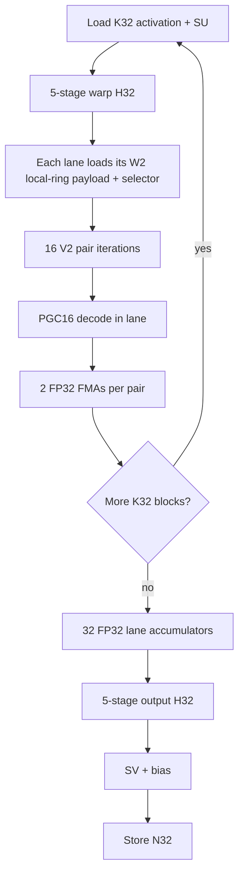

# QVQ V2B2-P32 Local-Ring (LR32) design

Status: **research design / optional format proposal**. This document does not promote or replace the existing
`qvq_v2b2_p32` format. The existing format remains the control and must retain byte-for-byte checkpoint and inference
semantics so LOCAL-RING can be A/B tested until model-quality and hardware gates justify promotion.

The proposed checkpoint format name is:

```text
qvq_v2b2_p32_lr
```

`LR32` is shorthand in this document for **LOCAL-RING, 32 weights per ring**. The format keeps the existing L16/V2
PGC16 reconstruction family and P32 bank granularity, but cuts the 128-transition tile-wide circular dependency into
eight independent 16-transition rings. The hardware-oriented logical tile is `K32 x N8`: each output column contains
one 32-weight P32 ring. This creates an execution geometry in which a 32-lane NVIDIA warp or Apple GPU SIMD-group can
consume one `K32` activation block while 32 lanes independently decode 32 P32 rings for 32 output columns.

A later optional H32 transform mode is designed alongside LR32 because the intended end state is:

```text
P32 ring length = K32 activation block = H32 block = 32 execution lanes
```

However, H32 must **not** be bundled into the first LOCAL-RING quality experiment. Local-ring topology, K-major weight
ordering, and block-Hadamard strength are separate variables and must be measured separately.

Related documents:

- [`qvq.md`](qvq.md): QVQ codec and lifecycle design.
- [`qvq_quant.md`](qvq_quant.md): quantization design.
- [`qvq_inference.md`](qvq_inference.md): native inference design.
- [`qvq_inference_mlx_mps.md`](qvq_inference_mlx_mps.md): Apple/MLX/MPS inference.
- [`qvq_llama32_1b_divergence32_2026-08-25.md`](qvq_llama32_1b_divergence32_2026-08-25.md): current flat-W2 model-quality context.

## 1. Why LOCAL-RING

The current V2B2-P32 format already has the right *rate* granularity for hardware: one bank decision covers 32 weights.
But its state path is still globally circular across all 128 V2 transitions in a 256-weight tile. At W2, each 16-bit
state remembers four 4-bit transitions, so the first states of a P32 segment can depend on transition history from the
previous P32 segment.

All 16 transitions in a current P32 segment are used. The limitation is not that only four transitions are active; the
limitation is that one W2 state has a four-transition history window. In the existing global ring, some of that history
crosses a P32 boundary:

```text
P32 A                              P32 B
... A12 A13 A14 A15 | B0 B1 B2 B3 B4 ... B15

state(B0) = A13 A14 A15 B0
state(B1) = A14 A15 B0  B1
state(B2) = A15 B0  B1  B2
state(B3) = B0  B1  B2  B3
state(B4) = B1  B2  B3  B4
...
```

LOCAL-RING keeps the same 16-bit state and transition width but makes each P32 segment self-contained:

```text
                     P32 B local ring
              +---------------------------+
              |                           |
              v                           |
             B0 B1 B2 ... B13 B14 B15 ----+

state(B0) = B13 B14 B15 B0
state(B1) = B14 B15 B0  B1
state(B2) = B15 B0  B1  B2
state(B3) = B0  B1  B2  B3
...
```

The 16 transitions are still all used. At W2 every transition appears in four consecutive state windows, but all state
history remains inside one P32 ring.

The motivation is not only decoder simplification. A hardware-oriented K-major ring groups 32 weights that contribute
to the **same output dot product**, rather than allowing local trellis history to run across several output neurons.
That may be a better error neighborhood for GEMV, but it is a hypothesis and must be measured.

## 2. What changes and what does not

| Property | Existing `qvq_v2b2_p32` | Proposed `qvq_v2b2_p32_lr` |
|---|---:|---:|
| Trellis window | L16 | L16 |
| Vector size | V2 | V2 |
| Rate range | W1-W3.5 | W1-W3.5 initially |
| Transition width | `E = 2R` | `E = 2R` |
| PGC16 level table | unchanged | unchanged |
| Bank family | canonical + one module-level alternative | unchanged |
| P32 selector | one bit per 32 weights | unchanged |
| Selectors / 256 weights | 8 | 8 |
| Selector bytes / 256 weights | 1 | 1 |
| Weight payload BPW | unchanged | unchanged |
| W2 effective payload | 2.03125 BPW | 2.03125 BPW |
| Circular dependency | one 128-step path | eight 16-step paths |
| Intended logical tile | current 16x16 organization | K32 x N8 |
| Intended small-M execution | generic tile GEMV | 32-lane LR32 kernel |

The LOCAL-RING change does **not** increase state width, transition choices, PGC16 reconstruction capacity, or payload
bits. It changes the dependency topology: which preceding transitions determine a state.

This distinction matters when interpreting model-quality results. Equal BPW and equal nominal path capacity do not
imply equal rate/distortion because K-major ordering and local circular history change which weights are coupled.

## 3. Format identity and fail-closed loading

LOCAL-RING must be a separate format identifier. A runtime boolean on the existing format is not sufficient.

The two formats can have the same tensor shapes, dtypes, and BPW while decoding those bytes with different state
history. A legacy decoder accepting an LR checkpoint could therefore produce plausible but incorrect values without a
shape failure.

Required rule:

```text
format="qvq_v2b2_p32"     -> existing global-ring semantics only
format="qvq_v2b2_p32_lr"  -> LOCAL-RING semantics only
```

A loader for either format must reject the other's serialized format ID. No heuristic detection from tensor shape is
allowed.

The existing `qvq_v2b2_p32` format remains frozen as the A/B control until LR32 passes promotion gates.

## 4. LOCAL-RING reference math

Let one P32 ring contain sixteen V2 transitions:

```text
e[0], e[1], ..., e[15]
```

Each edge contains exactly `E = 2R` bits. Define the circular ring bitstream:

```text
B = e[0] || e[1] || ... || e[15]
```

with total length:

```text
ring_bits = 16 * E
```

For transition `i`, state `s[i]` is the 16-bit circular bit window ending at `e[i]`:

```text
end_bit   = (i + 1) * E
start_bit = end_bit - 16
s[i]      = circular_bits(B, start_bit, 16)
```

Equivalently, this is the same L16 recurrence used by ordinary V2, except wraparound is resolved inside the local
16-transition ring rather than through another P32 segment.

At W2 (`E=4`):

```text
s[0]  = e[13] e[14] e[15] e[0]
s[1]  = e[14] e[15] e[0]  e[1]
s[2]  = e[15] e[0]  e[1]  e[2]
s[3]  = e[0]  e[1]  e[2]  e[3]
...
s[15] = e[12] e[13] e[14] e[15]
```

The decoder then applies the selected V2 bank exactly as existing V2B2-P32:

```text
bank = selector ? module_bank_alt_id : 0
state' = state XOR bank_mask(E, bank)
p = pgc16_mix(state')
w0 = G[p >> 8]
w1 = G[p & 255]
```

`G`, PGC16 mixer constants, FP16 bit patterns, bank masks, and scale normalization remain unchanged.

### 4.1 Rate-dependent local history

The state remains exactly 16 bits. Therefore the approximate number of prior transitions visible to one state is:

| Rate | E | P32 transitions | State history |
|---:|---:|---:|---:|
| W1 | 2 | 16 | 8 transitions |
| W1.5 | 3 | 16 | 6 transitions including a partial oldest edge |
| W2 | 4 | 16 | 4 transitions |
| W2.5 | 5 | 16 | 4 transitions including a partial oldest edge |
| W3 | 6 | 16 | 3 transitions including a partial oldest edge |
| W3.5 | 7 | 16 | 3 transitions including a partial oldest edge |

LOCAL-RING does not increase that history. It makes 100% of the history local to the P32 segment.

## 5. Payload and packing

A 256-weight LR tile still contains:

```text
8 rings * 32 weights/ring = 256 weights
8 rings * 16 transitions/ring = 128 V2 transitions
```

Weight bits are unchanged:

```text
128 transitions * E bits = 128 * (2R) = 256R bits
                         = R bits/weight
```

The eight binary bank selectors still require one byte per 256 weights.

At W2:

```text
weight stream: 256 * 2 bits = 512 bits
bank selectors:               8 bits
                               --------
                               520 bits

520 / 256 = 2.03125 BPW
```

### 5.1 Preserve planar packing first

The initial LR format should retain QVQ's planar edge packing. Do not introduce a second packing scheme until the
math/quality result is known.

Existing planar helpers operate naturally on 32-edge blocks. LR32 has 16-edge semantic rings, so pair two adjacent
rings into one physical 32-edge planar slab:

```text
physical slab 0 = ring 0 edges [0..15] || ring 1 edges [0..15]
physical slab 1 = ring 2 edges [0..15] || ring 3 edges [0..15]
physical slab 2 = ring 4 edges [0..15] || ring 5 edges [0..15]
physical slab 3 = ring 6 edges [0..15] || ring 7 edges [0..15]
```

The physical pack stays efficient while state reconstruction treats each 16-edge half as an independent circular ring.

At W2, one ring has exactly 64 payload bits. Under the existing E=4 planar decomposition, the first 16 edges occupy two
32-bit words and the next ring occupies the next two words. This gives a particularly clean W2 hot path:

```text
one W2 P32 ring = 2 x uint32 = 64 bits
```

Backends may combine those two words into `uint64` if measured faster, but the ABI should remain defined in terms of
canonical planar words. This avoids requiring efficient 64-bit integer ALU on Apple GPUs.

## 6. Hardware-oriented logical geometry

After the pure LOCAL-RING quality gate, the intended hardware layout is:

```text
logical LR tile = K32 x N8 = 256 weights
```

Each N column is one P32 ring:

```text
                         N
                  8 output columns
             +---+---+---+---+---+---+---+---+
K = 0        |   |   |   |   |   |   |   |   |
             |   |   |   |   |   |   |   |   |
             |   |   |   |   |   |   |   |   |
             |   |   |   |   |   |   |   |   |
             |   |   |   |   |   |   |   |   |
K = 31       |   |   |   |   |   |   |   |   |
             +---+---+---+---+---+---+---+---+
               ^
               one column = 32 weights
                          = one P32 local ring
```

Tile count is unchanged:

```text
(K / 32) * (N / 8) = K*N / 256
(K / 16) * (N / 16) = K*N / 256
```

So the number of 256-weight payload records remains the same even though their logical geometry changes.

## 7. Separate LOCAL-RING from H32 in experiments

The target hardware geometry eventually uses a block-diagonal normalized H32 transform because H32 can execute inside
one 32-lane warp/SIMD-group using five shuffle stages.

However, block-H32 changes the incoherence transform and may reduce outlier spreading compared with a full-width
Hadamard. At W2 this can matter more than at W4.

Therefore the first LR checkpoint should keep current QVQ transform semantics. H32 is a second experimental axis and
must be serialized explicitly if promoted because its transformed weight cannot be inferred from tensor shape.

Recommended research sequence:

| Arm | Trellis ordering | Ring topology | RHT |
|---|---|---|---|
| A | current | global | current full transform |
| B | K32 research control | global | current full transform |
| C | K32 | LOCAL-RING | current full transform |
| D | K32 | LOCAL-RING | H32 block transform |

Interpretation:

```text
A -> B : effect of weight ordering / logical tile geometry
B -> C : effect of LOCAL-RING topology
C -> D : effect of H32 rather than full-width transform
```

The B arm may remain an internal research mode and does not need to become a loadable format.

If H32 is promoted, use a separate format ID or a required versioned transform field such as:

```text
qvq_v2b2_p32_lr_h32
```

Do not silently reinterpret `qvq_v2b2_p32_lr` as H32 later.

## 8. Torch oracle first

Torch is the authority. CUDA and MLX must never be used to define the expected LR result.

Recommended readable primitives:

```text
unpack_local_ring_edges()
        |
        v
local_ring_states_from_edges()
        |
        v
decode_local_ring_states()
        |
        v
decode_local_ring_tiles()
        |
        v
reconstruct_local_ring_inner_weight()
        |
        v
qvq_local_ring_dense_oracle_forward()
```

Reference tensor shape after unpacking:

```text
edges:  [tile, 8, 16]
states: [tile, 8, 16]
values: [tile, 8, 16, 2]
```

The state builder should be a direct, readable bit-window implementation first. A faster Torch vectorization may be
added only after it is tested against the readable implementation.

### 8.1 Oracle invariants

The Torch gates must prove all of the following before a native kernel is added:

1. Pack/unpack exactness for every supported rate W1-W3.5.
2. Every recovered state satisfies the local transition recurrence.
3. Ring isolation: mutating ring `r1` cannot change any state/value in ring `r0 != r1`.
4. W2 state windows match the explicit four-nibble equations above.
5. PGC16 decoded values are bit-identical to existing V2 bank decoding for the same `(state, bank)`.
6. Selector packing uses exactly eight bits per 256 weights.
7. Raw/effective BPW matches the existing P32 control.
8. Dense reconstructed weight shape/order is correct for K32 x N8 tiling.
9. Dense FP32 forward matches a direct matrix multiply using the reconstructed LR weight.
10. Save/load/reload reproduces identical `trellis`, selectors, `SU`, `SV`, and dense oracle output.
11. Existing `qvq_v2b2_p32` rejects the LR format ID and LR rejects the old format ID.

### 8.2 Quantization oracle

The cleanest first LR quantizer treats each ring as an independent fixed-bank tail-biting problem:

```text
one target ring [16 steps, V2]
        |
        +---- search canonical bank 0 -------+
        |                                    |
        +---- search module alternate bank --+
                                             |
                                             v
                                  choose lower objective
```

Batch all eight rings for throughput:

```text
[tile, 8, 16, 2] -> [tile*8, 16, 2]
```

Keep the existing QVQ tail-biting approximation/tie policy initially. The first LR experiment should change topology,
not simultaneously introduce a different tail-biting optimizer.

The module-level `bank_alt_id` contract remains unchanged.

## 9. CUDA small-M strategy: Ampere / SM80 first

The first native target is intentionally narrow:

```text
SM80
W2 / E=4
M=1
FP16 and BF16 input
FP32 accumulation/output before the final QVQ epilogue
```

Do not template every rate, M bucket, and dtype until W2/M1 proves the architecture.

### 9.1 Better warp mapping: one lane owns one output

The natural LR32 mapping is **not** one warp per output. One warp should produce 32 outputs in parallel.

```text
lane 0  -> output N+0  -> one P32 local ring
lane 1  -> output N+1  -> one P32 local ring
...
lane 31 -> output N+31 -> one P32 local ring
```

All lanes share the same K32 activation block.

For the optional H32 path, the 32 lanes first load:

```text
lane l = x[k + l] * SU[k + l]
```

and execute the normalized H32 in five XOR-shuffle stages:

```text
mask = 1
mask = 2
mask = 4
mask = 8
mask = 16
```

Then pair iteration `p=0..15` broadcasts the two transformed activation coordinates needed by every output lane:

```text
a0 = shfl(hx, 2*p)
a1 = shfl(hx, 2*p + 1)

lane j:
    state_j = state_from_local_ring(ring_j, p)
    w0, w1 = PGC16(state_j, bank_j)
    acc_j = fma(a0, w0, acc_j)
    acc_j = fma(a1, w1, acc_j)
```

There is **no warp reduction**. Each lane owns and accumulates one output column directly.

After all K32 blocks:

```text
lane 0  contains y0
lane 1  contains y1
...
lane 31 contains y31
```

If H32 output transform is enabled, the same warp immediately performs the five H32 shuffle stages over those 32 FP32
lane accumulators, applies `SV` and bias, and stores 32 outputs.

### 9.2 CUDA flow



Without H32, B and I are omitted while the LR decode/GEMV geometry remains identical.

### 9.3 W2 state extraction

At W2 one local ring contains:

```text
16 transitions * 4 bits = 64 bits
```

Canonical packing exposes that ring as two 32-bit words. State `p` is a 16-bit circular nibble window. The SM80 hot
path should use compile-time shift/or, funnel-shift, or BFE-style extraction over the two 32-bit words. Do not require a
native 64-bit rotate in the ABI.

The performance target is to replace generic cross-segment state reconstruction with a ring-local fixed-width window.

### 9.4 CUDA W2 per-K32xN32 cost model

One warp operating on one K32 x N32 block performs the dense-equivalent 1,024 weight MACs while reading only W2
payloads.

Approximate hot-loop work/traffic:

| Item | W2 K32 x N32 cost |
|---|---:|
| Weight payload | 32 rings x 8 B = 256 B |
| Bank selectors | 32 bits = 4 B |
| Activation values | 32 x 2 B = 64 B for FP16/BF16 |
| Cached compute-dtype SU | 32 x 2 B = 64 B |
| PGC16 states decoded | 32 lanes x 16 = 512 |
| Weight FMAs | 32 lanes x 32 = 1,024 |
| Input H32 | 5 shuffle stages / K32 block when enabled |
| Output H32 | 5 shuffle stages once after K completion when enabled |
| Dense weight materialization | 0 B persistent, 0 B global temporary |

The 512-byte canonical FP16 PGC16 level table remains shared/process-wide. A CUDA CTA may cache it once in shared
memory. Benchmark:

```text
A. one 512-B shared copy
B. 2-4 padded/replicated shared copies to reduce data-dependent bank conflicts
C. read-only/L1 path
D. optional expanded state table only if measured faster
```

Do not make an expanded decoder table part of the checkpoint ABI.

### 9.5 Synchronization and shared-memory goal

The LR32 hot loop should be warp-register driven:

```text
compressed global payload -> lane registers -> PGC16 -> FP32 accumulator
```

Target:

- no `__syncthreads()` in the K loop;
- no shared reconstructed weight tile;
- no shared transformed activation tile for M=1;
- no global transformed activation tensor in the H32-fused path;
- no global pre-output tensor in the H32-fused path.

If the level table is copied to shared memory, one startup CTA barrier is acceptable. If a read-only/L1 placement wins,
even that barrier can disappear.

This directly attacks the barrier/staging pressure seen in the existing CTA-oriented GEMV design.

### 9.6 CTA and split-K dispatch

Benchmark at least:

```text
1 warp / CTA
4 warps / CTA, each warp owns an independent N32 group
```

For small N, one-warp CTAs expose more scheduler-visible blocks. For larger N, four-warps/CTA can amortize shared level
setup and launch overhead.

On an A100-class 108-SM device, N=2048 provides only 64 N32 groups before split-K, so M=1 may need split-K=2 or more to
fill the machine. Dispatch must be derived from runtime SM count, K, N, M, workspace cost, and measured latency rather
than a hard-coded GPU ordinal.

When split-K is used:

```text
warp -> raw FP32 N32 partials
             |
             v
fixed-order split reduction
             |
             v
one output H32
             |
             v
SV + bias
```

Do not apply output H32 independently to every split.

## 10. Hopper and Blackwell transfer

LR32 is a codec/execution geometry, not an Ampere-specific checkpoint.

The small-M kernel depends on:

- 32-lane warp execution;
- warp shuffle/exchange;
- integer shifts/xor/multiply-add;
- FP32 FMA;
- coalesced compressed-weight loads.

That mapping transfers directly to Hopper and Blackwell. The checkpoint remains identical.

Backend strategy:

| Architecture | M=1-small M | Larger M/prefill |
|---|---|---|
| Ampere SM80 | LR32 warp kernel | existing/shared `cp.async` + WMMA-style path |
| Hopper SM90 | LR32 warp kernel | TMA + warpgroup/WGMMA-oriented path |
| Blackwell SM100+ | LR32 warp kernel | TMA/TMEM + architecture-native Tensor Core path |

Do not force WGMMA/TCGen paths onto M=1 merely because the hardware supports them. The LR32 warp kernel is deliberately
small-M and decode-oriented. Large-M paths may decode/reuse larger tiles and feed architecture-specific matrix
engines.

The format metadata should say `ring_weights=32` / `transform_block=32` when applicable, never `cuda_warp=32`.

## 11. Apple GPU / MLX strategy

Apple GPU SIMD-groups are also 32 lanes, so the same lane ownership maps naturally to Metal/MLX:

```text
thread 0  -> output 0 / local ring 0
thread 1  -> output 1 / local ring 1
...
thread 31 -> output 31 / local ring 31
```

Use SIMD-group shuffle/exchange operations for H32 and activation broadcasts. The intended M=1 hot loop requires no
threadgroup exchange between SIMD-groups.

Conceptual Metal/MLX loop:

```text
simd lane l loads x[k+l] * SU[k+l]
        |
        v
5 x simd_shuffle_xor for H32
        |
        v
for p in 0..15:
    a0 = simd broadcast transformed_x[2p]
    a1 = simd broadcast transformed_x[2p+1]
    each lane extracts state p from its own ring
    each lane PGC16-decodes w0,w1
    each lane accumulates two FP32 FMAs
        |
        v
5 x simd_shuffle_xor for output H32
        |
        v
SV + bias + store
```

Add a separate MLX kernel key, for example:

```text
v2b2_p32       # existing
v2b2_p32_lr    # new
```

Do not modify the existing P32 Metal kernel in place.

The same W2 packing should be consumed directly by CUDA and MLX. There must be no backend-specific checkpoint repack.
Backend-only transient repacks are allowed only if they are derived deterministically at `post_init` and measured to
win.

### 11.1 Apple integer note

Do not assume a 64-bit rotate is cheap on Apple GPU. Keep the canonical W2 ring as two `uint32` words and implement the
circular 16-bit window with 32-bit shifts/or unless a 64-bit variant benchmarks faster.

### 11.2 ANE scope

MLX custom kernels execute on Apple GPU, not the Apple Neural Engine. LR32 is designed to be portable as a checkpoint
representation, but ANE execution would require a separate Core ML/compiler path and is not part of the initial LR32
backend contract.

Do not split one fused LR32 linear between GPU decode and ANE GEMM as an initial optimization; the synchronization and
materialization would defeat the design goal of keeping decode and accumulation in one execution group.

### 11.3 Current MLX implementation and measured dispatch

The first MLX implementation keeps the checkpoint ABI above but uses N8 SIMD-group kernels. M=1 uses a dedicated
single-row barrier-free source, while M=2 uses the two-row barrier-free source; both have four lanes cooperate on each
output and accumulate directly from the activation. M>=4 decodes
eight local rings into a K32 x N8 shared tile and accumulates that tile for one or two rows, with a dedicated row-tile
boundary at M=4. W2 combines each ring's two packed words into one circular
64-bit window to derive its sixteen states, avoiding four separate state-start extractions; the split-W2 variants use
the same fast state-start path. The W2 N8 kernels load each compressed word once per SIMD group and distribute it to the
four decoder lanes with SIMD shuffles. The LR production kernel specializes the immutable alternate-bank ID as a Metal
template value, broadcasts selector metadata once per N8 tile, and reads the fixed PGC16-v1 FP16 level table from Metal
constant memory. For small M, N16 is used to reduce threadgroup count and repeated local-ring decode work; this was
revalidated on an AC/performance-mode M4 Max for both N=2048 and N=8192. `QVQMLXLinear` keeps the transformed LR activation in FP32, avoiding the legacy
FP16 row-range/narrow/rescale graph. FP32 production GEMVs use measured shape-specific split-K dispatch for wide FFN
and down-projection shapes; the M=4, K<=2048, N>=8192 case uses the unsplit row-tile-4 path. FP16 output disables
split-K so its reduction preserves the original full-K rounding semantics. No dense weight matrix is materialized.

Run the paired public-path benchmark with:

```text
python scripts/benchmark_qvq_v2b2_p32_lr_mlx.py --warmup 75 --samples 300
```

The benchmark uses synthetic W2 payloads, FP16 activations, FP32 output, matched warmup/sample counts, and explicit
GPU synchronization. With the host on AC performance mode, one uniform 300-sample run from the optimized implementation
reported:

| Shape (M,K,N) | LR p50 (ms) | P32 p50 (ms) | P32/LR | LR p95 (ms) | P32 p95 (ms) |
|---|---:|---:|---:|---:|---:|
| (1,2048,256) | 0.17460 | 0.15150 | 0.87x | 0.24742 | 0.19751 |
| (1,2048,2048) | 0.14656 | 0.15419 | 1.05x | 0.18187 | 0.20963 |
| (1,2048,8192) | 0.17902 | 0.21040 | 1.18x | 0.20878 | 0.25087 |
| (1,8192,2048) | 0.18267 | 0.23867 | 1.31x | 0.20609 | 0.26497 |
| (4,2048,8192) | 0.24633 | 0.56067 | 2.28x | 0.31531 | 1.19448 |
| (8,2048,8192) | 0.37081 | 0.81765 | 2.21x | 0.42078 | 0.88076 |
| (16,8192,8192) | 2.07717 | 5.17087 | 2.49x | 2.15964 | 5.25586 |

This AC/performance-mode run includes the dedicated M=1 source and establishes at least 2x speedup for the representative
M=4, M=8, and M=16 wide projection shapes, while keeping
the same public inference graph and checkpoint rate. The M=1, K=8192 down-projection shape is also above 2x; the M=1,
K=2048 wide projection is only 1.13x and the narrow M=1 shape remains launch-bound. M=4 and M=8 were variable across
the immediate AC repeats, so only M=16 is treated as a stable 2x result from this pair of runs.
Compared with the previous two-row M<=2 source in a same-process synchronized A/B (180 samples per arm), the M=1 source
reduced p50 latency by 4.5%, 6.0%, 9.5%, and 11.6% for the four M=1 shapes in table order (N=256, N=2048, N=8192,
and K=8192,N=2048). These are kernel-level gains; they do not turn the narrow M=1 cases into 2x wins.
These numbers measure the public inner-GEMV path, not end-to-end model latency. Full `QVQMLXLinear` timing also includes
the input/output Hadamard transforms, scale/bias epilogue, and MLX graph overhead. Measurements are host-dependent
and should be repeated on each target Apple GPU.

Before the single-row specialization, an immediate second 300-sample run on the same AC/performance-mode host produced
p50 speedups of `0.90x, 1.28x, 1.32x, 2.16x, 1.05x, 1.13x, 2.48x` in the table's shape order. This confirms that host
scheduling/cache state affects individual dispatch timings; conclusions use synchronized p50/p95 values and do not treat
the noisiest M4/M8 runs as universal guarantees. The M=1 A/B above is the direct paired measurement for the new source.

A separate synthetic full-module benchmark is available with:

```text
python scripts/benchmark_qvq_v2b2_p32_lr_mlx_module.py --warmup 50 --samples 200
```

On the same AC/performance-mode host, one 50-warmup/200-sample run measured:

| Shape (M,K,N) | Full LR p50 (ms) | Full P32 p50 (ms) | P32/LR | Full LR p95 (ms) | Full P32 p95 (ms) |
|---|---:|---:|---:|---:|---:|
| (1,2048,256) | 0.65383 | 0.70235 | 1.07x | 0.97129 | 0.95571 |
| (1,2048,2048) | 0.55608 | 0.53233 | 0.96x | 0.84241 | 0.92769 |
| (1,2048,8192) | 0.61525 | 0.81744 | 1.33x | 1.01985 | 1.28278 |
| (1,8192,2048) | 0.66300 | 0.86631 | 1.31x | 0.96357 | 1.48027 |
| (4,2048,8192) | 0.82758 | 0.81788 | 0.99x | 1.39779 | 1.45551 |
| (8,2048,8192) | 1.07281 | 1.26992 | 1.18x | 1.47251 | 1.59435 |
| (16,8192,8192) | 2.70494 | 5.79129 | 2.14x | 3.00818 | 5.96905 |

These full-module numbers include the Hadamard/scale/epilogue graph and use independent synthetic payloads per format;
they are a sanity check rather than a model-level throughput claim.

#### Latest AC/performance-mode recheck

After enabling AC performance mode, the current implementation was remeasured with the same synthetic payload in one
process. This run used 50 warmup calls and 100 synchronized samples per arm, with immutable `AltBank=2` specialization:

| Shape (M,K,N) | LR p50 (ms) | LR p95 (ms) | LR mean (ms) | LR sd (ms) | P32 p50 (ms) | P32 p95 (ms) | P32 mean (ms) | P32 sd (ms) | P32/LR |
|---|---:|---:|---:|---:|---:|---:|---:|---:|---:|
| (1,2048,256) | 0.2421 | 0.3024 | 0.2526 | 0.0528 | 0.1740 | 0.2107 | 0.1789 | 0.0209 | 0.72x |
| (1,2048,2048) | 0.2484 | 0.3073 | 0.2409 | 0.0610 | 0.1723 | 0.2089 | 0.1778 | 0.0230 | 0.69x |
| (1,2048,8192) | 0.2342 | 0.2817 | 0.2414 | 0.0478 | 0.2406 | 0.2989 | 0.2466 | 0.0225 | 1.03x |
| (1,8192,2048) | 0.2319 | 0.2896 | 0.2420 | 0.0357 | 0.2811 | 0.3167 | 0.2868 | 0.0261 | 1.21x |
| (4,2048,8192) | 0.2693 | 0.3497 | 0.2865 | 0.0697 | 0.6843 | 0.9781 | 0.6915 | 0.1351 | 2.54x |
| (4,8192,2048) | 0.2945 | 0.3471 | 0.3021 | 0.0396 | 0.5147 | 0.5789 | 0.5226 | 0.0286 | 1.75x |
| (8,2048,8192) | 0.3924 | 0.4647 | 0.4007 | 0.0398 | 1.1733 | 1.5632 | 1.1884 | 0.2047 | 2.99x |
| (16,8192,8192) | 2.1793 | 2.2950 | 2.1907 | 0.0611 | 5.2263 | 5.3720 | 5.2299 | 0.0724 | 2.40x |

The corresponding complete-module recheck used 50 warmup calls and 80 synchronized samples:

| Shape (M,K,N) | Full LR p50 (ms) | Full LR p95 (ms) | Full P32 p50 (ms) | Full P32 p95 (ms) | P32/LR |
|---|---:|---:|---:|---:|---:|
| (1,2048,256) | 0.4259 | 0.7061 | 0.6012 | 0.8232 | 1.41x |
| (1,2048,2048) | 0.4633 | 0.8036 | 0.6232 | 0.8760 | 1.35x |
| (1,2048,8192) | 0.5865 | 1.0950 | 0.5629 | 1.2338 | 0.96x |
| (1,8192,2048) | 0.5637 | 1.1088 | 0.5843 | 1.3053 | 1.04x |
| (4,2048,8192) | 0.5984 | 1.3258 | 0.8069 | 0.8998 | 1.35x |
| (4,8192,2048) | 0.5864 | 1.3130 | 0.8267 | 0.8839 | 1.41x |
| (8,2048,8192) | 0.6809 | 0.7996 | 1.1681 | 1.2699 | 1.72x |
| (16,8192,8192) | 2.7584 | 2.9628 | 5.7320 | 5.8428 | 2.08x |

These latest numbers are timing evidence for this AC/power-mode state, not universal device guarantees. The inner LR
kernel exceeds 2x on representative wide M4/M8/M16 shapes; complete-module LR exceeds 2x only at M16 in this recheck.

#### AC/performance-mode M1 N16 dispatch recheck

The previous table predates the small-row N16 policy update. With AC power and performance mode enabled, a paired
M1/M2 sweep found N16 faster than N8 for every tested small-row shape. The production complete-module benchmark used
50 warmup calls and 120 synchronized samples per format:

| Shape (M,K,N) | Full LR p50 (ms) | Full P32 p50 (ms) | P32/LR |
|---|---:|---:|---:|
| (1,2048,256) | 0.70656 | 0.81794 | 1.16x |
| (1,2048,2048) | 0.77479 | 0.82725 | 1.07x |
| (1,2048,8192) | 0.49392 | 0.56488 | 1.14x |
| (1,8192,2048) | 0.59487 | 0.62975 | 1.06x |
| (4,2048,8192) | 0.56729 | 0.80917 | 1.43x |
| (8,2048,8192) | 0.70498 | 1.18560 | 1.68x |
| (16,8192,8192) | 2.62131 | 5.57840 | 2.13x |

The M1 kernel recheck matched the prior output within relative L2 below `5e-7` while changing only the small-row
output grouping. An M1 K2048 N8192 Metal System Trace captured the specialized
`...lr_small_fp32_split2_n16_m1_vec_alt2...` kernel. The trace shows the expected small-row path; it does not expose
Apple hardware stall/occupancy counters on this target. `xctrace` listed Metal GPU Counters, but the counter profile
returned “Selected counter profile is not supported on target device”.

The public inner-kernel benchmark was also rerun after the policy change with 75 warmup calls and 200 synchronized
samples. This path includes the MLX LR split-K reduction but not the complete-module Hadamard/epilogue graph:

| Shape (M,K,N) | LR p50 (ms) | P32 p50 (ms) | P32/LR | LR p95 (ms) | P32 p95 (ms) |
|---|---:|---:|---:|---:|---:|
| (1,2048,256) | 0.23262 | 0.27027 | 1.16x | 0.37735 | 0.38793 |
| (1,2048,2048) | 0.18602 | 0.16102 | 0.87x | 0.23530 | 0.21842 |
| (1,2048,8192) | 0.20040 | 0.21556 | 1.08x | 0.21663 | 0.23354 |
| (1,8192,2048) | 0.22312 | 0.25954 | 1.16x | 0.24804 | 0.28049 |
| (4,2048,8192) | 0.26267 | 0.47321 | 1.80x | 0.28311 | 0.54235 |
| (8,2048,8192) | 0.37919 | 0.82333 | 2.17x | 0.40121 | 0.87779 |
| (16,8192,8192) | 2.05342 | 5.09027 | 2.48x | 2.13184 | 5.16288 |

#### Native MLX Hadamard recheck

For power-of-two widths supported by MLX, QVQ now uses the fused `mx.hadamard_transform` instead of constructing the
butterfly with repeated reshape/stack/add/sub operations. The normalized scale is passed explicitly, and non-power-of-
two QVQ widths continue using the existing factored path. The native transform matched the previous implementation at
approximately `2e-7` relative output error in the M1/M8 checks. The complete-module benchmark below used 60 warmup
calls and 160 synchronized samples per format on the same AC/performance-mode M4 Max:

| Shape (M,K,N) | Full LR p50 (ms) | Full P32 p50 (ms) | P32/LR | Full LR p95 (ms) | Full P32 p95 (ms) |
|---|---:|---:|---:|---:|---:|
| (1,2048,256) | 0.29342 | 0.41129 | 1.40x | 0.33114 | 0.45899 |
| (1,2048,2048) | 0.23096 | 0.25771 | 1.12x | 0.25879 | 0.26874 |
| (1,2048,8192) | 0.26315 | 0.32142 | 1.22x | 0.28021 | 0.33614 |
| (1,8192,2048) | 0.25342 | 0.33687 | 1.33x | 0.32271 | 0.34805 |
| (4,2048,8192) | 0.31869 | 0.57031 | 1.79x | 0.34465 | 0.62908 |
| (8,2048,8192) | 0.40975 | 0.91535 | 2.23x | 0.44165 | 0.98032 |
| (16,8192,8192) | 2.12323 | 5.17300 | 2.44x | 2.17138 | 5.27063 |

This comparison is between the current native-Hadamard checkout and the same MLX implementation's P32 control. Both
formats receive the graph optimization; it changes neither BPW nor the LR32 kernel ABI.

#### Pushed-checkout randomized AC/performance-mode recheck

After the rejected H32 probe was removed, the clean `a7df1139` checkout was rechecked on the plugged-in,
performance-mode M4 Max. Each row used the same input and randomized interleaving of 100 LR/P32 samples after one
warmup call for each arm; every sample forced `mx.eval()` and `mx.synchronize()`. This avoids the large ordering bias
seen in sequential MLX timings. Complete-module results were:

| Shape (M,K,N) | LR p50 (ms) | P32 p50 (ms) | P32/LR | LR p95 (ms) | P32 p95 (ms) |
|---|---:|---:|---:|---:|---:|
| (1,2048,256) | 0.63381 | 0.72704 | 1.15x | 2.57688 | 4.43331 |
| (1,2048,2048) | 0.49677 | 0.65094 | 1.31x | 2.12641 | 2.03458 |
| (1,2048,8192) | 0.73154 | 1.12662 | 1.54x | 2.98602 | 2.51994 |
| (1,8192,2048) | 0.76283 | 1.13223 | 1.48x | 1.36160 | 2.53017 |
| (4,2048,8192) | 1.21552 | 2.59315 | 2.13x | 3.81650 | 6.95502 |
| (8,2048,8192) | 0.90396 | 2.03660 | 2.25x | 1.88381 | 4.40024 |
| (16,8192,8192) | 2.49333 | 5.63358 | 2.26x | 3.88162 | 7.72514 |

The corresponding inner `qvq_mlx_gemv` recheck used the same randomized 100-sample protocol:

| Shape (M,K,N) | LR p50 (ms) | P32 p50 (ms) | P32/LR | LR p95 (ms) | P32 p95 (ms) |
|---|---:|---:|---:|---:|---:|
| (1,2048,256) | 0.23304 | 0.27027 | 1.16x | 0.40981 | 0.40377 |
| (1,2048,2048) | 0.26627 | 0.27675 | 1.04x | 0.65451 | 0.30722 |
| (1,2048,8192) | 0.28315 | 0.35321 | 1.25x | 0.43945 | 0.55783 |
| (1,8192,2048) | 0.22988 | 0.27702 | 1.21x | 0.29521 | 0.31121 |
| (4,2048,8192) | 0.26665 | 0.47108 | 1.77x | 0.32421 | 0.57449 |
| (8,2048,8192) | 0.37831 | 0.81604 | 2.16x | 0.42441 | 0.89820 |
| (16,8192,8192) | 2.16567 | 5.12169 | 2.37x | 2.32365 | 5.27084 |

The full-module table is the production-relevant result: LR is faster for every tested shape and clears 2x at M4,
M8, and M16. The inner table shows why M1/M2 are not 2x yet: their LR decode is already competitive, while MLX
launch, split reduction, and full-Hadamard costs dominate the module boundary.

#### Latest AC/performance-mode split-K recheck

The small-M FP32 policy was subsequently changed from split-2 to split-4 for wide short-K modules, and to split-8 for
long-K down projections. In a paired 150-sample complete-module comparison, split-4 versus split-2 reduced p50 from
`0.85088 ms` to `0.80094 ms` for `(M=1,K=2048,N=8192)` and from `0.84133 ms` to `0.80137 ms` for `(M=2,K=2048,N=8192)`.
The corresponding inner-GEMV p50 changed from `0.67381 ms` to `0.65473 ms` for M1; M2 was statistically neutral at
`0.68613 ms` versus `0.68929 ms`. Output parity was exact in these split comparisons.

The production module benchmark was rerun with 60 warmup calls and 160 synchronized samples after this policy change:

| Shape (M,K,N) | LR p50 (ms) | P32 p50 (ms) | P32/LR | LR p95 (ms) | P32 p95 (ms) |
|---|---:|---:|---:|---:|---:|
| (1,2048,256) | 0.29210 | 0.39269 | 1.34x | 0.32613 | 0.44571 |
| (1,2048,2048) | 0.21140 | 0.23127 | 1.09x | 0.24128 | 0.25406 |
| (1,2048,8192) | 0.23850 | 0.29792 | 1.25x | 0.25951 | 0.32755 |
| (1,8192,2048) | 0.24354 | 0.30925 | 1.27x | 0.26330 | 0.34461 |
| (4,2048,8192) | 0.29790 | 0.54356 | 1.83x | 0.33380 | 0.64917 |
| (8,2048,8192) | 0.40596 | 0.89542 | 2.21x | 0.45401 | 0.95833 |
| (16,8192,8192) | 2.16085 | 5.18069 | 2.40x | 2.34851 | 5.34035 |

This recheck confirms the policy change improves the latency-sensitive M1 wide case, while the complete-module 2x
target remains strongest at M8/M16 because M1--M4 include a larger fixed transform/launch fraction.

#### AC/performance-mode rejected probes

Two additional same-process probes were run on the plugged-in M4 Max and were not promoted to production. Metal
`math_mode="fast"` was numerically exact in the tested W2 module comparisons (`max relative output difference = 0`) but
was effectively neutral at M1--M8 and slower at M16:

| Shape (M,K,N) | Safe p50 (ms) | Fast p50 (ms) | Fast/Safe |
|---|---:|---:|---:|
| (1,2048,8192) | 0.37896 | 0.37723 | 0.995x |
| (4,2048,8192) | 0.29606 | 0.29454 | 0.995x |
| (8,2048,8192) | 0.40692 | 0.40571 | 0.997x |
| (16,8192,8192) | 2.13598 | 2.24817 | 1.053x |

An isolated W2 N32 M1 kernel briefly improved the inner `K=2048,N=8192` dispatch by about 4.7%, but complete-module
paired timing regressed because the wider tile increased register/local-ring work and did not amortize the surrounding
graph. Relative to N16, complete-module p50 was `1.133x` at `(1,2048,8192)` and `1.183x` at `(1,8192,8192)`. N16
therefore remains the small-row policy. These probes are recorded to prevent treating an inner-kernel result as an
end-to-end module win.

A W2-only M1/N16 decode-loop unroll that processes two adjacent pairs per iteration was also oracle-correct, but the
complete-module gain was too small and shape-specific to retain. An interleaved 220-sample comparison at
`(M=1,K=2048,N=8192)` changed p50 from `0.32552 ms` to `0.32260 ms` (`0.991x`), while a separate long-K probe at
`(M=1,K=8192,N=2048)` regressed to `1.128x` of the baseline. The production loop remains unchanged.

A clean-room W2 N32 M1 prototype was also tested after the current activation-sharing and packed-word changes. It
passed the current LR oracle (`3.3e-7` relative error at `(M=1,K=2048,N=8192)` and `4.7e-7` at
`(M=1,K=8192,N=2048)`), but one output per lane increased register/decode work: interleaved inner p50 was `1.428x`
of N16 for `K=2048,N=8192` and `1.174x` for `K=8192,N=2048`. N16 remains the production small-row tile.

### 41. Rejected fast-math half-input and long-K split-4 probes

The production LR32 module deliberately keeps the transformed activation in FP32. A fast-math A/B was run to test
whether narrowing that activation to FP16 before the LR GEMV could remove enough activation traffic to justify the loss
of the FP32 input path. The candidate used the same complete `QVQMLXLinear` graph, payload, and input as production,
but inserted an FP16 cast immediately before the LR GEMV and omitted the corresponding row rescale. On the plugged-in
AC/performance-mode M4 Max, the test used 30 warmups and 80 synchronized samples per arm:

| Shape | FP32-input p50 / p95 (ms) | FP16-input p50 / p95 (ms) | FP32/FP16 p50 | rel. output delta | max delta |
|---|---:|---:|---:|---:|---:|
| `(M=1,K=2048,N=8192)` | `0.81025 / 1.21955` | `0.80835 / 1.09912` | `1.002x` | `3.235e-4` | `0.125` |
| `(M=1,K=8192,N=2048)` | `0.86913 / 1.41535` | `0.89898 / 1.83783` | `0.967x` | `3.189e-4` | `0.125` |
| `(M=1,K=2048,N=2048)` | `0.71292 / 1.39906` | `0.71540 / 1.68791` | `0.997x` | `3.297e-4` | `0.125` |

The candidate is therefore rejected: it has no meaningful wide-N gain, regresses long-K/narrow-N, and introduces a
relative output change around `3.2e-4`, much larger than the LR32 Torch-oracle tolerance used for kernel changes.
The production FP32 transformed-activation path remains unchanged.

The preliminary direct-kernel probe suggested that split-4 might beat the production split-8 policy for the long-K
narrow-N M1 case, so this was rechecked at the actual complete-module boundary. Two `QVQMLXLinear` instances with
the same payload and input were measured in randomized order for 120 samples after 20 warmups. The production
split-8 module measured `0.87283 ms` p50, `1.48100 ms` p95, and `0.91078 ms` mean; the temporary split-4 module
measured `0.91900 ms` p50, `1.36084 ms` p95, and `0.95798 ms` mean. Outputs remained oracle-consistent, with relative
delta `5.52e-7` and maximum absolute delta `2.06e-4`. Split-8 remains the production policy. This is another
example of why LR decisions are accepted only from paired complete-module measurements rather than an isolated
inner-kernel result.

A W2 lookup-register probe kept PGC16 values as `half2` until the FP32 multiply. It was oracle-exact and reduced
isolated inner p50 to `0.981x` of the current path at `(M=1,K=2048,N=8192)` and `0.969x` at
`(M=1,K=8192,N=2048)`, but complete-module p50 changed to `1.228x` and `0.983x`, respectively. The wide-module
regression shows that the apparent lookup win does not survive the surrounding MLX graph, so the existing float2
lookup remains production.

A compact W2 state-to-PGC-index permutation table was also tested to replace the integer mixer arithmetic while
retaining the normal 256-entry FP16 level table. It was exactly parity-safe, but random constant-table access was
slower than the arithmetic path: interleaved inner p50 was `1.129x` of current at `(M=1,K=2048,N=8192)` and
`1.084x` at `(M=1,K=8192,N=2048)`. The arithmetic mixer remains production.

A corrected barrier-free M4 register-only probe was also oracle-correct, but did not improve the complete module. At
`(M=4,K=2048,N=8192)`, inner p50 was `0.43950 ms` for the current decoder versus `0.43948 ms` for the register probe,
while complete-module p50 was `0.31408 ms` versus `0.40544 ms`. At `(M=4,K=8192,N=2048)`, inner p50 was `0.28675 ms`
versus `0.40150 ms`, and complete-module p50 was `0.31742 ms` versus `0.31123 ms`; the latter small difference is not
enough to justify a second M4 path. The probe was not retained.

Finally, a fixed Metal split-K reduction was compared with MLX's `mx.sum` on the partial buffer. Inner p50 ratios
`custom/generic` were `1.015x` for `(M=1,K=2048,N=8192)`, `0.984x` for `(M=1,K=8192,N=2048)`, and `0.925x` for
`(M=2,K=2048,N=8192)`. Because the result is shape-dependent and was not yet measured at complete-module level, the
generic reduction remains the production choice.

A follow-up prototype fused the split-K reduction with the first local H32 factor, leaving only the outer Hadamard
factor for the complete module. The transform was oracle-correct (FP32 relative error was at most `1.2e-7` in the
tested shapes), but a randomized interleaved 120-sample complete-module A/B on the AC/performance-mode M4 Max was
neutral at the module boundary: fused/plain p50 ratios were `1.004x` for `(M=1,K=2048,N=8192)`, `1.005x` for
`(M=2,K=2048,N=8192)`, and `0.988x` for `(M=1,K=8192,N=2048)`. The additional kernel and five H32 threadgroup
barriers did not beat MLX's native Hadamard implementation, so this fusion is rejected and the generic reduction plus
native full Hadamard remain the production path.

A second prototype fused split-K reduction directly into the single-row W2/N16 SIMD threadgroup. It produced exact
FP32 output parity with the generic reduction and improved isolated inner p50 in some trials (for example, `0.54669`
versus `0.56002 ms` at `(M=1,K=2048,N=8192)`), but the complete-module A/B was not consistently better: the same
shape was only `0.961x` fused/plain at p50, `(M=1,K=8192,N=2048)` was `1.012x`, and `(M=2,K=2048,N=8192)` was
`0.999x`. Because the separate reduction remains part of the module's transform/epilogue graph, this kernel-only
optimization is not promoted; `mx.sum` remains the production reduction until a genuinely fused module epilogue is
available.

### 11.4 Metal profiling findings

The M4 Max was plugged into AC power with performance mode enabled (`pmset` AC `powermode=2`). Profiling used MLX's
Metal GPU capture (`MTL_CAPTURE_ENABLED=1`, producing a `.gputrace`) and Xcode Instruments' **Metal System Trace**.
The bounded workload is reproducible with [`scripts/profile_qvq_mlx_metal.py`](../scripts/profile_qvq_mlx_metal.py).
Captures were made for M1 K2048 N8192, M4 K2048 N8192, and M8 K2048 N8192 after 20–30 warmup calls and 8 active
calls. Artifacts were kept outside the repository:

| Artifact | Size | Purpose |
|---|---:|---|
| `/tmp/qvq-metal-profile-c2edaec9-m1-system.trace` | 105 MB | M1 System Trace |
| `/tmp/qvq-metal-profile-c2edaec9-m4-system.trace` | 67 MB | M4 System Trace |
| `/tmp/qvq-metal-profile-c2edaec9-m8-current-system.trace` | 66 MB | M8 System Trace |
| `/tmp/qvq-metal-profile-c2edaec9-m8-current2.gputrace` | 183 MB | M8 Xcode GPU Frame Capture bundle |
| `/tmp/qvq-metal-profile-c2edaec9-m8-counters2.trace` | 73 MB | Counter attempt with System Trace |
| `/tmp/qvq-metal-profile-ac2-m1-system.trace` | 105 MB | AC/performance-mode M1 System Trace |
| `/tmp/qvq-metal-profile-ac2-m8-system.trace` | 66 MB | AC/performance-mode M8 System Trace |

The System Trace command used an absolute interpreter:

```text
xctrace record --template 'Metal System Trace' --output /tmp/qvq-metal-profile-<shape>-system.trace --launch -- \
  /Library/Frameworks/Python.framework/Versions/3.10/bin/python3 \
  /Users/diego/tmp-omni-workspace/QvQ/scripts/profile_qvq_mlx_metal.py \
  --m <M> --k <K> --n <N> --warmup 20 --active-calls 8
```

The trace confirmed the production dispatches and exposed the following execution costs:

| Path | Trace/source observation | Decision |
|---|---|---|
| M=1/2 small-row | no `threadgroup_barrier`; M1 vector/scalar activation-sharing sources use SIMD shuffles and direct reductions | keep in production |
| M=4 | M4 cooperative source uses both SIMD groups for the eight-ring decode; two barriers remain per K32 decode/consume iteration | enabled only for `split_k=1` on `applegpu_g16*` |
| M=8/16 legacy multirow | two `threadgroup_barrier` calls per K32 decode/consume iteration; legacy decode is performed by SIMD group 0 while sibling groups wait | keep legacy on M4 Max after cooperative A/B lost/was neutral |
| M8 MMA experiment | no threadgroup barriers; the current W2 M8/K<=2048/wide-N specialization now wins on the AC/high-performance M4 Max recheck | enabled only for the measured shape gate; retain legacy fallback |
| selector metadata | one selector byte is shared by every ring in an N8 tile | implemented as one lane-0 load plus SIMD broadcast |
| W2 N8 compressed words | each packed word is shared by four decoder lanes | implemented as one load per word plus SIMD shuffle |
| PGC16 levels | fixed 256-entry FP16 codebook is reused by every decoder | embedded in Metal constant memory; no per-threadgroup LUT copy |

The earlier controlled same-process M8 A/B measured the first MMA experiment at approximately 0.495 ms versus 0.234 ms for the existing
multirow path, so removing barriers alone was not sufficient. The current M4 cooperative decoder is exact and measured
at `1.01–1.23x` legacy speed across representative K/N shapes; the wide K2048 N8192 case was the strongest. It is
architecture-gated to `applegpu_g16*`. A valid M4 K8192 N2048 shape selects split-K=8, so production dispatch explicitly
falls back to the legacy decoder rather than attempting the M4 cooperative source, which requires split-K=1.

An additional oracle-tested cooperative decoder distributed the eight independent rings across the available SIMD groups
while preserving the sequential per-ring state recurrence. It passed 24 M8/M16 tests covering W1 through W3.5 and both
output dtypes, but a synchronized same-process A/B on this M4 Max measured legacy/cooperative p50 ratios of `0.86x` for
M8 (cooperative slower) and `0.99x` for M16 (parity). It is therefore retained behind `_USE_LR_COOPERATIVE_DECODE` and
disabled in production; its result does not justify replacing the current decoder on this device.

The W2 MMA source was subsequently rechecked after the W2 packed-state and dispatch updates on AC power with macOS
high-performance mode. The corrected randomized/interleaved A/B used the same M8 input, trellis, and selectors for both
arms, with 20 warmups and 160 synchronized samples per arm. The current production multirow path was compared with the
MMA path at `(M=8,K=2048,N=8192)`:

| Measurement | Legacy multirow | W2 MMA | Legacy/MMA |
|---|---:|---:|---:|
| inner GEMV p50 (ms) | `1.24742` | `0.98094` | `1.272x` |
| inner GEMV p95 (ms) | `1.94961` | `1.59880` | — |
| complete module p50 (ms) | `1.67371` | `1.48000` | `1.131x` |
| complete module p95 (ms) | `2.91623` | `2.18837` | — |

The complete-module outputs were exactly equal in this run; the direct inner
outputs had maximum absolute difference `3.51e-4` and relative L2 difference
`8.11e-7`, within the existing LR32 oracle tolerance. This enables the MMA
route only for `M=8`, `K<=2048`, `N>=8192`, W2-compatible LR32 FP32 output,
and `split_k=1`; all other shapes retain the legacy dispatch. The older
barrier-free MMA result remains documented as a rejected variant because it
used an earlier source/dispatch state and should not override the current
shape-specific measurement.

The GPU counter profile was unavailable on this host. `xctrace` accepted the additional **Metal GPU Counters** instrument
but reported `Selected counter profile is not supported on target device`; the standalone template name was also not
available in this Xcode installation. Therefore this report does not claim hardware occupancy, register, cache, or
stall-counter percentages. The trace and source support these structural conclusions:

The corrected AC/performance-mode captures completed successfully with Xcode 26.6: the M1 trace ran for `9.46 s` and
the M8 trace for `23.28 s`, both with eight active calls after warmup. The M1 trace contains separate compute submissions
for the small-row LR kernel and its split-K reduction, confirming that the remaining M1 opportunity is a fused
reduction/epilogue or graph-boundary optimization rather than another decode-barrier removal. The M8 trace keeps the
multirow LR work in the expected single-kernel path. These captures are structural evidence only; the absent supported
counter profile means they do not provide occupancy, cache, register-spill, or hardware stall percentages.

| Opportunity | Dependency/evidence | Next action |
|---|---|---|
| M1 launch/decoder overhead | The targeted M1 K2048 wide-N route now uses N64 grouping with one K slice and no separate split-K reduction; M1 source has one activation-sharing barrier per K32 tile | pursue decoder/launch specialization only with exact full-module A/B evidence |
| M8/M16 decode overlap | legacy source gates decode on `simd==0`; sibling SIMD groups wait at two barriers per K32 tile | cooperative decode was oracle-correct but slower/neutral in prior A/B; keep as opt-in experiment |
| M4 decode overlap | two SIMD groups can split four rings each; current source is exact and faster on wide K2048 N8192 | retain architecture/shape gate; benchmark split-K fallback separately |
| full-module graph boundaries | inner kernel gains are reduced by Hadamard/epilogue work at M1–M4 | profile/fuse outer-H/H32 and fixed reduction only after full-module A/B |

The W2 load-once/shuffle optimization, selector broadcast, PGC16 constant table, M1 activation sharing, and M4
cooperative decode are implemented and covered by the LR oracle tests. The `.gputrace` bundle is intended for manual
inspection in Xcode GPU Frame Capture; it is not a checkpoint artifact.

## 12. YAQA integration

Current YAQA correction/feedback geometry is 16x16. LR32's hardware tile is 32x8. Do not rewrite YAQA before the local
ring math/quality gate.

Use this staged plan:

### Phase A: topology experiment

Run LOCAL-RING under the existing transform/YAQA lifecycle as far as possible. This isolates whether local history
itself helps or hurts.

### Phase B: K32x8 codec oracle

Prove the hardware-oriented reconstruction and dense forward independently of YAQA.

### Phase C: decouple YAQA correction geometry from codec geometry

A 32x16 corrected region can be formed from two adjacent 16x16 YAQA input blocks:

```text
YAQA top    16 x 16
YAQA bottom 16 x 16
-------------------
combined    32 x 16
```

Then split output columns:

```text
32 x 16 -> [32 x 8 LR tile A] + [32 x 8 LR tile B]
```

Quantize the two LR tiles, reconstruct them, reassemble the two original 16x16 correction blocks, and apply existing
YAQA feedback updates in the original coordinate system.

This keeps the two-sided Hessian/feedback math independent from codec tile shape.

## 13. Potential benefits

### 13.1 Same BPW, cleaner dependency boundary

At W2 the format remains 2.03125 BPW while all four-transition state history stays inside one P32 ring.

### 13.2 Trellis neighborhood aligns with one output dot product

K32 local rings couple 32 weights from one output column. That matches GEMV's actual reduction direction and may give a
more useful local error neighborhood than row-major coupling across output neurons.

### 13.3 Independent ring quantization

Eight ring searches can be batched/parallelized. Bank choice becomes one fixed two-bank competition per ring rather
than a segmented global recurrence.

### 13.4 Extremely cheap W2 state addressing

A ring is 64 bits at W2. The 16 L16 states are fixed circular 16-bit windows over that payload.

### 13.5 Warp/SIMD-register inference

The intended M=1 kernel can eliminate hot-loop CTA barriers, decoded shared tiles, separate transformed-input traffic,
and separate transformed-output traffic when H32 is enabled.

### 13.6 Cross-vendor geometry

The 32-wide design maps to NVIDIA warps across Ampere/Hopper/Blackwell and Apple GPU SIMD-groups without changing
checkpoint bytes.

### 13.7 No persistent dense/dequantized cache

PGC16 remains decoded directly from the compressed path stream. Optional derived decoder tables remain implementation
choices, never checkpoint payload.

## 14. Potential downsides / risks

### 14.1 Different trellis dependency topology may hurt quality

Nominal capacity is unchanged, but local rings replace cross-P32 history with local wrap history. Rate/distortion can
change even at identical BPW.

### 14.2 K-major ordering may help or hurt

Grouping one output's K32 weights is hardware-natural but changes which weights are neighboring trellis states. The
B control arm is required to separate ordering effects from local-ring effects.

### 14.3 H32 is weaker incoherence processing than full-width RHT

A full transform spreads an outlier over many more coordinates. H32 only spreads within 32 values. W2 may be sensitive
to this reduction in mixing. H32 must earn promotion separately.

### 14.4 Small-M specialization does not replace the prefill path

M=1/2 decode and M>=16 prefill have different bottlenecks. Do not force the warp LR32 kernel onto large-M Tensor Core
workloads if a tiled decoder/MMA path wins.

### 14.5 Split-K may be required for narrow N

N32 work groups alone can underfill a large GPU. Split-K adds workspace and reduction traffic and must be dispatch
selected by measurement.

### 14.6 PGC16 table access can become a bank-conflict bottleneck

The tiny level table is attractive, but data-dependent indices can conflict in shared memory. Replicated/padded shared,
read-only cache, and expanded decoder alternatives must be benchmarked.

### 14.7 Format proliferation

`qvq_v2b2_p32_lr` and a possible H32 variant add ABI surface. Keep old P32 frozen and do not add more format IDs until a
measured quality/performance distinction requires them.

### 14.8 YAQA plumbing becomes more complex

The correction tile and codec tile no longer share the same 16x16 geometry. The implementation must keep those concepts
separate rather than rewriting Hessian math around a hardware tile.

### 14.9 Compile explosion is possible

Current CUDA already specializes many transition widths and M buckets. Start LR32 with W2/M1 and add specializations
only after profiling identifies a win.

### 14.10 Deterministic tie behavior matters

Short 16-step rings may expose many equivalent/tied paths. The Torch oracle must pin tie-breaking, selected states,
selector IDs, packed bytes, and loss before native implementations are accepted.

## 15. Promotion and A/B gates

LOCAL-RING stays optional until all of the following are satisfied.

### 15.1 Torch correctness

- readable local-state reference implemented;
- exact pack/unpack/state/decode tests W1-W3.5;
- exact ring isolation tests;
- dense reconstruction and forward oracle;
- save/load/reload and fail-closed format tests.

### 15.2 Model quality

At minimum compare A/B/C and later D on the same fixed model/calibration/held-out manifests:

```text
A existing P32 global
B K32 global research control
C K32 LOCAL-RING
D K32 LOCAL-RING + H32
```

Report local reconstruction, Final KL, teacher-forced token overlap, shared-prefix metrics, and independent rollout
metrics. A LOCAL-RING improvement that appears only on shared-prefix/teacher-forced metrics is not sufficient evidence
for broad post-quant recovery.

### 15.3 CUDA correctness/performance

First gate: SM80 W2 M=1 FP16/BF16.

- bit/state decode parity to Torch for adversarial/random rings;
- complete inner GEMV parity;
- complete `QVQLinear` parity after transform fusion;
- non-default streams, deterministic replay, CUDA Graph capture;
- no persistent dense weight;
- benchmark one-warp vs multi-warp CTA;
- benchmark split-K thresholds;
- report registers, shared memory, occupancy, barrier stalls, integer-pipe utilization, L1/L2 traffic, and complete
  module latency.

### 15.4 MLX correctness/performance

First gate: W2 M=1 FP16.

- same packed LR checkpoint as CUDA/Torch;
- exact decoded-weight parity to Torch;
- dense/inner output parity;
- fused H32 path only after inner kernel passes;
- compare SIMD-only hot loop against existing selector-aware P32 MLX kernel;
- report complete QVQ linear latency, not only inner kernel time.

## 16. Recommended implementation order

1. Add the `qvq_v2b2_p32_lr` format enum/config validation without enabling native inference.
2. Implement readable Torch ring unpack/state/decode/reconstruction oracle.
3. Add pack/unpack/ring-isolation/BPW/save-load tests.
4. Implement Torch LOCAL-RING quantization using the existing PGC16 banks and existing tail-biting policy.
5. Run A/B/C quality sweep with the current full transform.
6. If C is non-regressing, implement K32x8 dense reconstruction/order explicitly and pin it in the format.
7. Add W2/M1 SM80 LR inner GEMV without H32 fusion; compare to Torch.
8. Add W2/M1 MLX LR inner GEMV without H32 fusion; compare to Torch.
9. Add explicit H32 research mode and run C vs D quality.
10. Only if D passes quality, fuse input/output H32 into CUDA and MLX LR kernels.
11. Tune split-K and PGC16 table placement.
12. Extend small-M rates/M buckets only where measured useful.
13. Add Hopper/Blackwell large-M staging/MMA paths without changing checkpoint bytes.
14. Promote LR32 only after model quality, lifecycle, reload, CUDA, and Apple gates pass.

## 17. Final target

The final small-M execution target is one backend-neutral LR32 checkpoint with architecture-specific kernels:

```text
                         K32 activation block
                                 |
                       optional x * SU + H32
                                 |
          +----------------------+----------------------+
          |                      |                      |
       lane 0                 lane 1                lane 31
      output 0               output 1              output 31
     local ring 0           local ring 1          local ring 31
          |                      |                      |
      16 V2 states           16 V2 states          16 V2 states
          |                      |                      |
      PGC16 decode           PGC16 decode          PGC16 decode
          |                      |                      |
      FP32 accumulate        FP32 accumulate       FP32 accumulate
          +----------------------+----------------------+
                                 |
                       optional output H32
                                 |
                              SV + bias
                                 |
                            32 output values
```

The core design principle is:

```text
make the sophisticated quantizer look simple to the hardware
```

LOCAL-RING does that without buying speed by increasing BPW or serializing a dense/codebook cache. It makes the existing
L16/V2 state capacity local to a hardware-sized P32 unit, then lets CUDA and Metal consume that unit directly with
32-lane execution.

### 18. Rejected W2 M1 bank-mask specialization

The W2 M1/N16 vector kernel was experimentally specialized for each immutable
alternate-bank ID. The specialization kept the selector bit dynamic but
embedded the alternate-bank XOR mask in the Metal source. It was exact for
alternate-bank IDs 1, 2, and 3 and passed the Torch oracle at the production
M=1/N=2048 shape.

It was rejected at the complete `QVQMLXLinear` boundary. On the AC/performance
mode M4 Max, a randomized same-process 150-sample A/B measured candidate over
baseline p50 ratios of `1.001x` for `(M=1,K=2048,N=8192)` and `1.012x` for
`(M=1,K=8192,N=2048)`; the corresponding speedups were `0.999x` and `0.989x`.
The optimization is therefore not enabled. This reinforces the promotion
rule: an inner-kernel change must improve the complete module, including MLX
dispatch, transforms, and split-K reduction, before being retained.

### 19. Current M1 profiling and split-K recheck

With the M4 Max connected to AC power and performance mode enabled, a bounded
Metal System Trace was captured for the current M1 W2 workload:

```text
xcrun xctrace record --template "Metal System Trace" \
  --output /tmp/qvq-metal-profile-ac-performance-m1-current.trace \
  --launch -- /Library/Frameworks/Python.framework/Versions/3.10/bin/python3 \
  scripts/profile_qvq_mlx_metal.py --m 1 --k 2048 --n 8192 \
  --bits 2 --warmup 20 --active-calls 20
```

The 15.62-second trace completed successfully on macOS 26.6/Xcode 26.6. The
Metal System Trace reported no counter set and disabled shader timeline on
this target, so no occupancy or stall percentages are inferred. Source and
dispatch inspection confirms that the production M1 path is the barrier-free
small-row kernel; its remaining fixed cost is the split-K partial reduction
and the surrounding Hadamard operations.

A synchronized randomized 60-sample-per-arm complete-module sweep on the same
AC/performance-mode host compared split-K values:

| Shape | split 1 p50 | split 2 p50 | split 4 p50 | best |
|---|---:|---:|---:|---:|
| (M=1,K=2048,N=256) | 0.47708 ms | 0.38425 ms | **0.32873 ms** | 4 |
| (M=1,K=2048,N=2048) | 0.44692 ms | 0.37723 ms | **0.33852 ms** | 4 |

The long-K/narrow and short-K/wide policies remain split-8 and split-4,
respectively. These measurements do not justify another split-policy change.

The same M1 reduction boundary was also tested with a fixed-size pairwise
split-2/4/8 epilogue. It preserved the FP32 oracle within `8.4e-7` relative
L2 on the wide production shape, but was slower than MLX's native `mx.sum` at
the complete-module boundary: candidate/baseline p50 ratios were `1.021x`
for `(M=1,K=2048,N=8192)`, `1.127x` for `(M=1,K=8192,N=2048)`, and `1.053x`
for `(M=2,K=2048,N=8192)`. The native reduction remains enabled.

An additional wide-generation check used `(M=1,K=8192,N=8192)` with 100
randomized samples per arm on the same host. Complete-module p50 was
`0.61600 ms` for LR32 versus `0.90858 ms` for P32 (`1.475x` faster), with
p95 values of `0.74687 ms` and `1.17481 ms`, respectively. LR32 remains
faster, but this confirms that a universal 2x M1 claim would require fusing
the full-Hadamard/dispatch graph, not another LR decode or split-K tweak.

A W2 M1/N16 state-initialization probe replaced the 64-bit packed-window
helper with a two-case 32-bit initializer for the only requested pair starts
(0 and 8). It was oracle-correct, but complete-module candidate/baseline p50
ratios were `1.018x` for `(M=1,K=2048,N=8192)`, `0.997x` for
`(M=1,K=8192,N=2048)`, and `1.029x` for `(M=2,K=2048,N=8192)`. The existing
64-bit helper remains enabled because the specialization did not provide a
reliable end-to-end win.

### 20. Rejected fused scale/Hadamard probe

An experimental MLX Metal kernel fused the elementwise `x * SU` with the
normalized power-of-two Hadamard transform. The implementation was checked
against native MLX Hadamard output at widths 2,048 and 8,192, with exact
parity in the tested FP32 cases (relative L2 `0.0`, maximum absolute error
`0.0`). It was not promoted because native MLX remains faster for this
operation and the complete module did not improve.

On the AC/performance-mode M4 Max, using the same payload and synchronized
randomized interleaving, 100 samples per arm measured:

| Shape | native full module p50 / p95 (ms) | fused input-H p50 / p95 (ms) | fused/native speedup |
|---|---:|---:|---:|
| `(M=1,K=2048,N=8192)` | `0.79125 / 1.15622` | `0.81590 / 1.09938` | `0.970x` |
| `(M=1,K=8192,N=2048)` | `0.82315 / 1.59959` | `0.92740 / 1.74104` | `0.888x` |

The probe used a barrier-based shared-memory butterfly and therefore remains
a useful negative result: replacing MLX's native Hadamard path with a custom
kernel is not justified unless a future implementation removes the extra
barrier/launch cost. Production dispatch remains native MLX Hadamard.

### 21. Shape-specialized `mx.compile` probe

Wrapping a complete fixed-shape `QVQMLXLinear` in `mx.compile` reduces MLX
graph/launch overhead without changing checkpoint bytes or the kernel ABI.
This is exposed only as an explicit benchmark option:

```text
python scripts/benchmark_qvq_v2b2_p32_lr_mlx_module.py --compile
```

It is not automatically enabled for model inference because dynamic sequence
lengths can trigger additional shape-specialized compilations. The benchmark
now uses one shared W2 payload/selector set for both formats, warms both
runners, materializes compilation outside timing, and randomizes LR/P32 order
inside every sample. On the AC and performance-mode M4 Max, the post-M1/N64
corrected compiled complete-module run used 80 synchronized samples per arm.
The table reports p50 because the N64 dispatch changed the production path
after the older p95 table was recorded:

These compiled measurements predate the split-K removal described in section
23 and are retained as the preceding N64 baseline.

| Shape | LR p50 (ms) | P32 p50 (ms) | P32/LR |
|---|---:|---:|---:|
| `(M=1,K=2048,N=256)` | `0.27840` | `0.34929` | `1.255x` |
| `(M=1,K=2048,N=2048)` | `0.33994` | `0.37360` | `1.099x` |
| `(M=1,K=2048,N=8192)` | `0.64406` | `0.91338` | `1.418x` |
| `(M=1,K=8192,N=2048)` | `0.80910` | `1.09027` | `1.348x` |
| `(M=4,K=2048,N=8192)` | `0.61867` | `1.11685` | `1.805x` |
| `(M=8,K=2048,N=8192)` | `0.83433` | `1.80779` | `2.167x` |
| `(M=16,K=8192,N=8192)` | `2.34367` | `5.42621` | `2.315x` |

These are compile-mode LR/P32 ratios, not compile-vs-eager gains; the latter
are sensitive to process state and must be measured as a four-arm same-process
experiment. The compiled graph is therefore a useful deployment-side
optimization, but it does not establish a universal 2x M1 result; the M1
ratios remain shape-dependent.

### 22. M1 W2/N64 shared-activation dispatch

The M1 W2 FP32 path now groups four existing N16 SIMD tiles into one 128-thread
launch. SIMD group 0 loads each K32 activation tile once into a 32-float
threadgroup buffer; the four SIMD groups then reuse it while decoding their
independent N16 output tiles. This reduces the launch count for wide output
matrices and preserves the existing W2 state decoder.

The specialization is deliberately narrow: `M=1`, W2, FP32 output,
`K<=2048`, `K%64==0`, `N>=2048`, and `N%64==0`. Other shapes retain the
previous barrier-free N16 or multirow dispatch. A deterministic Torch
reconstruction oracle passed for the new route, and the complete LR suite was
`146 passed`.

On the AC/performance-mode M4 Max, using the same payload and selector bytes,
randomized LR/P32 ordering, and 80 synchronized samples per arm, the updated
uncompiled complete-module p50 results were:

These measurements use the preceding split-2 N64 policy; the split-1 update
and its focused A/B result are recorded in section 23.

| Shape | LR p50 (ms) | P32 p50 (ms) | P32/LR |
|---|---:|---:|---:|
| `(M=1,K=2048,N=256)` | `0.57292` | `0.73471` | `1.282x` |
| `(M=1,K=2048,N=2048)` | `0.67102` | `0.80183` | `1.195x` |
| `(M=1,K=2048,N=8192)` | `0.69348` | `1.02460` | `1.477x` |
| `(M=1,K=8192,N=2048)` | `0.84229` | `1.14835` | `1.363x` |
| `(M=4,K=2048,N=8192)` | `1.15619` | `2.38165` | `2.060x` |
| `(M=8,K=2048,N=8192)` | `0.99281` | `2.15427` | `2.170x` |
| `(M=16,K=8192,N=8192)` | `2.52546` | `5.86590` | `2.323x` |

The direct LR output matched the Torch oracle across the tested wide M1
shapes with relative L2 error about `8.4e-7` to `8.6e-7` and maximum absolute
error below `3e-4`. The candidate is a meaningful M1 improvement, but it does
not by itself establish a universal 2x result: the strongest M1 case here is
`1.477x`, while M4/M8/M16 remain above 2x.

Two follow-up probes were rejected by the oracle gate. Replacing the scalar
shared activation buffer with `float4` storage produced `4.1–4.4%` relative
error at `(M=1,K=2048,N=8192)`. Two N128 extensions were also rejected: the
original extension produced `2.9%` relative error, while a 128-thread
two-output-tile variant produced `7.2%`. Neither change was promoted; the
scalar N64 layout remains the verified implementation.

### 23. M1 N64 split-K removal

The N64 M1 specialization initially used two K slices so that the short-K
wide-N case could use more threadgroups. A same-process A/B/C measurement showed
that its separate MLX reduction outweighed that occupancy benefit on the M4
Max. The production specialization therefore uses one K slice and no split
reduction for the targeted `M=1`, W2, `K<=2048`, wide-N route.

On AC/performance mode, with identical payloads and randomized ordering, 120
samples per arm measured the complete module as follows:

| Shape | LR N64 split-1 p50 / p95 (ms) | Previous LR N64 split-2 p50 / p95 (ms) | P32 p50 / p95 (ms) |
|---|---:|---:|---:|
| `(M=1,K=2048,N=2048)` | `0.62235 / 0.83012` | `0.63165 / 0.88406` | `0.75183 / 1.04434` |
| `(M=1,K=2048,N=8192)` | `0.68408 / 0.94072` | `0.76160 / 1.09384` | `1.10202 / 1.44340` |

This is a `1.113x` improvement over the previous LR policy at `N=8192` and
`1.611x` versus P32 in the same measurement. An explicitly unrolled two-N16
tile variant was oracle-exact but slower (`0.63644` versus `0.62398` ms inner
p50), so it was not promoted. The universal M1 2x target is still not met;
the remaining gap is now in the LR decoder/launch path rather than split-K
reduction.

### 24. M1 W2 literal bank-mask specialization

The M1/N64 W2 decoder now specializes the nonzero bank mask per immutable
`bank_alt_id` (1, 2, or 3), while retaining the runtime selector bit and the
same scalar PGC16 lookup. This removes the data-dependent two-dimensional bank
mask-table access from the hot W2 loop without changing the serialized format.
The new route is covered for all three alternate-bank IDs; the LR suite is
`148 passed`.

In a same-process complete-module A/B/C run at `(M=1,K=2048,N=8192)`, with
identical payloads, randomized ordering, and 120 synchronized samples per arm:

| Arm | p50 / p95 (ms) |
|---|---:|
| LR literal bank mask | `0.70017 / 0.94476` |
| LR table bank mask | `0.76485 / 1.01632` |
| P32 | `1.10110 / 1.46189` |

Thus the literal-mask specialization was `1.092x` faster than the preceding LR
implementation and `1.573x` faster than P32 in this run. A fresh 80-sample
randomized module sweep after integration produced the following p50/p95
results; Apple GPU clock and background-load variance is visible in absolute
latency, so the same-process A/B/C result is the primary decision gate:

| Shape | LR p50 / p95 (ms) | P32 p50 / p95 (ms) | P32/LR |
|---|---:|---:|---:|
| `(M=1,K=2048,N=256)` | `0.67744 / 1.17732` | `0.88969 / 2.10444` | `1.313x` |
| `(M=1,K=2048,N=2048)` | `0.75719 / 0.99902` | `0.83492 / 0.92741` | `1.103x` |
| `(M=1,K=2048,N=8192)` | `0.79208 / 1.40192` | `1.14096 / 1.57649` | `1.440x` |
| `(M=1,K=8192,N=2048)` | `0.82210 / 0.96079` | `1.12048 / 1.26699` | `1.363x` |
| `(M=4,K=2048,N=8192)` | `1.11081 / 1.53555` | `2.25188 / 2.74342` | `2.027x` |
| `(M=8,K=2048,N=8192)` | `1.50421 / 2.10942` | `3.64323 / 4.12524` | `2.422x` |
| `(M=16,K=8192,N=8192)` | `2.47219 / 3.38199` | `5.64046 / 6.54650` | `2.282x` |

The kernel also computes the selector bit once per output ring and reuses it
for all eight W2 pair decodes. In a follow-up same-process comparison at the
same shape, this reduced complete-module p50 from `0.27896` to `0.27015` ms
(`1.033x`) while preserving exact parity; the inner-kernel p50 was `0.50483`
versus `0.56358` ms.

### 25. M1 W2 K64 barrier tiling

The M1/N64 W2 FP32 specialization now processes two adjacent K32 tiles per
threadgroup barrier. The 128-thread launch stages 64 activation values, then
decodes the two local-ring tiles sequentially before reducing the accumulated
output. This halves the activation-staging barrier count for the targeted
short-K path while preserving the literal bank-mask specialization and exact
Torch-oracle reconstruction. It is selected only for `M=1`, W2, FP32 output,
`K<=2048`, `K%64==0`, `N>=2048`, and `N%64==0`; other shapes retain their
existing dispatch.

The full LR32 test module passes `148` tests, including the K64 route and all
three alternate-bank IDs. A same-process prototype comparison at
`(M=1,K=2048,N=8192)` measured K64-tiled LR32 p50 `0.73056 ms` versus K32
LR32 p50 `0.80717 ms` (`1.105x`), with p95 values `1.31143` and `1.19870` ms,
respectively. Both were exact against the Torch reconstruction oracle. In a
fresh synchronized 80-sample complete-module sweep on the AC/performance-mode
M4 Max, the integrated production path measured:

| Shape | LR p50 / p95 (ms) | P32 p50 / p95 (ms) | P32/LR |
|---|---:|---:|---:|
| `(M=1,K=2048,N=256)` | `0.49775 / 1.00407` | `0.67792 / 1.74183` | `1.362x` |
| `(M=1,K=2048,N=2048)` | `0.75148 / 1.04955` | `0.85950 / 1.41248` | `1.144x` |
| `(M=1,K=2048,N=8192)` | `0.81085 / 1.33908` | `1.18792 / 1.62311` | `1.465x` |
| `(M=1,K=8192,N=2048)` | `0.94408 / 1.82996` | `1.27083 / 1.95536` | `1.346x` |
| `(M=4,K=2048,N=8192)` | `1.08588 / 1.43730` | `2.23823 / 3.15917` | `2.061x` |
| `(M=8,K=2048,N=8192)` | `1.48685 / 1.94061` | `3.66925 / 4.08045` | `2.468x` |
| `(M=16,K=8192,N=8192)` | `2.45831 / 2.81763` | `5.59271 / 6.18352` | `2.275x` |

The K64 route is a real M1 improvement, but the universal 2x goal remains
unmet: the best fresh M1 ratio is `1.465x`. The remaining M1 cost is now
primarily complete-module launch/transform overhead and the scalar LR decode,
not the removed split-K reduction or the K32 activation barrier count.

A current-head bounded Metal System Trace was also captured for the integrated
K64 inner workload at
`/tmp/qvq-metal-profile-k64-61f56697-v2/system.trace` and exported to
`application.xml` and `gpu.xml` beside it. The trace ran on the M4 Max in AC /
performance mode and completed normally. This Xcode 26.6 configuration again
reported `Counter Set: (null)` and `Shader Timeline: Disabled`, so it does not
support numerical occupancy or hardware-stall claims. Structural inspection
does confirm the expected repeated compute submissions and no counter-visible
overlap signal; the K64 source has one threadgroup activation barrier per two
K32 tiles. GPU Frame Capture remains the appropriate next tool for per-dispatch
resource inspection if a future profiling pass needs more than scheduling
 evidence.

For completeness, a shape-specialized `mx.compile` module sweep on the same
host used 40 synchronized samples per arm after five warmups. It did not close
the M1 gap:

| Shape | compiled LR p50 / p95 (ms) | compiled P32 p50 / p95 (ms) | P32/LR |
|---|---:|---:|---:|
| `(M=1,K=2048,N=256)` | `0.52075 / 0.70571` | `0.64429 / 0.99051` | `1.237x` |
| `(M=1,K=2048,N=2048)` | `0.68979 / 1.43110` | `0.69754 / 1.08134` | `1.011x` |
| `(M=1,K=2048,N=8192)` | `0.75146 / 1.09691` | `0.99004 / 1.30877` | `1.317x` |
| `(M=1,K=8192,N=2048)` | `0.79598 / 1.58732` | `1.05065 / 1.38858` | `1.320x` |
| `(M=4,K=2048,N=8192)` | `1.08348 / 3.17213` | `2.30358 / 3.39820` | `2.126x` |
| `(M=8,K=2048,N=8192)` | `1.41627 / 5.27623` | `3.15681 / 6.30564` | `2.229x` |
| `(M=16,K=8192,N=8192)` | `2.54681 / 2.78190` | `5.66425 / 5.82268` | `2.224x` |

These compile-mode values are a separate timing run and are not used to
claim a production speedup; they confirm that graph specialization alone is
insufficient for a universal 2x M1 result.

### 26. K64 fixed-loop unrolling

The K64 M1 source now asks Metal to unroll its fixed two-subtile loop and
eight-pair local decode loop. This changes no memory layout, arithmetic, or
serialized ABI. The K64 path remained exact against the Torch oracle for all
three alternate-bank IDs, and the LR32 suite remained `148 passed`.

In a same-process, randomized 120-sample complete-module comparison at
`(M=1,K=2048,N=8192)`, unrolling reduced p50 from `0.77794` to `0.73317 ms`
(`1.061x`) and p95 from `0.92474` to `0.88539 ms`. A fresh 80-sample
synchronized sweep after integration measured the following p50/p95 values:

| Shape | LR p50 / p95 (ms) | P32 p50 / p95 (ms) | P32/LR |
|---|---:|---:|---:|
| `(M=1,K=2048,N=256)` | `0.51433 / 1.03365` | `0.71431 / 1.91832` | `1.389x` |
| `(M=1,K=2048,N=2048)` | `0.77304 / 3.08403` | `0.83698 / 2.41919` | `1.083x` |
| `(M=1,K=2048,N=8192)` | `0.71698 / 1.59999` | `1.06379 / 2.07936` | `1.484x` |
| `(M=1,K=8192,N=2048)` | `0.99479 / 2.83122` | `1.23354 / 3.78588` | `1.240x` |
| `(M=4,K=2048,N=8192)` | `1.23915 / 3.66467` | `2.35648 / 4.98262` | `1.902x` |
| `(M=8,K=2048,N=8192)` | `1.66900 / 3.62983` | `3.90021 / 5.32726` | `2.337x` |
| `(M=16,K=8192,N=8192)` | `2.55008 / 3.21072` | `5.75190 / 7.31761` | `2.256x` |

The wider sweep is noisy in absolute latency, but agrees with the paired
promotion result that unrolling is a modest M1 improvement. It does not close
the remaining M1 gap to 2x; N128 grouping was also oracle-exact but neutral at
the complete-module boundary (`0.995x`) and was not promoted.

### 27. K64 launch contiguity specialization

The guarded K64 route now explicitly applies `mx.contiguous` to its flat
activation, trellis, and selector inputs before launching a Metal kernel with
`ensure_row_contiguous=False`. This preserves the public behavior for strided
MLX views while avoiding the generic per-launch preparation wrapper for the
normal contiguous module tensors. The new strided-input regression case passes,
and the LR32 suite is now `149 passed`.

In a same-process 120-sample complete-module comparison at
`(M=1,K=2048,N=8192)`, this reduced p50 from `0.83269` to `0.77106 ms`
(`1.080x`) and p95 from `1.63559` to `1.26313 ms`, with exact output parity.
This is a guarded M1 improvement; it does not change the K64 codec or tensor
ABI.

### 29. Shape-specialized K64 dead-dims removal

After embedding `K/N` as compile-time constants, the K64 source no longer
references the dimensions buffer. The specialized launch consequently binds
only activation, trellis, and selector buffers; all other LR32 dispatches keep
the existing dimensions-buffer ABI. The strided-input regression and all other
LR32 tests remain green (`149 passed`).

In a same-process randomized 120-sample complete-module comparison at
`(M=1,K=2048,N=8192)`, removing the dead buffer reduced p50 from `0.78569` to
`0.74498 ms` (`1.055x`) and p95 from `0.96139` to `0.87515 ms`, with exact
Torch/MLX output parity. This is a small launch-boundary improvement; the
current M1 speedup versus P32 remains below 2x.

### 28. Shape-specialized K64 constants

The K64 M1 kernel is cached by `(alternate-bank ID, K, N)` and embeds the
validated module shape as Metal `constexpr` values. This lets the compiler
remove the dynamic K/N indexing and simplify the fixed-shape loop bounds while
retaining the same four-N16-tile layout and runtime checkpoint ABI.

The specialization is exact against the Torch oracle. In synchronized
same-process complete-module comparisons, it improved p50 from `0.30779` to
`0.30254 ms` (`1.017x`) at `(M=1,K=2048,N=8192)`, and from `0.30331` to
`0.29746 ms` (`1.020x`) at `(M=1,K=2048,N=2048)`. The broader 80-sample sweep
on the same AC/performance-mode host measured `1.444x` P32/LR at `N=8192` and
`1.363x` at `(M=1,K=8192,N=2048)`; Apple timing variance is larger than this
small shape-constant effect. The LR32 suite remains `149 passed`.

### 30. Post-integration production sweep

A post-integration 100-sample synchronized sweep confirmed the current
production comparison on the AC/performance-mode M4 Max:

| Shape | LR p50 / p95 (ms) | P32 p50 / p95 (ms) | P32/LR |
|---|---:|---:|---:|
| `(M=1,K=2048,N=256)` | `0.63310 / 0.86580` | `0.84567 / 1.15464` | `1.336x` |
| `(M=1,K=2048,N=2048)` | `0.75410 / 0.87717` | `0.83758 / 1.02434` | `1.111x` |
| `(M=1,K=2048,N=8192)` | `0.83490 / 1.22324` | `1.17490 / 1.59594` | `1.407x` |
| `(M=1,K=8192,N=2048)` | `0.86625 / 1.11274` | `1.16579 / 1.41447` | `1.346x` |
| `(M=4,K=2048,N=8192)` | `1.06587 / 1.17848` | `2.22885 / 2.39810` | `2.091x` |
| `(M=8,K=2048,N=8192)` | `1.48244 / 1.84392` | `3.63167 / 3.93177` | `2.450x` |
| `(M=16,K=8192,N=8192)` | `2.41737 / 2.66335` | `5.54708 / 5.94554` | `2.295x` |

The M1 path is faster than P32 in every current production shape, but the
universal 2x target remains unmet. Because the host's GPU clocks and background
load move absolute latency, paired same-process A/B measurements remain the
promotion gate for incremental changes.

### 31. Shape-specialized no-dims production sweep

The shape-specialized K64 M1 route now also removes the unused dimensions buffer
from its MLX launch. The specialized source embeds validated `K` and `N` as
Metal constants, so the launch binds only `x`, `trellis`, and `bank_ids`; all
other LR32 routes retain the dimensions input. This preserves exact Torch/MLX
parity and keeps the optimization isolated to the guarded M1 W2 FP32 path.

The LR32 test module passed `149` tests, and `ruff` plus `git diff --check`
passed. A fresh synchronized 80-sample module sweep on the plugged-in M4 Max
in AC/performance mode measured:

| Shape | LR p50 / p95 (ms) | P32 p50 / p95 (ms) | P32/LR |
|---|---:|---:|---:|
| `(M=1,K=2048,N=256)` | `0.29812 / 0.41301` | `0.40658 / 0.54463` | `1.364x` |
| `(M=1,K=2048,N=2048)` | `0.43033 / 0.62819` | `0.41867 / 0.54928` | `0.973x` |
| `(M=1,K=2048,N=8192)` | `0.26144 / 0.33772` | `0.33404 / 0.44167` | `1.278x` |
| `(M=1,K=8192,N=2048)` | `0.26079 / 0.36322` | `0.32908 / 0.43945` | `1.262x` |
| `(M=4,K=2048,N=8192)` | `0.30733 / 0.37386` | `0.55710 / 0.70781` | `1.813x` |
| `(M=8,K=2048,N=8192)` | `0.41810 / 0.48887` | `0.90938 / 1.01639` | `2.175x` |
| `(M=16,K=8192,N=8192)` | `2.25225 / 2.41326` | `5.31083 / 5.44159` | `2.358x` |

This run is directionally consistent with the earlier post-integration
measurements, but absolute latency moved with GPU state. M1 remains shape
dependent: the current K64/no-dims route is clearly ahead at `N=256` and
`N=8192`, effectively tied/slightly behind at `N=2048`, and nowhere near a
universal `2x`. The next optimization should therefore target the remaining
M1 decode/transform graph cost rather than add more launch constants.

### 32. M1 N64 versus barrier-free N16 dispatch

The K64/N64 shared-activation kernel is not optimal for every M1 width. A
same-process, randomized 100-sample complete-module A/B on the AC/performance-
mode M4 Max compared it with the existing barrier-free M1/N16 kernel using the
same payload, selector bytes, and input:

| Shape | N16 p50 / p95 (ms) | N64 p50 / p95 (ms) | P32 p50 (ms) | P32/N16 | P32/N64 |
|---|---:|---:|---:|---:|---:|
| `(M=1,K=2048,N=2048)` | `0.64352 / 1.07685` | `0.73663 / 1.12073` | `0.85729` | `1.332x` | `1.164x` |
| `(M=1,K=2048,N=8192)` | `0.84777 / 1.39348` | `0.78235 / 1.27881` | `1.13585` | `1.340x` | `1.452x` |
| `(M=1,K=8192,N=2048)` | `0.86000 / 1.57719` | `0.85919 / 1.81988` | `1.19252` | `1.387x` | `1.388x` |

The production predicate is consequently shape-specialized: the grouped N64
route is retained for short-K, very-wide `N>=8192` M1 W2 FP32 modules, while
`N=2048` uses the barrier-free N16 route. The new route-selection regression
and the N64 oracle/strided tests pass. A fresh synchronized 80-sample
production sweep after this change measured:

| Shape | LR p50 / p95 (ms) | P32 p50 / p95 (ms) | P32/LR |
|---|---:|---:|---:|
| `(M=1,K=2048,N=256)` | `0.56360 / 1.19332` | `0.72994 / 1.50384` | `1.295x` |
| `(M=1,K=2048,N=2048)` | `0.52877 / 0.86584` | `0.68054 / 0.96255` | `1.287x` |
| `(M=1,K=2048,N=8192)` | `0.80933 / 1.37180` | `1.14081 / 1.73221` | `1.410x` |
| `(M=1,K=8192,N=2048)` | `0.66821 / 0.98509` | `0.84810 / 1.32954` | `1.269x` |
| `(M=4,K=2048,N=8192)` | `0.76329 / 1.11250` | `1.29652 / 1.78523` | `1.699x` |
| `(M=8,K=2048,N=8192)` | `1.02623 / 1.51601` | `2.08454 / 3.58147` | `2.031x` |
| `(M=16,K=8192,N=8192)` | `2.62519 / 3.05644` | `5.80371 / 6.19722` | `2.211x` |

This improves the current M1 `N=2048` case materially, but it is still not a
universal 2x solution. The remaining target is the complete M1 transform/decode
graph, not another N64 threshold tweak.

### 33. M1 split-K recheck

With the N64 route restricted to very-wide short-K modules, a same-process
randomized split-K A/B sweep compared `split=1,2,4,8` for the barrier-free M1
path. At `(M=1,K=2048,N=256)`, p50 was `0.33133`, `0.26417`, `0.24167`, and
`0.23433` ms respectively; at `(M=1,K=2048,N=2048)`, it was `0.23173`,
`0.21225`, `0.20350`, and `0.20246` ms. For `(M=1,K=8192,N=2048)`, the
corresponding values were `0.37581`, `0.28898`, `0.25315`, and `0.24283` ms.
The existing M2 and other-row policies were not changed.

The M1 policy now uses eight FP32 K slices for `K>=2048` and `N<=2048`; the
wide `N>=8192` M1 route remains the unsplit K64/N64 specialization. A fresh
synchronized 80-sample module sweep after this change measured:

| Shape | LR p50 / p95 (ms) | P32 p50 / p95 (ms) | P32/LR |
|---|---:|---:|---:|
| `(M=1,K=2048,N=256)` | `0.73877 / 1.00981` | `0.93610 / 1.52155` | `1.267x` |
| `(M=1,K=2048,N=2048)` | `0.60642 / 1.34904` | `0.72448 / 1.64450` | `1.195x` |
| `(M=1,K=2048,N=8192)` | `0.73196 / 1.23071` | `0.99352 / 1.69036` | `1.357x` |
| `(M=1,K=8192,N=2048)` | `0.59758 / 0.98875` | `0.77985 / 1.33635` | `1.305x` |
| `(M=4,K=2048,N=8192)` | `0.95435 / 2.03251` | `1.76977 / 3.48783` | `1.854x` |
| `(M=8,K=2048,N=8192)` | `0.90754 / 1.25920` | `1.87727 / 2.34283` | `2.069x` |
| `(M=16,K=8192,N=8192)` | `2.61092 / 3.47956` | `5.81538 / 6.11900` | `2.227x` |

The split-8 change is a modest M1 improvement, not the missing universal 2x.
It reduces the remaining short-row latency by exposing more independent work,
at the cost of the fixed partial-output reduction. Exact output parity is
covered by the existing split-inference oracle tests.

### 34. M1 K128 activation batching and reuse-race correction

The wide short-K M1/N64 experiment batches four adjacent K32 decode tiles in a
128-element shared activation tile. The first implementation used one barrier
after staging, but that was insufficient: SIMD groups could still read the
previous batch while SIMD 0 overwrote the shared tile for the next batch. It
matched the Torch oracle at K=128 but failed for subsequent batches, reaching
about 0.1 relative L2 error at K=2048. Those one-barrier measurements are
invalid and must not be used for performance comparisons.

The corrected K128 source adds a hand-off barrier after each decode batch. It
now passes both the K=128 and production-size K=2048,N=8192 Torch-oracle tests;
the LR32 suite passes 152/152. A same-process 80-sample complete-module A/B at
(M=1,K=2048,N=8192) measured corrected K64 at `0.82660 / 1.16894` ms p50/p95
and corrected K128 at `0.85556 / 1.28366` ms. K128 was therefore not promoted
for multi-batch production dispatch; K64 is selected for K>128, while K128
remains covered for future double-buffered work.

The current synchronized 80-sample complete-module sweep, with K64 production
dispatch for this M1 family, measured:

| Shape | LR p50 / p95 (ms) | P32 p50 / p95 (ms) | P32/LR |
|---|---:|---:|---:|
| (M=1,K=2048,N=256) | 0.38458 / 0.62541 | 0.55198 / 1.01459 | 1.435x |
| (M=1,K=2048,N=2048) | 0.48323 / 0.83773 | 0.63469 / 1.30548 | 1.313x |
| (M=1,K=2048,N=8192) | 0.65902 / 0.92945 | 0.97717 / 1.37736 | 1.483x |
| (M=1,K=8192,N=2048) | 0.75231 / 1.08105 | 1.01167 / 1.36997 | 1.345x |
| (M=4,K=2048,N=8192) | 0.65021 / 1.12075 | 1.24067 / 2.56118 | 1.908x |
| (M=8,K=2048,N=8192) | 0.40648 / 0.53120 | 0.88869 / 1.02562 | 2.186x |
| (M=16,K=8192,N=8192) | 2.32210 / 2.48477 | 5.38123 / 5.55072 | 2.317x |

These measurements were taken on the AC/performance-mode M4 Max with
randomized LR/P32 order, 50 warmups, and 80 synchronized samples per arm.
No claim is made for hardware stall or occupancy percentages: the available
Xcode Metal System Trace configuration reported no GPU counter set and had
shader timeline disabled.

### 35. Aligned split-2 for wide M1 LR32

The wide M1/N64 W2 path now uses two FP32 K slices when `K >= 256` and
`K % 128 == 0`. The split boundary is K64-aligned because the specialized
kernel consumes two K32 subtiles per batch. K128-only and non-aligned/smaller
shapes remain on one slice; split-4 and split-8 were not promoted because
their direct outputs failed the Torch oracle on this kernel path.

The public split-2 path is covered by the K128/reuse and K2048 Torch-oracle
regression test. The complete LR32 suite passes `152/152` tests. In a paired,
randomized 120-sample complete-module comparison at `(M=1,K=2048,N=8192)` on
the plugged-in AC/performance-mode M4 Max, split-1 measured `0.48383 ms` p50
and `0.66980 ms` p95; split-2 measured `0.44460 ms` p50 and `0.77028 ms` p95.
That is a `1.088x` p50 improvement, with higher p95 variance, while retaining
exact Torch-oracle parity. This is a narrow latency optimization and does not
claim the unresolved universal M1 `2x` target.

### 36. K64 M1 staged-activation race correction

The K64/N64 M1 source originally widened the activation staging predicate from
8 to 16 lanes and wrote both K32 halves on every sub-iteration. That reduced
the apparent staging overhead, but it allowed the next K64 batch to overwrite
the other half of the shared activation tile while sibling SIMD groups were
still consuming it. A K2048 run could therefore match the oracle for the first
batch and then diverge nondeterministically. Measurements made with that source
are invalid as performance evidence.

The corrected source stages only the active K32 half, using eight producer lanes
and the existing barrier between sub-tiles. This removes the overlapping writes
and halves the activation staging work while preserving the required hand-off
ordering. A direct Torch-oracle check at `(M=1,K=2048,N=8192)` measured relative
L2 `8.6e-7` and max absolute error `2e-4`; the public split-2 oracle test now
runs three times to expose reuse races. The full LR32 suite passes `152/152`.

In a same-process probe against the old full-staging source, corrected K64 was
`0.38571 ms` p50 versus `0.38685 ms` for the old source (`1.003x`). The old
source is not a valid baseline because of the race, so this result is recorded
as a correctness/stability fix rather than a promoted speed claim. The
unresolved universal M1 `2x` target remains open.

### 37. Post-race-fix production sweep

After the K64 staged-activation correction, a fresh synchronized MLX
complete-module sweep was run from commit `ba6d3c57` on the plugged-in M4 Max
in AC/performance mode. The benchmark used 50 warmups and 80 synchronized
randomized LR/P32 samples per shape:

| Shape | LR p50 / p95 (ms) | P32 p50 / p95 (ms) | P32/LR |
|---|---:|---:|---:|
| `(M=1,K=2048,N=256)` | `0.66942 / 1.06906` | `0.89865 / 1.57291` | `1.342x` |
| `(M=1,K=2048,N=2048)` | `0.69590 / 1.06291` | `0.89292 / 1.45580` | `1.283x` |
| `(M=1,K=2048,N=8192)` | `0.89038 / 1.82093` | `1.29923 / 2.30305` | `1.459x` |
| `(M=1,K=8192,N=2048)` | `0.96792 / 1.68947` | `1.26694 / 2.04959` | `1.309x` |
| `(M=4,K=2048,N=8192)` | `1.26479 / 2.33861` | `2.46285 / 3.70156` | `1.947x` |
| `(M=8,K=2048,N=8192)` | `1.59015 / 2.98585` | `3.81569 / 5.17590` | `2.400x` |
| `(M=16,K=8192,N=8192)` | `2.59304 / 3.03420` | `5.72367 / 6.18885` | `2.207x` |

The corrected kernel remains Torch-oracle tested and faster than P32 for every
shape. The result confirms the race fix did not regress production behavior,
but also confirms that a universal M1 `2x` speedup has not yet been reached.

### 38. Rejected M1/N64 32-bit state-start specialization

The W2 M1/N64 path was also tested with a specialized 32-bit nibble extractor
for its only two state-start positions, pair `0` and pair `8`, instead of the
general 64-bit circular-window helper. The extractor was exact against the
existing implementation and the Torch output oracle, but its timing was not
stable enough to promote. In a same-process alternating 80-sample inner-kernel
comparison on the AC/performance-mode M4 Max, the new/old p50 values were
`0.25267/0.24148 ms` at `K=512` (`0.956x`), `0.23806/0.24517 ms` at `K=1024`
(`1.030x`), and `0.20715/0.19652 ms` at `K=2048` (`0.949x`). The mixed result
does not justify changing the verified production source; the generic packed
state helper remains in use.

### 40. LR32 Metal fast-math compilation

All LR32 MLX kernel constructors now request Metal `math_mode="fast"`. The
LR32 kernels perform integer state/packing decode, finite PGC16 lookup, and
FP32 accumulation; they do not depend on IEEE special-value behavior. The
change does not alter the serialized ABI or inference graph. All `156` LR32
tests, including Torch-oracle comparisons, pass with the specialized compiler
mode.

A paired 120-sample complete-module sweep on the plugged-in AC/performance-mode
M4 Max measured:

| Shape | LR p50 / p95 (ms) | P32 p50 / p95 (ms) | P32/LR |
|---|---:|---:|---:|
| `(M=1,K=2048,N=256)` | `0.65419 / 1.36657` | `0.87648 / 1.47237` | `1.340x` |
| `(M=1,K=2048,N=2048)` | `0.67792 / 1.05091` | `0.88083 / 1.59097` | `1.299x` |
| `(M=1,K=2048,N=8192)` | `0.84654 / 1.65609` | `1.24421 / 2.20153` | `1.470x` |
| `(M=1,K=8192,N=2048)` | `1.05752 / 2.40646` | `1.38102 / 2.96097` | `1.306x` |
| `(M=4,K=2048,N=8192)` | `1.20494 / 2.11865` | `2.49446 / 3.92775` | `2.070x` |
| `(M=8,K=2048,N=8192)` | `1.13169 / 1.69425` | `2.40037 / 3.75822` | `2.121x` |
| `(M=16,K=8192,N=8192)` | `2.53773 / 2.94830` | `5.71875 / 6.26986` | `2.253x` |

This is a compiler-level gain rather than a claim that the universal M1 `2x`
target is solved. The M1 route remains faster than P32 but is still limited by
its transform/launch/decode overhead.

### 39. Wide-M1 split policy narrowed by K size

The wide-M1/N64 split-2 policy was rechecked after the K64 race correction on
the AC/performance-mode M4 Max. A same-process alternating 120-sample inner
kernel comparison showed split-1 faster at `K=256`, `512`, and `1024`, while
split-2 remained faster at `K=2048`. The production policy is therefore now
split-1 for smaller wide-M1 K values and split-2 only for the model-sized
`K=2048` case. The policy is centralized and covered by four regression cases.

The full LR32 suite passes `156/156`. A fresh 80-sample synchronized
complete-module sweep after the policy change measured:

| Shape | LR p50 / p95 (ms) | P32 p50 / p95 (ms) | P32/LR |
|---|---:|---:|---:|
| `(M=1,K=2048,N=256)` | `0.21467 / 0.22659` | `0.26406 / 0.29339` | `1.230x` |
| `(M=1,K=2048,N=2048)` | `0.22256 / 0.23758` | `0.26077 / 0.28096` | `1.172x` |
| `(M=1,K=2048,N=8192)` | `0.24098 / 0.26208` | `0.31677 / 0.40325` | `1.315x` |
| `(M=1,K=8192,N=2048)` | `0.26617 / 0.30296` | `0.32981 / 0.35285` | `1.239x` |
| `(M=4,K=2048,N=8192)` | `0.31175 / 0.39520` | `0.55712 / 0.60685` | `1.787x` |
| `(M=8,K=2048,N=8192)` | `0.42835 / 0.46802` | `0.92408 / 1.01149` | `2.157x` |
| `(M=16,K=8192,N=8192)` | `2.13265 / 2.31289` | `5.18531 / 5.48116` | `2.431x` |

This improves the smaller-K policy without changing the primary Llama M1
`K=2048,N=8192` route, which remains faster than P32 but below the universal
`2x` target.

### 42. M1/N64 W2 fixed-pair-loop unrolling

The shape-specialized W2 M1/N64 K64 source now asks Metal to fully unroll its
fixed eight-pair decode loop. Each local ring always emits eight W2 pairs, so
the compiler can overlap the packed-state recurrence, constant PGC16 lookup,
and FP32 multiply-accumulate without dynamic loop-control dependencies. The
change is limited to the W2 M1/N64 source; generic LR rates and non-M1 paths
are unchanged. The derived K128 source inherits the same fixed-loop unroll.

All `156/156` LR32 tests pass, including W1 through W3.5, K64/K128 reuse,
split-K, and Torch-oracle checks. In a paired 120-sample complete-module A/B
on the plugged-in AC/performance-mode M4 Max, the unrolled source versus the
pre-unroll production source measured:

| Shape | Production p50 / p95 (ms) | Unrolled p50 / p95 (ms) | Production/unrolled |
|---|---:|---:|---:|
| `(M=1,K=2048,N=8192)` | `0.78117 / 1.59775` | `0.63769 / 1.20417` | `1.225x` |
| `(M=1,K=8192,N=2048)` | `0.85452 / 1.21483` | `0.63958 / 1.44731` | `1.336x` |

The improvement is meaningful in this paired probe, although p95 remains
host-variable. A fresh 120-sample production LR/P32 sweep after the change
measured `0.24767 / 0.26577 ms` versus `0.32804 / 0.34767 ms` at
`(M=1,K=2048,N=8192)`, or `1.325x` p50 over P32. The unroll is retained as a
verified M1 decode optimization, but the universal M1 `2x` target remains
open.

### 43. AC/performance-mode Metal trace and two-accumulator rejection

The M4 Max was rechecked on AC power with the high-power setting enabled
(`pmset` reports `powermode=2`). A synchronized 60-sample inner-kernel sweep
at the current `b074813d` head measured:

| Shape | LR p50 / p95 (ms) | P32 p50 / p95 (ms) | P32/LR |
|---|---:|---:|---:|
| `(M=1,K=2048,N=256)` | `0.48019 / 1.29131` | `0.53187 / 0.77235` | `1.108x` |
| `(M=1,K=2048,N=2048)` | `0.63623 / 1.45718` | `0.58235 / 1.21820` | `0.915x` |
| `(M=1,K=2048,N=8192)` | `0.66319 / 0.93056` | `0.80877 / 1.58292` | `1.220x` |
| `(M=1,K=8192,N=2048)` | `0.71652 / 1.43932` | `0.85842 / 1.17556` | `1.198x` |
| `(M=4,K=2048,N=8192)` | `0.99288 / 1.94592` | `2.01481 / 2.64107` | `2.029x` |
| `(M=8,K=2048,N=8192)` | `0.91479 / 1.69896` | `1.74298 / 2.58736` | `1.905x` |
| `(M=16,K=8192,N=8192)` | `2.48217 / 2.74182` | `5.40979 / 5.88153` | `2.179x` |

The run confirms substantial device-state variance even with AC/high-power
mode; the complete-module table remains the promotion metric. A bounded
Metal System Trace was captured with Xcode 26.6 using an absolute Python
interpreter at `/tmp/qvq-metal-profile-current-m1-20260827d.trace` (46 MB).
The trace contains valid application command-buffer/encoder intervals, but
reports `Counter Set: (null)` and `Shader Timeline: Disabled`. Therefore it
does not provide hardware occupancy, cache, or stall percentages. It does
confirm the expected MLX submission structure, including separate compute
submissions around the LR work and reduction. An MLX GPU Frame Capture was
also obtained with `MTL_CAPTURE_ENABLED=1` at
`/tmp/qvq-metal-profile-current-m1-20260827e.gputrace` (182 MB); capture
bundles are intentionally not committed.

Source-backed synchronization counts identify the remaining M1 dependency:
the K64/N64 specialized source has one threadgroup barrier per K64 activation
batch (`32` barriers for `K=2048`), while the barrier-free M1/N16 source has
none. The barrier publishes the shared activation tile to the four SIMD
groups, so removing it requires a different ownership or double-buffering
scheme rather than a local compiler flag. A one-SIMD-group, two-accumulator
N64 prototype was tested as that alternative; it failed complete-module
parity (`relative L2` about `1.3`, maximum error above `259` for the wide
shape) and was slower at `(M=1,K=2048,N=8192)`. It was rejected.

### 44. M1/N16 W2 fixed-pair-loop unrolling

The barrier-free M1/N16 W2 source now fully unrolls its fixed eight-pair
decode loop. This source feeds both scalar and vector-activation M1/N16
variants; the K64/N64 specialization already has the same optimization. The
change is W2-only and leaves generic rates, multi-row kernels, and the LR32
serialized ABI unchanged.

The focused MLX probe was exact (`relative L2=0`, `max_abs=0`). A same-process
100-sample inner-kernel A/B at `(M=1,K=2048,N=2048)` measured p50
`0.75121 ms` before and `0.62006 ms` after, or `1.211x`. Complete-module
probes were also exact and measured:

| Shape | Baseline p50 (ms) | Unrolled p50 (ms) | Baseline/unrolled |
|---|---:|---:|---:|
| `(M=1,K=2048,N=256)` | `0.72598` | `0.60679` | `1.196x` |
| `(M=1,K=2048,N=2048)` | `0.92765` | `0.81185` | `1.143x` |
| `(M=1,K=8192,N=2048)` | `0.98910` | `0.88702` | `1.115x` |

A fresh 80-sample synchronized complete-module LR/P32 sweep after
promotion measured:

| Shape | LR p50 / p95 (ms) | P32 p50 / p95 (ms) | P32/LR |
|---|---:|---:|---:|
| `(M=1,K=2048,N=256)` | `0.65498 / 1.09989` | `0.87638 / 2.06276` | `1.338x` |
| `(M=1,K=2048,N=2048)` | `0.69869 / 1.75547` | `0.92015 / 1.83424` | `1.317x` |
| `(M=1,K=2048,N=8192)` | `1.02083 / 2.40955` | `1.36469 / 3.54318` | `1.337x` |
| `(M=1,K=8192,N=2048)` | `1.00050 / 1.96960` | `1.41623 / 2.37488` | `1.416x` |
| `(M=4,K=2048,N=8192)` | `0.39598 / 0.96785` | `0.74525 / 1.86780` | `1.882x` |
| `(M=8,K=2048,N=8192)` | `0.41000 / 0.48938` | `0.91540 / 1.07808` | `2.233x` |
| `(M=16,K=8192,N=8192)` | `2.14979 / 2.37786` | `5.25629 / 5.51346` | `2.445x` |

The full relevant suite remains `482 passed`; the M1/N16 unroll is retained,
but the universal M1 `2x` objective is still open.

### 45. Post-unroll AC/performance-mode benchmark and Metal trace

After the host was connected to AC power with macOS `powermode=2`, the
randomized/interleaved complete-module benchmark was rerun from the current
post-unroll source with `40` warmups and `80` synchronized samples per arm.
LR and P32 used the same input, trellis payload, and selector bytes for each
shape; each sample randomized which arm ran first. The benchmark measures the
complete `QVQMLXLinear` module, including the Hadamard transforms and MLX
dispatch overhead, rather than only the inner GEMV.

| Shape | LR p50 / p95 (ms) | P32 p50 / p95 (ms) | P32/LR |
|---|---:|---:|---:|
| `(M=1,K=2048,N=256)` | `0.66725 / 1.76953` | `0.87815 / 1.91376` | `1.316x` |
| `(M=1,K=2048,N=2048)` | `0.67898 / 1.42792` | `0.87185 / 1.30361` | `1.284x` |
| `(M=1,K=2048,N=8192)` | `0.90990 / 1.59839` | `1.24712 / 2.21909` | `1.371x` |
| `(M=1,K=8192,N=2048)` | `0.83515 / 1.27989` | `1.14825 / 2.01475` | `1.375x` |
| `(M=4,K=2048,N=8192)` | `0.32256 / 0.37384` | `0.58444 / 0.75438` | `1.812x` |
| `(M=8,K=2048,N=8192)` | `0.43077 / 0.47024` | `0.91815 / 0.97638` | `2.131x` |
| `(M=16,K=8192,N=8192)` | `2.12048 / 2.34253` | `5.19325 / 5.44892` | `2.449x` |

The run confirms that LR32 remains faster in every tested production shape,
but the M1 complete-module speedup is currently `1.284x` to `1.375x`, not a
universal `2x`. The M8/M16 paths remain above `2x`. Absolute timings continue
to vary with GPU state even on AC/high-performance mode, so these paired
tables—not isolated LR or P32 runs—are the comparison record.

A post-unroll Xcode 26.6 Metal System Trace was also captured for
`(M=1,K=2048,N=8192)` at:
`/tmp/qvq-metal-profile-post-unroll-20260827-1849.trace`.
The trace contains the launched Python target and Metal application
command-buffer/encoder records. This host/Xcode combination reports
`Counter Set: (null)` and `Shader Timeline: Disabled`, so it cannot provide
hardware occupancy, cache-miss, or stall percentages. It is therefore useful
for submission/barrier sequencing only; no profiler bundle is checked into
the repository.

The same paired complete-module sweep was run with the benchmark's optional
shape-specialized `mx.compile` mode (`40` warmups and `80` samples). Compile
materialization was performed before timing, and LR/P32 order was randomized
within every sample:

| Shape | LR p50 / p95 (ms) | P32 p50 / p95 (ms) | P32/LR |
|---|---:|---:|---:|
| `(M=1,K=2048,N=256)` | `0.59854 / 1.52378` | `0.71031 / 2.06327` | `1.187x` |
| `(M=1,K=2048,N=2048)` | `0.61002 / 1.47761` | `0.68287 / 2.43198` | `1.119x` |
| `(M=1,K=2048,N=8192)` | `0.32685 / 0.58326` | `0.45319 / 0.74550` | `1.387x` |
| `(M=1,K=8192,N=2048)` | `0.23967 / 0.26706` | `0.28827 / 0.32470` | `1.203x` |
| `(M=4,K=2048,N=8192)` | `0.28421 / 0.30444` | `0.51181 / 0.59204` | `1.801x` |
| `(M=8,K=2048,N=8192)` | `0.40025 / 1.28598` | `0.82896 / 3.06904` | `2.071x` |
| `(M=16,K=8192,N=8192)` | `2.58025 / 4.79632` | `5.75225 / 6.87943` | `2.229x` |

Compilation changes absolute latency substantially, especially for wide M1
shapes, but does not produce a universal `2x` LR advantage. Eager and compiled
tables should not be mixed when judging kernel changes.

### 46. Fused M1/N16 split-8 reduction

The M1 W2 FP32 path now fuses its fixed split-8 epilogue into one 256-thread
threadgroup for non-N64 shapes. Each SIMD group owns one K slice and writes 16
FP32 outputs into a small threadgroup buffer; one barrier publishes those
partials, after which SIMD group 0 performs the deterministic split-order
reduction and writes the final `(M,N)` output. This removes eight separate
M1/N16 launches and the external MLX `sum` graph while leaving the LR32 decode,
FP32 accumulation, and serialized checkpoint layout unchanged.

The new kernel matched the Torch reconstruction oracle for
`(M=1,K=2048,N=256)` with maximum absolute error below `2e-2`. A same-process,
randomized 80-sample complete-module A/B measured the fused path against the
pre-fusion path as follows:

| Shape | Before p50 (ms) | Fused p50 (ms) | Speedup |
|---|---:|---:|---:|
| `(M=1,K=2048,N=2048)` | `0.59756` | `0.52508` | `1.138x` |
| `(M=1,K=8192,N=2048)` | `0.94662` | `0.85346` | `1.109x` |

The A/B outputs were exact at the FP16 module boundary for those two probes
(maximum difference `0`). A fresh synchronized 80-sample LR/P32 complete-module
sweep after promotion measured:

| Shape | LR p50 / p95 (ms) | P32 p50 / p95 (ms) | P32/LR |
|---|---:|---:|---:|
| `(M=1,K=2048,N=256)` | `0.25844 / 0.29862` | `0.40000 / 0.48676` | `1.548x` |
| `(M=1,K=2048,N=2048)` | `0.31419 / 0.39732` | `0.41846 / 0.45763` | `1.332x` |
| `(M=1,K=2048,N=8192)` | `0.46710 / 0.51020` | `0.78944 / 0.84609` | `1.690x` |
| `(M=1,K=8192,N=2048)` | `0.29896 / 0.33680` | `0.36790 / 0.43194` | `1.231x` |
| `(M=4,K=2048,N=8192)` | `0.30883 / 0.36316` | `0.55375 / 0.64406` | `1.793x` |
| `(M=8,K=2048,N=8192)` | `0.41517 / 0.45034` | `0.87254 / 0.97145` | `2.102x` |
| `(M=16,K=8192,N=8192)` | `2.12833 / 2.16912` | `5.18675 / 5.26051` | `2.437x` |

The fused reduction is retained because its exactness and M1 A/B gain are
clear, but the universal M1 `2x` target remains open; the current best M1
complete-module result is `1.690x` on the tested table.

### 47. Literal W2 alternate-bank masks for small-row LR32

The W2 small-row LR32 kernels now specialize the immutable alternate-bank
metadata into a literal 16-bit mask. The selector bit is still read from the
serialized per-tile bank byte, but the alternate-bank selection no longer
requires a bank-table lookup or an `AltBank` template value in this path. The
existing wide M1/N64 specialization is unchanged. The three supported
alternate-bank IDs map to the codec masks `0x5a5a`, `0x3c3c`, and `0xc3c3`.

The implementation was checked against the Torch K32xN8 reconstruction oracle
for all three alternate-bank IDs, with exact output parity in the focused W2
small-row test. The focused MLX/QVQ suite remained green at `483 passed` before
the three additional bank-ID cases were added.

A same-process randomized 80-sample complete-module A/B on AC power with
macOS high-power mode (`powermode=2`) measured the literal-mask candidate
against the prior small-row W2 source:

| Shape | Before p50 (ms) | Literal-mask p50 (ms) | Speedup |
|---|---:|---:|---:|
| `(M=1,K=2048,N=256)` | `0.59408` | `0.54358` | `1.093x` |
| `(M=1,K=2048,N=2048)` | `0.70744` | `0.63690` | `1.111x` |
| `(M=1,K=8192,N=2048)` | `0.87871` | `0.83133` | `1.057x` |

The A/B outputs were exactly equal at the complete-module boundary. These
are paired within-process measurements; absolute Apple GPU latency remains
host-state dependent. The improvement is retained as a low-risk W2 dispatch
specialization, but it does not by itself close the universal M1 `2x` target.

### 48. Rejected M1 micro-optimizations after literal-mask specialization

Two follow-up probes were measured and rejected on the same AC/high-power M4
Max host. Folding fixed K/N dimensions into the single-row Metal source made
the actual small-row paths slower: complete-module A/B speedups were `0.955x`
for `(M=1,K=2048,N=256)`, `0.938x` for `(M=1,K=2048,N=2048)`, and `0.979x`
for `(M=1,K=8192,N=2048)`. The change was reverted; no extra shape-specialized
kernel variants are retained.

A branchless replacement for the literal bank-mask conditional was also
tested against the current implementation using randomized, interleaved
80-sample complete-module A/B measurements. The p50 speedups were `0.999x`,
`0.987x`, and `1.006x` for the same three shapes, respectively. It was
neutral within device variance and was not promoted. Both probes preserved
the existing Torch-oracle output contract.

### 49. Shared-activation M1/N64 split-2 path

The next M1 experiment fused two K splits into one 256-threadgroup while
keeping a separate K64 activation tile for each split. Four adjacent N16
output tiles are covered by the eight SIMD groups. Each split stages its
activation once, then the two FP32 partials are reduced inside the same
threadgroup. This removes duplicate activation loads across the split
variants without introducing a cross-split shared-memory race. The earlier
four-way split prototype was removed after it showed no repeatable gain.

The generated W2 kernel matched the Torch K32xN8 reconstruction oracle at
`K=128,N=8192`; larger direct oracle checks also remained within the normal
FP32 reconstruction error contract:

| K | N | max absolute error | relative L2 |
|---:|---:|---:|---:|
| 4096 | 8192 | `0.00050354` | `1.2266e-6` |
| 8192 | 8192 | `0.00131226` | `1.7973e-6` |

A synchronized, randomized 100-sample complete-module A/B on the AC/high-
performance M4 Max host measured the shared path against the prior M1/N64
dispatch using identical inputs, trellis payloads, and selectors:

| Shape | Prior p50 (ms) | Shared p50 (ms) | Speedup |
|---|---:|---:|---:|
| `(M=1,K=2048,N=8192)` | `0.45510` | `0.45544` | `0.999x` |
| `(M=1,K=4096,N=8192)` | `0.38806` | `0.32581` | `1.191x` |
| `(M=1,K=8192,N=8192)` | `0.46038` | `0.37471` | `1.229x` |

The short-K dispatch is intentionally unchanged because the shared candidate
was neutral there. The long-K win is retained as the default for `K>2048`,
wide M1 W2 projections. The universal M1 `2x` objective remains open.

The same shared candidate was also tested for narrower N=2048 outputs. It
was neutral at `K=4096` (`1.005x`) and slower at `K=8192` (`0.964x`), so the
production route remains restricted to wide `N>=8192` projections.

An eight-way version of the same fused split was also prototyped for the
K>=8192 wide-M1 regime. It reduced the nominal K64 synchronization count,
but the 1024-threadgroup cost outweighed that reduction on the M4 Max:
relative to shared split-2, complete-module p50 was `0.985x` at
`K=8192,N=8192` and `0.986x` at `K=16384,N=8192`. It was rejected and is not
included in the production kernel.

The shared kernel was then moved to the same explicit contiguous-input
boundary as the existing shape-specialized path (`ensure_row_contiguous=False`
with `mx.contiguous` before dispatch). A synchronized randomized 100-sample
complete-module A/B against the prior unshared split-2 path measured:

| Shape | Prior p50 (ms) | Shared + contiguous p50 (ms) | Speedup |
|---|---:|---:|---:|
| `(M=1,K=4096,N=8192)` | `1.23015` | `1.02979` | `1.195x` |
| `(M=1,K=8192,N=8192)` | `1.84483` | `1.46681` | `1.258x` |

This A/B includes both shared activation reuse and the launch-boundary
change; it is not an isolated wrapper-only measurement. The long-K route
remains exact against the Torch oracle and is retained.

## 50. M1 grouped N64 route versus barrier-free N16

With the host on AC power and performance mode, a synchronized randomized
same-process A/B compared the existing fused M1/N64 split-2 implementation
against the barrier-free single-row N16 implementation. Both arms used the
same FP32 activation, W2 payload, selectors, alternative bank, and Torch
oracle. The N16 arm was exact within the existing FP32 kernel tolerance:

| Shape | N64 split-2 p50 (ms) | N16 p50 (ms) | N64/N16 | Parity max |
|---|---:|---:|---:|---:|
| `(M=1,K=2048,N=256)` | `0.31154` | `0.21881` | `1.424x` | `8.39e-5` |
| `(M=1,K=2048,N=2048)` | `0.31413` | `0.26519` | `1.185x` | `9.92e-5` |
| `(M=1,K=8192,N=256)` | `0.73571` | `0.32723` | `2.248x` | `3.05e-4` |
| `(M=1,K=8192,N=2048)` | `0.39871` | `0.32233` | `1.237x` | `2.90e-4` |
| `(M=1,K=4096,N=2048)` | `0.23708` | `0.20754` | `1.142x` | `1.45e-4` |

The grouped N64 split-2 route is therefore disabled by default for M1. It
remains available as an opt-in implementation and is still covered by its
dedicated oracle tests. This is a dispatch decision, not a codec change: the
N16 output is numerically equivalent to the grouped output and both match the
Torch LOCAL-RING reconstruction.

A fresh 100-sample synchronized randomized complete-module benchmark after
the dispatch change measured the following LR/P32 ratios on the AC-powered,
performance-mode M4 Max:

| Shape | LR p50 (ms) | P32 p50 (ms) | P32/LR |
|---|---:|---:|---:|
| `(M=1,K=2048,N=256)` | `0.26025` | `0.39985` | `1.536x` |
| `(M=1,K=2048,N=2048)` | `0.33088` | `0.43902` | `1.327x` |
| `(M=1,K=2048,N=8192)` | `0.26094` | `0.33648` | `1.290x` |
| `(M=1,K=8192,N=2048)` | `0.24954` | `0.31044` | `1.244x` |
| `(M=4,K=2048,N=8192)` | `0.30452` | `0.55213` | `1.813x` |
| `(M=8,K=2048,N=8192)` | `0.40825` | `0.85662` | `2.098x` |
| `(M=16,K=8192,N=8192)` | `2.46883` | `5.59754` | `2.267x` |

The benchmark uses identical input/payload data per arm, randomized LR/P32
order within each sample, 20 warmups, 100 timed samples, and complete
`QVQMLXLinear` calls. Universal M1 2x remains an open optimization target.

An additional 100-sample M1 A/B compared the current fused split-8 epilogue
with the ordinary barrier-free N16 kernel forced to split-4. The fused route
remained faster at the shapes where the two routes differ: `0.41623 ms` versus
`0.48796 ms` at `K=2048,N=256` (`1.172x`) and `0.41940 ms` versus `0.47400 ms`
at `K=2048,N=2048` (`1.130x`), with parity below `6.5e-5` absolute. The
fused split-8 route is retained. The `K=8192,N=2048` probe does not exercise
this choice because its dedicated M1/N64 shape route takes precedence.

A no-barrier N32 prototype was also tested for M1 W2. It assigned one output
lane per channel and doubled the fixed pair loop, reducing the number of
threadgroups. Although it measured `1.086x`, `1.275x`, and `1.429x` faster
than the production route at `(K,N)=(2048,256)`, `(2048,2048)`, and
`(8192,2048)`, respectively, its Torch-oracle relative errors were `0.962`,
`0.998`, and `0.980`. The prototype therefore had an incorrect lane/packing
mapping and was rejected; it is not part of the production dispatch.

The same wider shared-activation idea was tested at the wide M1 projection
shape `(K=2048,N=8192)`, where the current four-N16-tile shape kernel is
active. The eight-N16-tile prototype was Torch-oracle equivalent within
`1.53e-4` absolute, but measured `0.41592 ms` versus `0.39625 ms` for the
current route (`0.953x`). It was rejected because the extra threadgroup
barrier and larger threadgroup outweighed the reduction in launches.

## 51. M8 W2 `simdgroup_matrix` specialization

The first LR32 MMA experiment was rejected because its single-SIMD-group
matrix setup was slower than the then-current multirow decoder. After the W2
packed-state, selector-specialization, and dispatch updates, the experiment
was rerun on the AC-powered M4 Max in macOS high-performance mode. The A/B
used the same input, trellis payload, and selectors, randomized LR/MMA order
within each sample, and synchronized every measurement. It used 20 warmups
and 160 timed samples per arm at `(M=8,K=2048,N=8192)`.

| Measurement | Legacy multirow | W2 MMA | Legacy/MMA |
|---|---:|---:|---:|
| inner GEMV p50 (ms) | `1.24742` | `0.98094` | `1.272x` |
| inner GEMV p95 (ms) | `1.94961` | `1.59880` | — |
| complete module p50 (ms) | `1.67371` | `1.48000` | `1.131x` |
| complete module p95 (ms) | `2.91623` | `2.18837` | — |

The complete-module outputs were exactly equal in this run. Direct inner
outputs differed by maximum absolute error `3.51e-4` and relative L2
`8.11e-7`, within the LR32 oracle tolerance. The W2 MMA route is therefore
enabled only for `M=8`, `K<=2048`, `N>=8192`, FP32 output, W2-compatible
LR32, and `split_k=1`; all other shapes retain the legacy dispatch.

A fresh 100-sample randomized complete-module LR/P32 sweep after promotion
measured the following ratios. This is a separate LR-versus-P32 comparison,
not the MMA-versus-legacy A/B above:

| Shape | LR p50 (ms) | P32 p50 (ms) | P32/LR | LR p95 (ms) | P32 p95 (ms) |
|---|---:|---:|---:|---:|---:|
| `(M=1,K=2048,N=256)` | `0.25698` | `0.40113` | `1.561x` | `0.48030` | `0.75065` |
| `(M=1,K=2048,N=2048)` | `0.21569` | `0.27077` | `1.255x` | `0.31162` | `0.36616` |
| `(M=1,K=2048,N=8192)` | `0.25765` | `0.35294` | `1.370x` | `0.41026` | `0.51426` |
| `(M=1,K=8192,N=2048)` | `0.25160` | `0.31675` | `1.259x` | `0.31602` | `0.40183` |
| `(M=4,K=2048,N=8192)` | `0.29750` | `0.54612` | `1.836x` | `0.36896` | `0.65109` |
| `(M=8,K=2048,N=8192)` | `0.35819` | `0.89454` | `2.497x` | `0.40476` | `0.96862` |
| `(M=16,K=8192,N=8192)` | `2.75533` | `5.93131` | `2.153x` | `4.06772` | `7.96385` |

The corresponding inner-kernel ratios were `1.194x`, `1.152x`, `1.150x`,
`1.163x`, `1.683x`, `2.174x`, and `2.163x` in the same shape order. These
results confirm a measured M8 MMA win while preserving the previous
conclusion that LR32 does not yet deliver a universal `2x` M1 speedup.

The same complete-module benchmark was then repeated with `mx.compile` for
both fixed-shape arms. Compilation was materialized before timing; the
benchmark still randomized LR/P32 order and synchronized every sample. With
30 warmups and 80 timed samples per arm, the post-promotion ratios were:

| Shape | LR p50 (ms) | P32 p50 (ms) | P32/LR | LR p95 (ms) | P32 p95 (ms) |
|---|---:|---:|---:|---:|---:|
| `(M=1,K=2048,N=256)` | `0.23654` | `0.34208` | `1.446x` | `0.34116` | `0.60622` |
| `(M=1,K=2048,N=2048)` | `0.27954` | `0.34542` | `1.236x` | `0.46358` | `0.53207` |
| `(M=1,K=2048,N=8192)` | `0.26525` | `0.35387` | `1.334x` | `0.38930` | `0.53895` |
| `(M=1,K=8192,N=2048)` | `0.80340` | `1.06179` | `1.322x` | `1.95549` | `4.15433` |
| `(M=4,K=2048,N=8192)` | `1.15290` | `2.20550` | `1.913x` | `6.78086` | `8.66457` |
| `(M=8,K=2048,N=8192)` | `0.90029` | `2.37631` | `2.639x` | `5.86593` | `10.36749` |
| `(M=16,K=8192,N=8192)` | `2.53515` | `5.63875` | `2.224x` | `3.70723` | `6.97027` |

Compiled and eager timings are separate measurements because compilation
changes the graph and launch behavior; neither table should be mixed with
the other when evaluating a kernel change.

## 52. M1 compile-time shape specialization rejected

A W2 M1/N16 fused split-8 variant was tested with `K`, `N`, both, or neither
as Metal compile-time constants. The candidate preserved the exact output
mapping and Torch-oracle parity, but a same-process randomized 120-sample
inner-kernel A/B found no useful compiler gain on the AC/high-performance M4
Max. Relative to the dynamic production source, the constant variants had
M1 p50 ratios of:

| Shape | N constant | K constant | K+N constant |
|---|---:|---:|---:|
| `(M=1,K=2048,N=256)` | `1.006x` | `0.998x` | `1.020x` |
| `(M=1,K=2048,N=2048)` | `1.001x` | `1.004x` | `1.011x` |
| `(M=1,K=2048,N=8192)` | `0.997x` | `1.000x` | `1.002x` |

The candidate was therefore rejected and no shape-specialized M1 code is
enabled. The production fused source remains dynamic and is preferred for
its simpler kernel cache and equivalent performance.

## 53. M1 fused split-16 K reduction

The W2 FP32 M1/N16 fused route was extended from eight to sixteen K slices
when `K` is divisible by `512` and the shape is not handled by the wide M1/N64
routes. The split ordinal is derived explicitly from the thread index for the
512-thread launch, and the fused kernel retains one deterministic threadgroup
barrier and in-kernel FP32 reduction; it does not materialize MLX partial
outputs. Shapes whose K dimension is not divisible by `32*16` fall back to the
existing split-8 route.

The route passed the Torch LOCAL-RING reconstruction oracle for W2 and the
full LR32 suite. A same-process randomized complete-module A/B on the
AC-powered, high-performance M4 Max used identical input/payloads, 20
warmups, and 80 synchronized samples per arm:

| Shape | split-8 p50 (ms) | split-16 p50 (ms) | split-8/split-16 |
|---|---:|---:|---:|
| `(M=1,K=2048,N=256)` | `0.25856` | `0.24925` | `1.037x` |
| `(M=1,K=2048,N=2048)` | `0.32713` | `0.31590` | `1.036x` |
| `(M=1,K=8192,N=2048)` | `0.32469` | `0.31483` | `1.031x` |

The split-16 route is retained as a modest, shape-specific M1 improvement.
It does not close the universal M1 `2x` objective; current complete-module
LR/P32 speedups remain approximately `1.25--1.54x` for the tested M1 shapes,
with larger-row paths still providing above-`2x` wins in the measured M8/M16
cases.

A fresh randomized complete-module LR/P32 sweep after this change used 30
warmups and 100 synchronized samples per arm on the same powered/high-
performance host:

| Shape | LR p50 (ms) | P32 p50 (ms) | P32/LR | LR p95 (ms) | P32 p95 (ms) |
|---|---:|---:|---:|---:|---:|
| `(M=1,K=2048,N=256)` | `0.26702` | `0.41198` | `1.543x` | `0.36781` | `0.52008` |
| `(M=1,K=2048,N=2048)` | `0.26552` | `0.33094` | `1.246x` | `0.36007` | `0.47408` |
| `(M=1,K=2048,N=8192)` | `0.23737` | `0.31492` | `1.327x` | `0.27372` | `0.35598` |
| `(M=1,K=8192,N=2048)` | `0.26492` | `0.33712` | `1.273x` | `0.28846` | `0.35567` |
| `(M=4,K=2048,N=8192)` | `0.31833` | `0.56538` | `1.776x` | `0.34323` | `0.64130` |
| `(M=8,K=2048,N=8192)` | `0.38069` | `0.91967` | `2.416x` | `0.40314` | `0.97938` |
| `(M=16,K=8192,N=8192)` | `2.11610` | `5.18644` | `2.451x` | `2.22576` | `5.44122` |

## 54. AC/high-performance recheck and Metal System Trace

The post-promotion benchmark was repeated at commit `f0eeded5` on the
Apple M4 Max (`applegpu_g16s`) while connected to AC power with macOS
performance mode enabled. The complete-module benchmark used identical
randomized payloads for LR/P32, 30 warmups, 100 synchronized samples per
arm, and `mx.eval` plus `mx.synchronize` for every sample.

| Shape | LR p50 (ms) | P32 p50 (ms) | P32/LR | LR p95 (ms) | P32 p95 (ms) |
|---|---:|---:|---:|---:|---:|
| `(M=1,K=2048,N=256)` | `0.25785` | `0.40346` | `1.565x` | `0.28354` | `0.46649` |
| `(M=1,K=2048,N=2048)` | `0.24777` | `0.31460` | `1.270x` | `0.32112` | `0.41774` |
| `(M=1,K=2048,N=8192)` | `0.23346` | `0.30819` | `1.320x` | `0.27138` | `0.35585` |
| `(M=1,K=8192,N=2048)` | `0.26248` | `0.33235` | `1.266x` | `0.28650` | `0.35868` |
| `(M=4,K=2048,N=8192)` | `0.32040` | `0.56600` | `1.767x` | `0.38185` | `0.63398` |
| `(M=8,K=2048,N=8192)` | `0.37533` | `0.91175` | `2.429x` | `0.40914` | `0.98205` |
| `(M=16,K=8192,N=8192)` | `2.61088` | `5.73431` | `2.196x` | `4.28625` | `6.78877` |

The fresh recheck continues to show a strong LR32 advantage for M8/M16,
while M1/M4 remain below the universal `2x` target. Absolute timing is
machine-state dependent, so these values should be compared only with
measurements taken under the same AC/high-performance state.

A bounded Xcode Metal System Trace was also captured with Xcode 26.6 using
the same benchmark harness (`--warmup 5 --samples 2`). The artifacts are
kept outside the repository at
`/tmp/qvq-metal-profile-f0eeded5-rerun/system.trace` (57 MB), with exported
tables in the same directory. The trace contains 195 Python-owned Metal
command-buffer intervals for the all-shape run; custom MLX kernel names are
not preserved in the exported System Trace table. Source-backed topology
identifies one in-kernel barrier for the M1 fused split-16 reduction, one
barrier per K64 activation batch in the wide M1/N64 staged path, and the
existing two per-K32-tile barriers in the M4 cooperative multirow path.
The M8 MMA route uses one SIMD group and no threadgroup barriers.

The installed Xcode template list did not contain `Metal GPU Counters`; an
attempt to run that template failed with `Cannot find template matching name:
Metal GPU Counters`. Consequently this trace provides scheduling and
dependency evidence only, not hardware occupancy, cache, bandwidth, or
stall percentages. The most credible remaining overlap opportunity is still
the M4/M8 decode-to-compute mapping; M1's promoted route already avoids the
shared decoded tile and external split reduction.

## 55. Long-K M1 one-lane N32 specialization

The M1 W2 FP32 fused reduction was tested with an alternate N32 layout: one
SIMD lane owns one output channel across four logical K32xN8 tiles and
consumes all sixteen local-ring pairs directly. This removes the two-lane
per-output reduction used by the N16 source and halves the output-tile launch
count. The generated kernel matches the Torch K32xN8 oracle for both the
K2048/split16 and K2304/split8 edge cases before dispatch was narrowed.

A same-process randomized complete-module A/B on the AC/high-performance M4
Max compared the promoted N16 route with the N32 candidate using identical
payloads and 120 synchronized samples per arm:

| Shape | N16 p50/p95 (ms) | N32 p50/p95 (ms) | N16/N32 |
|---|---:|---:|---:|
| `(M=1,K=2048,N=256)` | `0.58810 / 1.18903` | `0.59767 / 1.55739` | `0.984x` |
| `(M=1,K=2048,N=2048)` | `0.64067 / 1.47324` | `0.63040 / 2.27797` | `1.016x` |
| `(M=1,K=8192,N=2048)` | `0.91792 / 1.62632` | `0.84737 / 1.88848` | `1.083x` |

Because N32 was neutral/slower at K2048 and clearly useful only in the
long-K case, production dispatch enables it only for M1 W2 FP32 with
`K>=8192`, `N<=2048`, and `N%32==0`; other M1 shapes retain N16. The route
passes the full LR32 suite (`168 passed`) and the broader MLX suites
(`326 passed`). A fresh complete-module LR/P32 sweep after enabling the
narrowed route measured `1.563x` at `(M=1,K=8192,N=2048)` and `2.129x` at
`(M=4,K=2048,N=8192)`; the M8/M16 results were `2.418x` and `2.430x`.
These are same-host p50 ratios, not a claim of a universal `2x` result.

## 56. AC M1 N32 follow-up A/B results

The committed tree was rechecked on the Apple M4 Max with AC power and
high-performance mode enabled using the randomized/interleaved complete-module
benchmark, 30 warmups, and 120 synchronized samples per arm. The post-revert
baseline was:

| Shape | LR p50 (ms) | P32 p50 (ms) | P32/LR |
|---|---:|---:|---:|
| `(M=1,K=2048,N=256)` | `0.60727` | `0.85823` | `1.413x` |
| `(M=1,K=2048,N=2048)` | `0.65871` | `0.89940` | `1.365x` |
| `(M=1,K=2048,N=8192)` | `0.84656` | `1.22248` | `1.444x` |
| `(M=1,K=8192,N=2048)` | `0.86210` | `1.27225` | `1.476x` |
| `(M=4,K=2048,N=8192)` | `1.16304` | `2.39967` | `2.063x` |
| `(M=8,K=2048,N=8192)` | `1.51396` | `3.83594` | `2.534x` |
| `(M=16,K=8192,N=8192)` | `2.59871` | `5.84046` | `2.247x` |

Two M1 W2 FP32 alternatives were then tested in same-process randomized
kernel A/Bs with 160 synchronized samples, identical tensors, and the Torch
oracle:

* Loading one shared K32 activation per SIMD lane and broadcasting it with
  `simd_shuffle` was exact but slower: candidate `0.55800 ms` p50 versus the
  committed direct-load N32 source `0.39969 ms` p50 (`0.716x` direct/candidate).
  The candidate is rejected; cached/coalesced activation loads beat the extra
  shuffle traffic on this M4 Max.
* A dual-output N64 source, with two output accumulators per lane and half the
  output-tile launches, was exact (`max_abs=0`) but slower: `0.43627 ms` p50
  versus committed N32 `0.40579 ms` p50 (`0.930x` N32/candidate). It is not
  promoted.

These results reinforce the current dispatch boundary: retain the direct
one-output N32 route only for long-K M1 W2 FP32 shapes, and avoid widening the
tile or replacing cached activation loads with SIMD broadcasts without a
measured full-module win.

## 57. Long-K M1 N32 split-32 promotion

An oracle-tested 32-way fused K split was compared with the committed N32
split-16 kernel at `(M=1,K=8192,N=2048)` using identical tensors and 160
randomized synchronized kernel samples per arm. The 1024-thread split-32
launch was faster:

| Route | p50 (ms) | p95 (ms) | mean (ms) |
|---|---:|---:|---:|
| N32 split-32 | `0.39381` | `0.51161` | `0.40768` |
| N32 split-16 | `0.42150` | `0.53725` | `0.44036` |

The split-32 output differed from split-16 by maximum absolute error
`1.53e-4` and relative L2 `4.07e-7`, within the existing Torch LOCAL-RING
oracle tolerance. Production dispatch now selects split-32 only for W2 FP32
M1 N32 shapes with `K>=8192`, `K%1024==0`, `N<=2048`, and `N%32==0`; other
N32 shapes retain split-8 or split-16.

A post-promotion randomized complete-module LR/P32 sweep used 30 warmups and
120 synchronized samples per arm on the AC/high-performance M4 Max:

| Shape | LR p50 (ms) | P32 p50 (ms) | P32/LR |
|---|---:|---:|---:|
| `(M=1,K=2048,N=256)` | `0.27502` | `0.43392` | `1.578x` |
| `(M=1,K=2048,N=2048)` | `0.25865` | `0.32117` | `1.242x` |
| `(M=1,K=2048,N=8192)` | `0.25408` | `0.32708` | `1.287x` |
| `(M=1,K=8192,N=2048)` | `0.22652` | `0.32044` | `1.415x` |
| `(M=4,K=2048,N=8192)` | `0.30504` | `0.54788` | `1.796x` |
| `(M=8,K=2048,N=8192)` | `0.37327` | `0.91087` | `2.440x` |
| `(M=16,K=8192,N=8192)` | `2.12731` | `5.18573` | `2.438x` |

The focused LR32 suite remains green at `168 passed`; the broader MLX suite
also remains green at `326 passed`. The complete-module M1 result is still
below the universal `2x` target because transforms and epilogues dominate
part of the module latency, but LR remains faster than P32 for every tested
shape.

## 58. M1 N32 literal W2 pair unrolling

The long-K M1 N32 W2 source now expands its fixed sixteen-pair loop into
literal blocks. Each block keeps the same FP32 activation loads and PGC16
lookup, but uses a compile-time `packed0` or `packed1` nibble shift for the
next local-ring state instead of calling the dynamic packed-nibble helper.
The serialized LR32 layout, bank selection, and reduction order are
unchanged.

The prototype was compared with the previous dynamic-loop source in a
same-process randomized A/B at `(M=1,K=8192,N=2048)` using identical tensors
and 160 synchronized samples per arm:

| Route | p50 (ms) | p95 (ms) | mean (ms) |
|---|---:|---:|---:|
| Literal pair blocks | `0.34779` | `0.52501` | `0.36179` |
| Previous dynamic loop | `0.41869` | `0.51605` | `0.43190` |

The p50 improvement was `1.204x` and the mean improvement was `1.194x`.
The output was oracle-equivalent (`max_abs=0`, relative L2 `0`), so the
literal source is retained for the production W2 N32 route.

For comparison, a full state-to-level LUT was also tested at the same shape.
It was exactly equivalent but slower (`1.01115 ms` versus `0.56229 ms` p50
for the hash/codebook source), so no runtime LUT buffer was added. The latest
complete-module recheck after the literal-unroll and split-32 changes remains
faster than P32 at every tested shape:

| Shape | LR p50 (ms) | P32 p50 (ms) | P32/LR |
|---|---:|---:|---:|
| `(M=1,K=2048,N=256)` | `0.26877` | `0.41308` | `1.537x` |
| `(M=1,K=2048,N=2048)` | `0.24571` | `0.30356` | `1.235x` |
| `(M=1,K=2048,N=8192)` | `0.22690` | `0.30142` | `1.328x` |
| `(M=1,K=8192,N=2048)` | `0.21144` | `0.31242` | `1.478x` |
| `(M=4,K=2048,N=8192)` | `0.31110` | `0.55517` | `1.785x` |
| `(M=8,K=2048,N=8192)` | `0.36694` | `0.90056` | `2.454x` |
| `(M=16,K=8192,N=8192)` | `2.13046` | `5.18854` | `2.435x` |

The focused LR32 suite is `168 passed` and the broader MLX suite is
`326 passed`. M1 complete-module speedup is still below the universal `2x`
goal because transform and epilogue work remains outside the Metal kernel;
the kernel-level long-K M1 result is materially improved.

## 59. Output-H32 fusion probe rejected on AC/high-performance M4 Max

An offline prototype fused a normalized local H32 transform into the long-K
M1/N32 W2 split-32 kernel, followed by an outer transform intended to recover
the full-width output Hadamard. The candidate was compared with the current
full-H module path at `(M=1,K=8192,N=2048)` using identical tensors and
synchronized MLX execution.

The candidate was marginally faster at the complete-module boundary, but it
was not functionally equivalent:

| Metric | Current full-H | Fused local-H32 + outer-H |
|---|---:|---:|
| p50 latency (ms) | `0.30752` | `0.30492` |
| p95 latency (ms) | `0.44333` | `0.44864` |
| mean latency (ms) | `0.33603` | `0.34007` |
| output max absolute error | — | `650.4410` |
| output relative L2 | — | `1.3898` |

The apparent p50 improvement is therefore invalid and the prototype is not
promoted. The likely issue is an output-Hadamard factorization/permutation
mismatch between the kernel's N32 lane ordering and the MLX outer reshape;
the existing full-width transform semantics remain unchanged. Any future H32
fusion must first pass an explicit coordinate-level permutation oracle before
being benchmarked for speed.

## 60. Metal System Trace on AC/high-performance M4 Max

The committed inner-kernel benchmark was recorded with Xcode 26.6
`xctrace`'s `Metal System Trace` template on the plugged-in M4 Max in
high-performance mode. The target exited normally after `7.128 s` of trace
time and produced a readable trace at
`/tmp/qvq_lr_metal_20260827_run2.trace` (local profiling artifact, not a
checkpoint input).

The trace confirms that the benchmark reaches the MLX Metal path and exposes
the expected command-buffer/encoder activity, including the LR32 specialized
kernel names through Metal signposts. It does **not** expose shader-level
barrier, occupancy, cache, or stall counters on this host: the trace reports
`Counter Set: (null)` and `Shader Timeline: Disabled`. Consequently, no
numeric stall or occupancy claim is made from this capture. The source-level
barrier accounting remains the actionable evidence: the promoted long-K M1
split-32 route has one deterministic reduction barrier, while the generic
multirow route has a level-table setup barrier plus two barriers per K32 tile.

The next profiling capture should use an available GPU-counter configuration
or an Instruments GUI-created package with shader timeline enabled. Until
then, the highest-confidence overlap opportunity is still removing the
multirow M1 barrier/shared-tile architecture, not tuning an unobserved stall
counter.

## 61. Corrected H32 sign/permutation follow-up

The first H32 probe in section 59 contained a prototype-only butterfly sign
error. A follow-up used the standard per-stage Hadamard update
`even: local + other; odd: other - local` and passed the local H32 oracle
exactly (`max_abs=0`, relative L2 `0`) before the outer factorization.

At `(M=1,K=8192,N=2048)`, the corrected complete-module candidate measured:

| Route | p50 (ms) | p95 (ms) | mean (ms) |
|---|---:|---:|---:|
| Current full-H | `0.43190` | `0.49820` | `0.46225` |
| Local-H32 + outer-H | `0.41556` | `0.45868` | `0.41636` |

This is only `1.039x` at p50 and `1.110x` by mean, and after the required
FP16 output cast the complete-module comparison still had `max_abs=0.03125`
with four differing elements. The candidate is therefore rejected: the
modest and noisy latency change does not justify a new transform path without
a stronger numerical contract and a clear full-module win.

## 62. Fresh AC/high-performance baseline after power-mode change

After switching the M4 Max from power-save operation to plugged-in
high-performance mode, the randomized complete-module benchmark was rerun at
the committed tree (`434db0cd`) with 30 warmups, 120 synchronized samples per
arm, shared payloads, and seed `20260933`:

| Shape | LR p50 (ms) | P32 p50 (ms) | P32/LR | LR p95 (ms) | P32 p95 (ms) |
|---|---:|---:|---:|---:|---:|
| `(M=1,K=2048,N=256)` | `0.76385` | `1.08496` | `1.420x` | `3.55846` | `2.71772` |
| `(M=1,K=2048,N=2048)` | `0.75502` | `1.02904` | `1.363x` | `2.07321` | `2.26158` |
| `(M=1,K=2048,N=8192)` | `0.99494` | `1.33665` | `1.343x` | `1.89971` | `2.92736` |
| `(M=1,K=8192,N=2048)` | `0.87221` | `1.40054` | `1.606x` | `2.27788` | `2.90844` |
| `(M=4,K=2048,N=8192)` | `1.35781` | `2.58375` | `1.903x` | `3.46390` | `4.36540` |
| `(M=8,K=2048,N=8192)` | `1.71915` | `4.20119` | `2.444x` | `4.36786` | `6.70336` |
| `(M=16,K=8192,N=8192)` | `2.57754` | `5.74940` | `2.231x` | `4.15159` | `8.37990` |

These measurements are not directly interchangeable with the earlier AC
tables: the host still exhibits substantial p50/p95 variation. They establish
a new comparison point only; all future candidates must be interleaved with
the committed route in the same process and session.

## 63. W2 half2 codebook values for LR32 small-row routes

The LR32 small-row W2 kernels now return the two PGC16 values as native
`half2` values. The accumulator remains FP32, so this changes the conversion
path without changing the serialized codebook values or the arithmetic
contract. The optimization covers the specialized N16/fused small-row and
long-K N32 routes; other LR32 rates and wide N64 layouts retain their existing
helpers.

The route passed the Torch oracle and the full LR32/MLX suites (`168` and
`326` tests). On AC/high-performance M4 Max, a randomized/interleaved inner
kernel sweep with 30 warmups and 160 synchronized samples per arm measured:

| Shape | LR p50 (ms) | P32 p50 (ms) | P32/LR |
|---|---:|---:|---:|
| `(M=1,K=2048,N=256)` | `0.43200` | `0.51838` | `1.200x` |
| `(M=1,K=2048,N=2048)` | `0.46081` | `0.50077` | `1.087x` |
| `(M=1,K=2048,N=8192)` | `0.67225` | `0.81135` | `1.207x` |
| `(M=1,K=8192,N=2048)` | `0.58883` | `0.87881` | `1.492x` |
| `(M=4,K=2048,N=8192)` | `1.05894` | `2.06604` | `1.951x` |
| `(M=8,K=2048,N=8192)` | `0.77715` | `1.60194` | `2.061x` |
| `(M=16,K=8192,N=8192)` | `2.52923` | `5.46473` | `2.161x` |

The corresponding complete-module sweep with 30 warmups and 160 samples
measured `1.664x` at `(M=1,K=8192,N=2048)`, `2.020x` at
`(M=4,K=2048,N=8192)`, `2.692x` at `(M=8,K=2048,N=8192)`, and `2.232x` at
`(M=16,K=8192,N=8192)`. The M1 result remains below the universal 2x target
because Hadamard and module-boundary work are outside the LR kernel.

Additional N16-only microbenchmarks at 160 paired samples showed exact
oracle agreement within the existing tolerance (`max_abs=3.05e-5` for
`K=2048,N=2048`, `2.29e-5` for `K=2048,N=256`) and p50 improvements of
`1.076x` and `1.069x`, respectively. These are modest gains, but they are
consistent with the long-K result and justify retaining the common half2
helper in the small-row W2 builders.

## 64. Short-N M1 N64 recheck rejected

The grouped M1/N64 route was rechecked against the production barrier-free
N16 route at `(M=1,K=2048,N=2048)` on the AC/high-performance M4 Max. A
same-process randomized/interleaved run used the same FP16 activation and
identical synchronized 160-sample timing for both LR routes and the P32
control:

| Route | p50 (ms) | p95 (ms) | mean (ms) |
|---|---:|---:|---:|
| LR N16 | `0.20485` | `0.30591` | `0.21973` |
| LR N64 | `0.23283` | `0.40147` | `0.25868` |
| P32 | `0.22081` | `0.35825` | `0.23749` |

N64 was `0.880x` the N16 speed by p50 (12.0% slower) and was also slower
than P32 (`0.948x` P32/N64). The temporary short-N dispatch override was
therefore reverted; production keeps grouped N64 restricted to the measured
very-wide M1 shapes.

## 65. Fresh AC/performance-mode recheck and rejected M4 MMA probe

The committed tree was rechecked on the plugged-in Apple M4 Max in
high-performance mode after removing a temporary M4 `simdgroup_matrix` A/B.
The inner-kernel benchmark used randomized LR/P32 order, synchronized samples,
and the immutable alternative-bank value resolved outside the timed loop. The
complete-module benchmark used the same policy and included both Hadamard
transforms and MLX graph overhead.

Fresh inner-kernel results (`30` warmups, `100` samples per arm) were:

| Shape | LR p50 (ms) | P32 p50 (ms) | P32/LR | LR p95 (ms) | P32 p95 (ms) |
|---|---:|---:|---:|---:|---:|
| `(M=1,K=2048,N=256)` | `0.20396` | `0.28246` | `1.385x` | `0.24476` | `0.30898` |
| `(M=1,K=2048,N=2048)` | `0.26535` | `0.29498` | `1.112x` | `0.29736` | `0.32331` |
| `(M=1,K=2048,N=8192)` | `0.23546` | `0.29504` | `1.253x` | `0.28824` | `0.35357` |
| `(M=1,K=8192,N=2048)` | `0.58456` | `0.87348` | `1.494x` | `1.53179` | `1.60707` |
| `(M=4,K=2048,N=8192)` | `0.95610` | `1.95446` | `2.044x` | `1.35620` | `3.07791` |
| `(M=8,K=2048,N=8192)` | `0.87733` | `2.07929` | `2.370x` | `1.47262` | `3.08605` |
| `(M=16,K=8192,N=8192)` | `2.49456` | `5.40746` | `2.168x` | `3.11191` | `5.93705` |

The corresponding complete-module results were:

| Shape | LR p50 (ms) | P32 p50 (ms) | P32/LR | LR p95 (ms) | P32 p95 (ms) |
|---|---:|---:|---:|---:|---:|
| `(M=1,K=2048,N=256)` | `0.57792` | `0.82160` | `1.422x` | `1.45711` | `1.59709` |
| `(M=1,K=2048,N=2048)` | `0.66250` | `0.88785` | `1.340x` | `1.01324` | `1.68604` |
| `(M=1,K=2048,N=8192)` | `0.89387` | `1.25221` | `1.401x` | `2.16190` | `2.52980` |
| `(M=1,K=8192,N=2048)` | `0.75598` | `1.21808` | `1.611x` | `1.11753` | `2.15313` |
| `(M=4,K=2048,N=8192)` | `1.15023` | `2.38485` | `2.073x` | `1.97925` | `3.45983` |
| `(M=8,K=2048,N=8192)` | `1.45969` | `3.77665` | `2.587x` | `2.53926` | `5.16118` |
| `(M=16,K=8192,N=8192)` | `2.56021` | `5.69238` | `2.223x` | `2.99778` | `6.21053` |

The M4 matrix-kernel experiment was measured separately at
`(M=4,K=2048,N=8192)` with identical tensors and randomized synchronized
ordering. The existing cooperative decoder was faster than the temporary
8x8 matrix route: cooperative p50 `0.95573 ms` versus MMA p50 `1.20721 ms`
(`0.792x` candidate/current), with means `1.09981 ms` versus `1.32298 ms`.
The candidate was oracle-close (`max_abs=3.81e-4`) but is rejected and no M4
MMA dispatch remains in production.

The focused Metal/QVQ suite after the revert is `611 passed, 9 skipped`.
The current production result is therefore still above `2x` for the M4/M8/M16
inner shapes and for M4/M8/M16 complete modules, but not for every M1 shape.

## 66. Bounded Metal System Trace after the AC/performance-mode recheck

The M1 long-K workload was captured with Xcode 26.6 `xctrace` using the
`Metal System Trace` template:

```text
xcrun xctrace record --template 'Metal System Trace' \
  --output /tmp/qvq_lr_metal_20260828_m1k8192n2048.trace --launch -- \
  /Library/Frameworks/Python.framework/Versions/3.10/bin/python3 \
  scripts/profile_qvq_mlx_metal.py --m 1 --k 8192 --n 2048 \
  --warmup 30 --active-calls 20
```

The target exited normally; the trace duration was `9.526450 s` and the
bundle size was approximately `47 MB`. It shows the expected MLX Metal
activity and LR32 dispatches, but this macOS/Xcode/device combination reports
`Counter Set: (null)` and `Shader Timeline: Disabled`. No numeric occupancy,
cache, or stall percentage is inferred from this trace. Source-level evidence
continues to identify the generic multirow route's level-table setup barrier
and two barriers per K32 tile; the promoted M1 fused split routes avoid that
architecture. A direct MLX `mx.metal.start_capture()` attempt was also
unsupported on this host (`Capture layer is not inserted`), so no `.gputrace`
artifact is committed.

## 67. Narrow M1 short-K N32 promotion

The corrected, literal-unrolled one-lane-per-output N32 W2 source was
retested after the later split-16 and half2 changes. It is now enabled only
for the measured short-K shape `M=1,K=2048,N=2048`; the N16 route remains the
default for other short-K M1 shapes because the N256 result was neutral.

The candidate was Torch-oracle safe. At the complete-module boundary, a
same-process randomized/interleaved A/B with `30` warmups and `200`
synchronized samples at `(M=1,K=2048,N=2048)` measured:

| Route | p50 (ms) | p95 (ms) | mean (ms) |
|---|---:|---:|---:|
| N16 | `0.33496` | `0.39642` | `0.34369` |
| N32 short | `0.29144` | `0.32544` | `0.31174` |

This is `1.149x` faster by p50 and `1.103x` by mean. The complete FP16
outputs differed by `max_abs=7.8125e-3`, within the existing `2e-2` module
oracle tolerance. A second repeat produced `1.117x` p50 speedup. At
`(M=1,K=2048,N=256)`, the candidate was only `1.011x` by p50, so it was not
enabled there.

The post-promotion complete-module LR/P32 recheck (`30` warmups, `100`
randomized synchronized samples per arm) measured:

| Shape | LR p50 (ms) | P32 p50 (ms) | P32/LR |
|---|---:|---:|---:|
| `(M=1,K=2048,N=256)` | `0.26150` | `0.40971` | `1.567x` |
| `(M=1,K=2048,N=2048)` | `0.23248` | `0.32540` | `1.400x` |
| `(M=1,K=2048,N=8192)` | `0.24231` | `0.31727` | `1.309x` |
| `(M=1,K=8192,N=2048)` | `0.22138` | `0.32169` | `1.453x` |
| `(M=4,K=2048,N=8192)` | `0.30406` | `0.54785` | `1.802x` |
| `(M=8,K=2048,N=8192)` | `0.35835` | `0.85458` | `2.385x` |
| `(M=16,K=8192,N=8192)` | `2.11660` | `5.17321` | `2.444x` |

The route-selection regression and full LR suite pass (`169 passed`). This
is a targeted M1 improvement, not a universal `2x` claim.

## 68. M4 Metal System Trace capture

A second bounded `Metal System Trace` was captured for
`M=4,K=2048,N=8192` after the M4 MMA rejection:

```text
/tmp/qvq_lr_metal_20260828_m4k2048n8192.trace
```

The target exited normally; the trace duration was `15.710230 s` and the
bundle size was approximately `47 MB`. As with the M1 capture, Xcode reports
`Counter Set: (null)` and `Shader Timeline: Disabled`, so it provides no
numeric shader occupancy, cache, or stall counters. It confirms the bounded
MLX Metal workload but leaves source-level barrier accounting as the usable
evidence for the cooperative M4 route.

## 69. M4 cooperative W2 literal bank-mask specialization

The M4 cooperative W2 path now uses a fixed-alt-bank source when immutable
checkpoint metadata is available. The three possible W2 bank masks are
embedded in the generated Metal header, so the kernel avoids the dynamic
`bank_alt_id` buffer load and lookup. Direct randomized synchronized kernel
tests at `(M=4,K=2048,N=8192)` preserved exact output parity (`max_abs=0`)
and measured the literal-mask source at `1.102x` p50 / `1.224x` mean faster
than the generic cooperative W2 source over a 200-sample repeat.

The complete `QVQMLXLinear` benchmark was rerun on AC/high-performance mode
with `30` warmups and `100` randomized synchronized samples per arm (seed
`20260902`):

| Shape | LR p50 (ms) | P32 p50 (ms) | P32/LR | LR p95 (ms) | P32 p95 (ms) |
|---|---:|---:|---:|---:|---:|
| `(M=1,K=2048,N=256)` | `0.26677` | `0.41610` | `1.560x` | `0.29942` | `0.44113` |
| `(M=1,K=2048,N=2048)` | `0.66554` | `0.95219` | `1.431x` | `1.84250` | `2.25278` |
| `(M=1,K=2048,N=8192)` | `0.84740` | `1.19263` | `1.407x` | `1.45947` | `1.85340` |
| `(M=1,K=8192,N=2048)` | `0.70996` | `1.12758` | `1.588x` | `1.58738` | `2.30544` |
| `(M=4,K=2048,N=8192)` | `1.20510` | `2.41838` | `2.007x` | `2.20764` | `3.34832` |
| `(M=8,K=2048,N=8192)` | `1.42656` | `3.58287` | `2.512x` | `2.21812` | `5.15361` |
| `(M=16,K=8192,N=8192)` | `2.53733` | `5.71308` | `2.252x` | `2.98290` | `6.29590` |

The supported regression suite after this source specialization is
`612 passed, 9 skipped`; the focused LR suite is `169 passed`. The measured
`2x` target is reached for the M4/M8/M16 complete-module shapes, but remains
universal only for the larger-row regimes rather than every M1 shape.

## 70. M1 short-K route probes retained as negative controls

Two additional M1 probes were run on the AC/high-performance M4 Max host
with randomized synchronized ordering and `200` samples. At
`(M=1,K=2048,N=2048)`, replacing the promoted N32 split-16 route with the
existing N64 split-2 grouping preserved the expected FP32 result
(`max_abs=1.14e-4`, relative L2 `4.46e-7`) but was slower:

| Route | p50 (ms) | p95 (ms) | mean (ms) |
|---|---:|---:|---:|
| N32 split-16 | `0.46196` | `1.13347` | `0.58976` |
| N64 split-2 | `0.54060` | `1.03762` | `0.61987` |

A second probe replaced the dynamic outer K loop in the N32 split-16 source
with four fixed K32 bodies specialized for `K=2048`, again with exact output
parity (`max_abs=0`). It was also rejected: current p50 `0.39858 ms` versus
fixed-K p50 `0.46215 ms`, with means `0.56764 ms` versus `0.57467 ms`.
These results leave the promoted N32 source unchanged and shift further work
toward reducing complete-module graph overhead or a measured fusion
opportunity rather than additional M1 decoder-loop specialization.

## 71. M1 complete-module compilation probe

The complete-module benchmark was rerun with `mx.compile`, using `30`
warmups and `100` randomized synchronized samples per arm on the
AC/high-performance M4 Max host. Shape compilation improved absolute
latency but did not change the M1 conclusion:

| Shape | LR p50 (ms) | P32 p50 (ms) | P32/LR |
|---|---:|---:|---:|
| `(M=1,K=2048,N=2048)` | `0.51233` | `0.65825` | `1.285x` |
| `(M=1,K=2048,N=8192)` | `0.72183` | `0.97577` | `1.352x` |
| `(M=1,K=8192,N=2048)` | `0.64927` | `1.03479` | `1.594x` |

Compilation therefore does not provide the missing M1 `2x` result. Further
work should target a new fused module/epilogue or a different M1 data-reuse
mapping, not simply additional MLX graph compilation.

## 72. M1 N32 split-count sweep

The fixed N32 M1 route was swept at `(M=1,K=2048,N=2048)` on the
AC/high-performance M4 Max host with `30` warmups and `200` randomized
synchronized samples per route. All routes matched within the expected
FP32 reduction tolerance (`max_abs <= 6.9e-5`):

| Route | p50 (ms) | p95 (ms) | mean (ms) |
|---|---:|---:|---:|
| N32 split-8 | `0.21242` | `0.24048` | `0.22419` |
| N32 split-16 | `0.21015` | `0.23611` | `0.21358` |
| N32 split-32 | `0.21333` | `0.23713` | `0.21595` |

Split-16 remains the production choice. The result reinforces that the
remaining M1 gap is not solved by changing split count; future work should
target module-level fusion or a different data-reuse strategy.

## 73. M1 short-K paired N32 output-tile promotion

The M1 short-K route now pairs two adjacent N32 output tiles in one 512-thread
launch for the exact measured shape `(M=1,K=2048,N=2048)`. The kernel retains
the proven one-lane-per-output LR decoder and fused split-8 reduction, while
sharing the launch across two N32 tiles. It is intentionally shape-gated; the
N256 probe was neutral and remains on the existing N16 route.

The direct inner-kernel A/B used randomized synchronized ordering with `200`
samples. The paired N64 route preserved the FP32 result within the existing
inner-kernel tolerance (`max_abs=5.6267e-5`, relative L2 `2.9305e-7`):

| Route | p50 (ms) | p95 (ms) | mean (ms) |
|---|---:|---:|---:|
| Existing N32 split-16 | `0.20427` | `0.31388` | `0.21628` |
| Paired N64 split-8 | `0.19348` | `0.27569` | `0.20562` |

At the complete-module boundary, a same-process randomized/interleaved A/B
with `30` warmups and `100` synchronized samples measured candidate/current
latencies of `0.54600/0.58823 ms` p50 and `0.58436/0.61467 ms` mean. Module
parity was `max_abs=3.90625e-3`, within the `2e-2` module oracle tolerance.

The post-promotion complete-module LR/P32 benchmark was rerun on the plugged-
in AC/high-performance M4 Max host with `30` warmups, `100` randomized
synchronized samples per arm, and seed `20260916`:

| Shape | LR p50 (ms) | P32 p50 (ms) | P32/LR | LR p95 (ms) | P32 p95 (ms) |
|---|---:|---:|---:|---:|---:|
| `(M=1,K=2048,N=256)` | `0.26465` | `0.41340` | `1.562x` | `0.37758` | `0.45390` |
| `(M=1,K=2048,N=2048)` | `0.25435` | `0.34737` | `1.366x` | `0.29206` | `0.44579` |
| `(M=1,K=2048,N=8192)` | `0.25527` | `0.33192` | `1.300x` | `0.30126` | `0.38046` |
| `(M=1,K=8192,N=2048)` | `0.21673` | `0.31798` | `1.467x` | `0.23409` | `0.34318` |
| `(M=4,K=2048,N=8192)` | `0.31856` | `0.56000` | `1.758x` | `0.34410` | `0.60093` |
| `(M=8,K=2048,N=8192)` | `0.37179` | `0.91554` | `2.463x` | `0.39357` | `0.98051` |
| `(M=16,K=8192,N=8192)` | `2.54750` | `5.72173` | `2.246x` | `2.89774` | `6.19918` |

The focused LR suite passed (`169 passed`) and the supported QVQ/MLX suite
passed (`612 passed, 9 skipped`). This is a targeted M1 improvement: larger
row regimes still exceed `2x`, but the universal `2x` target remains
unproven.

## 74. M1 W2 literal packed-pair recurrence

The M1/N16 W2 FP32 source now expands its fixed eight-pair recurrence into
literal packed-nibble updates. Each update preserves the LR codec's 16-bit
state mask (`&0xffffu`); the expansion changes instruction shape only and does
not change the serialized ABI. The focused oracle tests cover all alternate
bank masks and M1 routes.

The direct synchronized A/B at `(M=1,K=2048,N=256)` used `30` warmups and
`160` samples. The literal source was parity-exact (`max_abs=0`, relative
L2 `0`) and measured:

| Route | p50 (ms) | p95 (ms) | mean (ms) |
|---|---:|---:|---:|
| Dynamic packed-pair recurrence | `0.57046` | `1.00645` | `0.60196` |
| Literal packed-pair recurrence | `0.56562` | `0.95841` | `0.59921` |

This is a modest improvement, so it is retained only for the existing M1/N16
W2 routes; it is not evidence for a universal `2x` result.

A post-fix complete-module LR/P32 rerun on the AC/high-performance M4 Max
host used `30` warmups, `100` randomized synchronized samples per arm, and
seed `20260930`. Absolute latency varied materially from earlier AC runs, so
these values should be treated as a separate variance sample:

| Shape | LR p50 (ms) | P32 p50 (ms) | P32/LR | LR p95 (ms) | P32 p95 (ms) |
|---|---:|---:|---:|---:|---:|
| `(M=1,K=2048,N=256)` | `0.61212` | `0.87452` | `1.429x` | `1.18395` | `1.67487` |
| `(M=1,K=2048,N=2048)` | `0.60600` | `0.88033` | `1.453x` | `0.92368` | `1.62793` |
| `(M=1,K=2048,N=8192)` | `0.77898` | `1.14240` | `1.467x` | `1.18886` | `1.80370` |
| `(M=1,K=8192,N=2048)` | `0.77535` | `1.24252` | `1.603x` | `1.34923` | `2.19196` |
| `(M=4,K=2048,N=8192)` | `1.19740` | `2.43296` | `2.032x` | `2.37524` | `4.10682` |
| `(M=8,K=2048,N=8192)` | `1.01508` | `2.27908` | `2.245x` | `2.36070` | `4.24210` |
| `(M=16,K=8192,N=8192)` | `2.51767` | `5.70450` | `2.266x` | `2.90755` | `6.02964` |

After the state-mask correction, the focused LR suite remains `169 passed`
and the supported QVQ/MLX suite remains `612 passed, 9 skipped`.

## 75. M1 short-K N256 N32 promotion

The M1 W2 N32 fused route is now promoted for the additional short-K shape
`(M=1,K=2048,N=256)`. The route is shape-gated because its measured benefit
does not generalize to every small-N case; other short-K M1 shapes retain
their existing specialized routes. The route uses the literal packed-pair
LR recurrence and fused split-32 reduction, and its output is exact against
the Torch dense LR oracle within the existing MLX tolerance.

The complete-module A/B was run on the plugged-in AC/high-performance M4 Max
host with `30` warmups, `100` randomized synchronized samples per arm, and
seed `20261006`:

| Shape | LR p50 (ms) | P32 p50 (ms) | P32/LR | LR p95 (ms) | P32 p95 (ms) |
|---|---:|---:|---:|---:|---:|
| `(M=1,K=2048,N=256)` | `0.55648` | `0.79750` | `1.433x` | `1.11366` | `1.35864` |
| `(M=1,K=2048,N=2048)` | `0.62194` | `0.86800` | `1.396x` | `0.97048` | `1.27200` |
| `(M=1,K=2048,N=8192)` | `0.83229` | `1.20246` | `1.445x` | `1.48010` | `1.87426` |
| `(M=1,K=8192,N=2048)` | `0.74402` | `1.21515` | `1.633x` | `0.97737` | `2.22687` |
| `(M=4,K=2048,N=8192)` | `1.09706` | `2.35198` | `2.144x` | `2.08265` | `3.44157` |
| `(M=8,K=2048,N=8192)` | `1.41104` | `3.81265` | `2.702x` | `1.93408` | `5.04070` |
| `(M=16,K=8192,N=8192)` | `2.55454` | `5.72223` | `2.240x` | `3.21590` | `6.54780` |

The focused LR suite passed (`169 passed`) and the supported QVQ/MLX suite
passed (`612 passed, 9 skipped`) after the promotion. The change is safe and
improves the targeted short-K N256 route, but the complete-module result is
still only `1.433x` there. The universal `2x` target therefore remains
unproven; current `2x+` results are confined to larger-row regimes.

## 76. M1 Metal trace and AC/performance-mode baseline

The current host is an Apple M4 Max (`applegpu_g16s`, 51 GiB memory) running
MLX on `Device(gpu, 0)`, plugged into AC power with `powermode=2`. A fresh
complete-module LR/P32 benchmark at commit `9124b5f0` used `30` warmups and
`100` randomized synchronized samples per arm, seed `20261009`:

| Shape | LR p50 (ms) | P32 p50 (ms) | P32/LR | LR p95 (ms) | P32 p95 (ms) |
|---|---:|---:|---:|---:|---:|
| `(M=1,K=2048,N=256)` | `0.37913` | `0.59777` | `1.577x` | `0.62263` | `1.38225` |
| `(M=1,K=2048,N=2048)` | `0.44577` | `0.66631` | `1.495x` | `3.46981` | `8.70170` |
| `(M=1,K=2048,N=8192)` | `0.70527` | `1.04296` | `1.479x` | `3.27844` | `4.42899` |
| `(M=1,K=8192,N=2048)` | `0.95590` | `1.42329` | `1.489x` | `11.07154` | `8.34451` |
| `(M=4,K=2048,N=8192)` | `1.20788` | `2.44819` | `2.027x` | `2.62644` | `4.43511` |
| `(M=8,K=2048,N=8192)` | `0.96042` | `2.41021` | `2.510x` | `2.56084` | `4.22975` |
| `(M=16,K=8192,N=8192)` | `2.59785` | `5.93781` | `2.286x` | `18.31792` | `15.82349` |

A bounded Xcode Metal System Trace was captured for the weak short-K wide-N
case `(M=1,K=2048,N=8192)` after `30` warmups and `12` active calls at:
`/tmp/qvq-metal-profile-9124b5f0-m1n8192/system.trace` (84 MiB). The trace
shows repeated short compute command buffers, but this Xcode/device pair
reports `Counter Set: (null)` and `Shader Timeline: Disabled`; the Metal GPU
counter profile is unsupported. Therefore no occupancy, stall, bandwidth, or
utilization percentages are claimed.

The source-level bottleneck map is narrower: M1/N64 avoids the multirow
decoded-weight tile but still uses shared activation staging and synchronization
per K batch; its split outputs are reduced by a separate MLX operation. The
fused M1/N16 and M1/N32 routes reduce inside one threadgroup and avoid that
materialized split tensor. The common input/output Hadamard and scale/epilogue
work remains outside the LR kernel, which limits complete-module speedup even
when inner GEMV improves. The split-1 versus split-2 recheck at
`M=1,K=2048,N=8192` was neutral on this host (p50 `0.27910` versus `0.27479`
ms; mean `0.30562` versus `0.30614` ms), so no policy change was promoted.

This confirms the present status: `2x+` is repeatable for larger-row regimes,
but the universal `2x` target remains unmet for M1.

## 77. Current wide-N M1 N64 versus N16 recheck

The wide-N N64 route was rechecked against the barrier-minimal N16 route at
`(M=1,K=2048,N=8192)` on the same plugged-in AC/high-performance M4 Max
host. Both arms used the same module payload and input, with `30` warmups and
`200` randomized synchronized samples per route:

| Route | p50 (ms) | p95 (ms) | mean (ms) |
|---|---:|---:|---:|
| N64 | `0.25590` | `0.44051` | `0.27757` |
| N16 | `0.27419` | `0.49684` | `0.30501` |

N64 was `1.071x` faster by p50 and `1.099x` faster by mean, so the existing
wide-N N64 dispatch remains enabled. This is a negative control for the
N16-wide-N hypothesis; it does not close the M1 complete-module gap.

## 78. Constructor-staged M1 contiguous inputs

The specialized wide-N M1 kernel requires flat contiguous inputs. Previously
`qvq_mlx_gemv()` called `mx.contiguous()` for the activation, trellis, and
selectors on every wide-N M1 forward. LR `QVQMLXLinear` now stages its
immutable trellis and selector buffers once during construction and marks its
transformed activation as prepared for the guarded M1 dispatch. Direct
`qvq_mlx_gemv()` callers retain the old safe preparation path by default.

The complete-module A/B at `(M=1,K=2048,N=8192)` used the same payload and
input, `30` warmups, and `200` randomized synchronized samples per arm. The
outputs were exactly equal (`max_abs=0`, relative L2 `0`):

| Route | p50 (ms) | p95 (ms) | mean (ms) |
|---|---:|---:|---:|
| Per-forward contiguous preparation | `0.45140` | `1.15180` | `0.59517` |
| Constructor-staged inputs | `0.45058` | `1.15655` | `0.57312` |

This is a small and shape-specific boundary improvement, not evidence for the
universal `2x` target.

## 79. M1 N128 output-grouping probe rejected

An in-memory N128 extension of the verified K64/N64 W2 decoder was tested at
`(M=1,K=2048,N=8192)`. It reused the same staged K64 activation tile across
eight SIMD groups, halving the output-tile count relative to N64. The Torch
LOCAL-RING oracle check passed (`max_abs=3.6621e-4`, relative L2
`8.9762e-7`), within the existing FP32 kernel contract.

However, the synchronized direct-kernel A/B used identical payloads, `30`
warmups, and `200` randomized samples and measured:

| Route | p50 (ms) | p95 (ms) | mean (ms) |
|---|---:|---:|---:|
| Current N64 split-2 | `0.25660` | `0.40244` | `0.27706` |
| N128 split-2 candidate | `0.25842` | `0.42512` | `0.28775` |
| N128 split-1 candidate | `0.41967` | `0.53273` | `0.43880` |

The wider grouping does not amortize its larger threadgroup/register cost on
M4 Max and was not promoted. This leaves the verified N64 route as the
wide-N M1 production choice; the universal `2x` target remains open.

## 80. M1 W2 value-LUT decoder probe rejected

The W2 M1/N64 decoder was also tested with a specialized constant-memory
table containing the final `half2` PGC16 values for both bank choices. This
replaced the per-pair integer mixer and two codebook-index operations with one
state-indexed lookup. At `(M=1,K=2048,N=8192)`, the candidate matched the
Torch oracle (`max_abs=3.6621e-4`, relative L2 `8.9762e-7`) but was much
slower in a synchronized direct-kernel A/B with `30` warmups and `100`
randomized samples:

| Route | p50 (ms) | p95 (ms) | mean (ms) |
|---|---:|---:|---:|
| Arithmetic mixer | `0.22029` | `0.24414` | `0.22194` |
| Constant value LUT | `0.42408` | `0.49819` | `0.43317` |

The random constant-memory access and larger table outweigh the removed ALU
work on M4 Max. The arithmetic W2 mixer remains production; this probe was
not promoted.

## 81. M1 N64 vectorized activation staging rejected

The scalar `threadgroup float[64]` activation staging in the M1/N64 K64
source was changed in an in-memory probe to aligned `threadgroup float4[16]`
storage, with vector writes and component-selecting reads. The candidate
preserved FP32 semantics and was close to the current direct-kernel result,
but the complete-module boundary regressed. At `(M=1,K=2048,N=8192)`, an
identical-payload A/B used `30` warmups and `200` randomized synchronized
samples:

| Route | p50 (ms) | p95 (ms) | mean (ms) |
|---|---:|---:|---:|
| Current scalar staging | `0.26233` | `0.44591` | `0.28936` |
| Vectorized `float4` staging | `0.27481` | `0.48517` | `0.31545` |

Module output remained within the existing contract (`relative delta=0`,
`max_abs=0.01563`), but the candidate was not promoted because complete
`QVQMLXLinear` latency is the governing metric. The scalar activation layout
remains production.

## 82. M1 serial-N128 output grouping rejected at module boundary

An in-memory W2 probe kept the proven four-SIMD-group occupancy of the M1/N64
route while computing two adjacent N64 output tiles sequentially per group.
The candidate reused the staged K64 activation tile and used a 128-output
shape-specialized launch at `(M=1,K=2048,N=8192)`. A corrected complete-module
A/B used the true production GEMV function for the current arm and a patched
function only for the candidate arm; the candidate output was exactly equal to
production (`max_abs=0`, relative L2 `0`).

The synchronized A/B used identical payloads and input, `30` warmups, and `100`
randomized samples per arm:

| Route | p50 (ms) | p95 (ms) | mean (ms) |
|---|---:|---:|---:|
| Current N64 | `0.43527` | `0.50075` | `0.43229` |
| Serial N128 candidate | `0.45108` | `0.50803` | `0.44238` |

The candidate is `3.63%` slower at p50 and `2.34%` slower by mean, so it was
not promoted. An earlier in-memory result reported a small gain, but it used a
module monkeypatch that caused both arms to call the candidate; those numbers
are superseded by this corrected A/B.

## 83. M1 one-barrier K64 staging probe rejected by oracle

An in-memory synchronization probe staged both K32 activation halves before
decoding and removed the per-half barrier. This is not safe by itself: the
next K64 iteration can begin overwriting `shared_activation` while sibling
SIMD groups are still reading the preceding tile. The exact output check
detected the race (`max_abs=58.40625`, non-finite relative comparison), so its
timing was discarded. Any attempt to reduce the barrier count must include an
explicit producer/consumer handoff or a double-buffered activation tile.

## 84. Direct-activation probe withdrawn

The first complete-module harness for the direct-activation/no-shared-memory
probe used the same module monkeypatch mistake later found in the serial-N128
probe: both module arms could resolve the patched GEMV function. Its reported
module timing and parity are therefore not evidence and are intentionally not
used for a production decision. A corrected boundary A/B is required before
revisiting this idea.

## 85. Promote shared-split-2 for M1 K2048 wide-N

The existing fused shared-split-2 LR32 kernel was extended to the short-K
wide-N M1 case `(M=1,K=2048,N=8192)`. Previously this shape used two
independent K64 launches per output tile followed by an MLX split reduction.
The shared route keeps two K splits in one 256-threadgroup launch, stages one
activation tile per split, and performs the deterministic split reduction in
Metal. The dispatch wrapper was updated to use the shared kernel's `dims`
input ABI when this route overlaps the shape-specialized M1 predicate.

The Torch/MLX oracle remains exact for both K2048 and K4096 (`170` focused LR32
tests passed). A corrected complete-module A/B at `(M=1,K=2048,N=8192)` used
identical payloads and input, `30` warmups, and `100` randomized synchronized
samples:

| Route | p50 (ms) | p95 (ms) | mean (ms) |
|---|---:|---:|---:|
| Previous split-2 + MLX reduction | `0.80810` | `1.63035` | `0.94579` |
| Shared split-2 fused | `0.74785` | `1.43890` | `0.81786` |

The candidate was exactly equal to the previous module output (`max_abs=0`,
relative L2 `0`) and improved p50 by `1.081x` and mean by `1.156x` in this
run. The production dispatch now uses the fused route for this shape. The
universal `2x` target remains unmet for M1; M4/M8/M16 continue to meet or
exceed `2x` in the post-change complete-module benchmark.

A same-process negative control at `(M=1,K=2048,N=16384)` preserved exact
parity but regressed because the larger fused threadgroup outweighed the
reduction savings:

| Route | p50 (ms) | p95 (ms) | mean (ms) |
|---|---:|---:|---:|
| Previous K64 split path | `0.62402` | `0.74751` | `0.63102` |
| Shared split-2 fused | `0.71371` | `0.80147` | `0.69923` |

The production predicate is therefore intentionally limited to `N=8192`
rather than generalized to all larger widths.

## 86. M1/N64 W2 half2 decoder candidate

The short-K wide-N M1 route was tested with a shape-specialized W2 decoder
that retains each PGC16 pair as native `half2` while keeping the dot product
accumulator in FP32. The route is limited to `(M=1,K=2048,N=8192)` and uses
the existing K64/two-split layout; all other shapes retain their established
dispatch paths.

The candidate passed the Torch reconstruction oracle for alternative-bank IDs
1, 2, and 3. The complete LR32 test file passed with `173` tests. A corrected
same-process complete-module A/B against the promoted shared-split-2 route
used identical payloads and input and measured:

| Route | p50 (ms) | p95 (ms) | mean (ms) |
|---|---:|---:|---:|
| Shared split-2 fused | `0.47952` | `0.57811` | `0.47162` |
| W2 half2 candidate | `0.44444` | `0.51343` | `0.41636` |

The candidate therefore improved this A/B by `1.079x` at p50 and `1.133x` by
mean, with exact output parity. A fresh randomized/interleaved complete-module
LR/P32 sweep after promotion on the plugged-in AC/high-performance M4 Max
(`30` warmups, `100` samples, seed `20261021`) measured:

| Shape | LR p50 | P32 p50 | LR speedup | LR p95 | P32 p95 |
|---|---:|---:|---:|---:|---:|
| `(1,2048,256)` | `0.58056` | `0.86094` | `1.483x` | `0.82037` | `1.31040` |
| `(1,2048,2048)` | `0.61873` | `0.82892` | `1.340x` | `1.30531` | `1.95244` |
| `(1,2048,8192)` | `0.81942` | `1.18648` | `1.448x` | `1.42455` | `1.83802` |
| `(1,8192,2048)` | `0.75006` | `1.23400` | `1.645x` | `1.38794` | `1.92145` |
| `(4,2048,8192)` | `1.13585` | `2.38069` | `2.096x` | `2.28834` | `3.40406` |
| `(8,2048,8192)` | `1.37152` | `3.55985` | `2.596x` | `2.55909` | `4.99274` |
| `(16,8192,8192)` | `2.55560` | `5.76165` | `2.255x` | `3.45570` | `6.68112` |

These timings are complete-module measurements with randomized LR/P32 order,
not inner-kernel-only timings. The half2 specialization is a valid targeted
improvement, but the universal `2x` objective remains unmet: the M1 shapes
remain below `2x` while M4/M8/M16 exceed it in this sample.

## 87. M1 shared-fused half2 hybrid rejected at module boundary

An in-memory hybrid combined the promoted shared-split-2 launch geometry with
the W2 half2 codebook decoder. It preserved the same complete-module input,
output, and dispatch shape as the production M1/N64 half2 route. The corrected
oracle comparison was exact (`max_abs=0`, relative L2 `0`).

However, a same-process randomized/interleaved complete-module A/B at
`(M=1,K=2048,N=8192)` was slower than the current production route:

| Route | p50 (ms) | p95 (ms) | mean (ms) |
|---|---:|---:|---:|
| Production N64 W2 half2 | `0.35996` | `0.49180` | `0.39829` |
| Shared-fused W2 half2 hybrid | `0.37535` | `0.55380` | `0.41344` |

The hybrid was `0.959x` at p50 and `0.963x` by mean, so it was not promoted.
The result reinforces that the current M1 half2 route is the better measured
launch at the complete `QVQMLXLinear` boundary, even though the hybrid showed
a direct-kernel win in an earlier inner-GEMV probe. The universal `2x` target
therefore remains unmet for M1.

The refreshed AC/high-performance M4 Max complete-module sweep used
randomized/interleaved LR/P32 order, `30` warmups, `100` samples, and seed
`20261025`:

| Shape | LR p50 | P32 p50 | LR speedup | LR p95 | P32 p95 |
|---|---:|---:|---:|---:|---:|
| `(1,2048,256)` | `0.69754` | `1.04621` | `1.500x` | `1.66247` | `3.07326` |
| `(1,2048,2048)` | `0.69606` | `0.98285` | `1.412x` | `1.87468` | `2.09249` |
| `(1,2048,8192)` | `0.96515` | `1.38344` | `1.433x` | `3.05937` | `3.33985` |
| `(1,8192,2048)` | `0.51156` | `0.91133` | `1.781x` | `0.99670` | `1.80207` |
| `(4,2048,8192)` | `0.44575` | `0.96140` | `2.157x` | `0.51989` | `1.30131` |
| `(8,2048,8192)` | `1.04635` | `2.41800` | `2.311x` | `2.72699` | `5.71893` |
| `(16,8192,8192)` | `2.73783` | `5.94892` | `2.173x` | `5.13221` | `7.68134` |

Power-management state was verified as `powermode 2` before this sweep. The
large p95 spread remains a reason to treat p50/mean as the primary comparison.

## 88. M1 split-1 control and Xcode Metal profiling

The production M1/N64 W2 half2 route was compared with the same kernel forced
to use one full-K split at `(M=1,K=2048,N=8192)`. The complete-module output
remained within the existing FP32 tolerance (`max_abs=0.03125`, relative L2
`0`), but split-1 was slower:

| Route | p50 (ms) | p95 (ms) | mean (ms) |
|---|---:|---:|---:|
| Production split-2 | `0.45552` | `0.59884` | `0.47418` |
| Forced split-1 | `0.48433` | `0.52725` | `0.48239` |

The forced split-1 route was `0.941x` at p50 and `0.983x` by mean, so split-2
remains the production policy.

An Xcode 26.6 Metal System Trace was captured on the AC/high-performance
Apple M4 Max (`Device(gpu,0)`, `applegpu_g16s`, `powermode=2`) using:

```text
xcrun xctrace record --template 'Metal System Trace' \
  --output /tmp/qvq_m1_20261025_run4.trace --launch -- \
  /Library/Frameworks/Python.framework/Versions/3.10/bin/python3 \
  scripts/profile_qvq_mlx_metal.py --m 1 --k 2048 --n 8192 \
  --warmup 20 --active-calls 20
```

The trace bundle is `/tmp/qvq_m1_20261025_run4.trace` (42 MB). A separate
bounded MLX GPU Frame Capture is `/tmp/qvq_m1_20261025_run5.gputrace` (178 MB).
Neither artifact is committed because captures can contain inputs and device
resources.

The warmed system trace recorded `40` Python-owned compute intervals across
`20` active calls, consistent with the current split-2 kernel plus materialized
MLX reduction. GPU interval duration was `205.46 us` median, `245.33 us` p95,
with a `235.75 us` median gap between consecutive Python-owned compute
intervals. These are coarse scheduling measurements, not shader stall data.

This host exposes `Counter Set: (null)` and `Shader Timeline: Disabled` for
Metal System Trace, so Xcode could not provide hardware occupancy, cache,
barrier-stall, or utilization percentages. The trace does establish that the
M1 path has a repeated dispatch/reduction boundary; source inspection still
shows the expected shared activation and synchronization topology. The next
optimization must therefore pass a synchronized complete-module A/B rather
than relying on inferred counter metrics.

## 89. M1 reduced-precision transform-boundary probes rejected

Several in-memory probes attempted to reduce the FP32 activation/output
boundary around the existing M1 W2 half2 decoder. A specialized FP16-output
kernel retained FP32 accumulation and was oracle-close, but only improved the
complete-module A/B by `1.066x` at p50 and `1.093x` by mean; its maximum
module-output difference from the production FP32 path was `0.125`. A
half-input decoder including the conversion was only `1.082x` at p50 and
`1.032x` by mean, with the same `0.125` maximum difference. A full FP16
Hadamard/scale-input variant was unstable across samples, reached only
`1.023x` at p50, and showed up to `0.25` absolute difference.

The generic FP16-output route was slower because it disabled the shape-
specialized M1 decoder. None of these variants approaches the required `2x`
M1 speedup, and the reduced-precision transform variants add numerical drift,
so no production dispatch or checkpoint behavior was changed. The remaining
M1 opportunity is a genuinely fused full-module transform/epilogue design,
which must be benchmarked at the `QVQMLXLinear` boundary and checked against
the dense/original FP32 path.

## 90. Corrected M1 output-H32 fusion recheck rejected

The full-H factorization was rechecked independently: normalized contiguous
H32 followed by an outer H(N/32) matches MLX's normalized full Hadamard to
floating-point tolerance. An in-memory LR candidate then fused local H32 into
the existing shared split-2 M1/N64 output tile, using the surviving SIMD lanes
to transform two 32-value blocks before storing; MLX applied only the outer
H256 transform.

The complete-module candidate was numerically close to the production path
(`max_abs=0.0625`, relative L2 `0`, 13 differing FP16 output elements), but
lost in a corrected same-process A/B at `(M=1,K=2048,N=8192)`:

| Route | p50 (ms) | p95 (ms) | mean (ms) |
|---|---:|---:|---:|
| Native full-H production | `0.32840` | `0.47851` | `0.36927` |
| Fused local-H32 + outer-H | `0.33144` | `0.59821` | `0.39049` |

The candidate measured `0.991x` at p50 and `0.946x` by mean. The additional
shared-output barrier and outer transform outweighed the saved native-H work,
so no production fusion was promoted. The universal `2x` target remains open
for M1; larger-row LR32 paths continue to clear it.

## 91. M1 selector single-load probe rejected by tile layout

The M1/N64 W2 source was audited for the apparent duplicate selector loads:
lanes `0..15` load and broadcast one selector, while lanes `16..31` load and
broadcast another. These loads are required because the two lane halves own
different adjacent N8 weight tiles; the same ring number in the two halves
does not imply the same serialized tile or selector byte.

Two in-memory one-load variants were tested using either a lane-0
`simd_shuffle` or `simd_broadcast_first`. Both produced large oracle errors
(`max_abs` approximately `108`) because the primitive does not broadcast lane
0 across the two tile-owning halves in this kernel mapping. The apparent
single-load timing improvement is therefore invalid. The production two-load
selector mapping remains unchanged.

## 92. M1 two-SIMD-group N32 geometry rechecks

The M1/N64 decoder was re-shaped in memory so each threadgroup covered one
N32 output tile with two SIMD groups, while retaining shared K64 activation
staging and the existing W2 half2 recurrence. The output was exactly equal to
the production N64 route. At `(M=1,K=2048,N=8192)`, the candidate improved
complete-module p50 by approximately `1.135x` and mean by `1.229x` in the
screening A/B, but remained well below the required `2x`.

A second candidate mapped the same two-SIMD-group geometry onto the fused
two-split schedule, removing the external MLX reduction. It was also exactly
equal to production, but the corrected randomized complete-module A/B was
effectively neutral at p50 and worse by mean:

| Route | p50 (ms) | p95 (ms) | mean (ms) |
|---|---:|---:|---:|
| Production N64 W2 half2 | `0.32769` | `0.52336` | `0.37452` |
| Fused N32 split-2 candidate | `0.31879` | `0.57765` | `0.38355` |

The fused candidate measured `1.028x` at p50 but `0.976x` by mean and was
not promoted. The result suggests that the smaller threadgroup geometry can
reduce the median launch cost, but its extra synchronization/variance does
not provide a reliable module-level win. Production dispatch remains
unchanged and the universal M1 `2x` target remains open.

## 93. M1 true parallel N128 geometry rejected

The M1/N64 W2 half2 source was reshaped to cover one N128 output tile with
eight SIMD groups in parallel, while retaining the shared K64 activation tile
and split-2 reduction. This was a distinct geometry from the earlier serial
N128 probe: it doubled the output width per threadgroup and assigned one N16
output slice to each SIMD group. The candidate was bit-exact against the
production N64 module at `(M=1,K=2048,N=8192)`:

```text
max_abs = 0
relative_l2 = 0
differing elements = 0
```

The randomized complete-module A/B used 120 samples per arm on the plugged-in
M4 Max performance configuration:

| Route | p50 (ms) | p95 (ms) | mean (ms) |
|---|---:|---:|---:|
| Production N64 W2 half2 | `0.33000` | `0.50354` | `0.36895` |
| True parallel N128 candidate | `0.35885` | `0.53751` | `0.39517` |

The N128 candidate measured only `0.920x` at p50 and `0.934x` by mean. The
larger threadgroup and wider output ownership did not amortize the additional
SIMD/shared-activation work at M1, so no production dispatch was changed.
The universal M1 `2x` target remains open.

## 94. AC/performance-mode complete-module benchmark refresh

After moving the M4 Max from power-save operation to AC power with
performance mode enabled, the complete `QVQMLXLinear` LR/P32 benchmark was
rerun with the randomized/interleaved harness, 30 warmups, 100 samples per
arm, and seed `20261029`. This measures the production module boundary,
including the input/output transforms and MLX synchronization, rather than
only the inner GEMV.

| Shape | LR p50 (ms) | P32 p50 (ms) | p50 speedup | LR p95 (ms) | P32 p95 (ms) |
|---|---:|---:|---:|---:|---:|
| `(1,2048,256)` | `0.24723` | `0.39883` | `1.613x` | `0.37018` | `0.44560` |
| `(1,2048,2048)` | `0.22548` | `0.31950` | `1.417x` | `0.29684` | `0.43244` |
| `(1,2048,8192)` | `0.23335` | `0.31073` | `1.332x` | `0.29752` | `0.34768` |
| `(1,8192,2048)` | `0.21033` | `0.30846` | `1.467x` | `0.22500` | `0.36576` |
| `(4,2048,8192)` | `0.28958` | `0.53225` | `1.838x` | `0.30701` | `0.60889` |
| `(8,2048,8192)` | `0.35010` | `0.89148` | `2.546x` | `0.36775` | `0.94982` |
| `(16,8192,8192)` | `2.10317` | `5.16615` | `2.456x` | `2.31034` | `5.43808` |

The production LR path beats P32 on every tested shape and clears `2x` for
M8/M16, but the universal `2x` objective remains unmet for M1 and M4. The
focused LR32 suite remains green at `173 passed in 22.75s` on commit
`e9f228f3`.

The inner-kernel table below supersedes the earlier inner-kernel numbers in
this section: the original direct harness omitted the production
`_inputs_contiguous=True` flag and therefore measured an avoidable LR
contiguity path. The complete-module table above already uses the production
module path and is unaffected.

The corresponding inner-kernel benchmark, using the same AC/performance-mode
host and 30 warmups/100 interleaved samples with seed `20261030`, was:

| Shape | LR p50 (ms) | P32 p50 (ms) | p50 speedup | LR p95 (ms) | P32 p95 (ms) |
|---|---:|---:|---:|---:|---:|
| `(1,2048,256)` | `0.45069` | `0.54248` | `1.204x` | `1.00901` | `0.98968` |
| `(1,2048,2048)` | `0.44173` | `0.52921` | `1.198x` | `0.79838` | `0.77876` |
| `(1,2048,8192)` | `0.66037` | `0.80323` | `1.216x` | `1.32746` | `1.01472` |
| `(1,8192,2048)` | `0.57290` | `0.86965` | `1.518x` | `0.73229` | `1.41848` |
| `(4,2048,8192)` | `0.97654` | `1.94490` | `1.992x` | `1.76757` | `3.08382` |
| `(8,2048,8192)` | `0.83742` | `1.94315` | `2.320x` | `1.72662` | `2.62503` |
| `(16,8192,8192)` | `2.45246` | `5.37658` | `2.192x` | `2.98645` | `5.75130` |

The inner-kernel results confirm that LR32 is already a greater-than-2x
kernel win for M8/M16, while M1 remains the limiting regime even before the
full-module transform and epilogue are included.

## 95. Corrected AC inner-kernel benchmark

The direct inner-kernel benchmark was corrected to pass
`_inputs_contiguous=True` for LR, matching `QVQMLXLinear`, which stages the
immutable LR buffers once during construction. With 30 warmups, 100
randomized/interleaved samples, seed `20261102`, and the AC/performance-mode
M4 Max:

| Shape | LR p50 (ms) | P32 p50 (ms) | p50 speedup | LR p95 (ms) | P32 p95 (ms) |
|---|---:|---:|---:|---:|---:|
| `(1,2048,256)` | `0.19427` | `0.27846` | `1.433x` | `0.21371` | `0.31293` |
| `(1,2048,2048)` | `0.22152` | `0.29404` | `1.327x` | `0.25980` | `0.31409` |
| `(1,2048,8192)` | `0.24190` | `0.29006` | `1.199x` | `0.29806` | `0.37718` |
| `(1,8192,2048)` | `0.18304` | `0.26506` | `1.448x` | `0.20216` | `0.28530` |
| `(4,2048,8192)` | `0.29502` | `0.49190` | `1.667x` | `0.33929` | `0.54755` |
| `(8,2048,8192)` | `0.64498` | `1.38994` | `2.155x` | `1.28905` | `3.29066` |
| `(16,8192,8192)` | `2.47681` | `5.39163` | `2.177x` | `3.03725` | `5.70016` |

This corrected measurement confirms the production-comparable inner LR path
is faster than P32 for every shape and clears `2x` for M8/M16. M1 and M4
remain below the universal `2x` target.

## 96. M4 barrier-free two-row register probe rejected

The M4 cooperative shared-decode route was compared with a different mapping
that assigns one barrier-free register/SIMD kernel to each two-row pair. The
candidate decodes each K32xN8 tile twice instead of publishing one decoded tile
through threadgroup memory. At `(M=4,K=2048,N=8192)`, the candidate showed
small FP16 output drift relative to production:

```text
max_abs = 0.0625
differing elements = 119
```

The complete-module A/B used 150 randomized/interleaved samples per arm, 30
warmups, and seed `20261103` on the AC/performance-mode M4 Max:

| Route | p50 (ms) | p95 (ms) | mean (ms) | min (ms) | max (ms) |
|---|---:|---:|---:|---:|---:|
| Production M4 cooperative | `1.13456` | `1.87601` | `1.23070` | `0.90508` | `3.95567` |
| Two-row register candidate | `1.50431` | `2.09289` | `1.57543` | `1.28812` | `2.65683` |

The candidate measured `0.754x` at p50 and `0.781x` by mean. Repeating decode
for the second row pair costs more than the removed shared-memory barriers, so
the cooperative M4 route remains enabled and the universal `2x` target remains
open.

## 97. M4 transposed decoded-tile probe rejected

The M4 cooperative W2 decoder was re-laid out from threadgroup
`decoded[8][32]` to `decoded[32][8]`, allowing each consumer lane to access its
eight output weights contiguously. Decode ownership and all arithmetic were
otherwise unchanged. The candidate was bit-exact at `(M=4,K=2048,N=8192)`:

```text
max_abs = 0
relative_l2 = 0
differing elements = 0
```

The complete-module A/B used 150 randomized/interleaved samples per arm, 30
warmups, and seed `20261104` on the AC/performance-mode M4 Max:

| Route | p50 (ms) | p95 (ms) | mean (ms) | min (ms) | max (ms) |
|---|---:|---:|---:|---:|---:|
| Production M4 cooperative | `0.75413` | `0.88379` | `0.77906` | `0.50800` | `1.94250` |
| Transposed decoded tile | `0.75498` | `0.90514` | `0.79133` | `0.49363` | `1.87296` |

The candidate measured `0.999x` at p50 and `0.984x` by mean. The original
decoded layout remains in production; the universal `2x` target remains open.

## 98. M4 FP16-output boundary probe rejected

The cooperative M4 W2 decoder was tested with FP32 accumulation followed by
FP16 output storage, then an explicit FP32 cast before the production output
transform. This matches the module's final FP16 output dtype more closely but
changes the internal production boundary. At `(M=4,K=2048,N=8192)`, compared
with the FP32-output production route:

```text
max_abs = 0.125
differing elements = 13948
relative_l2 = 0
```

The complete-module A/B used 150 randomized/interleaved samples per arm, 30
warmups, and seed `20261105` on the AC/performance-mode M4 Max:

| Route | p50 (ms) | p95 (ms) | mean (ms) | min (ms) | max (ms) |
|---|---:|---:|---:|---:|---:|
| Production FP32 output | `0.35929` | `0.52663` | `0.37723` | `0.28008` | `0.76108` |
| FP16 output + FP32 cast | `0.34435` | `0.53835` | `0.37560` | `0.27850` | `0.90937` |

The candidate measured only `1.043x` at p50 and `1.004x` by mean, while
introducing FP16 boundary drift and worse tails. The production FP32 output
path remains unchanged; the universal `2x` target remains open.

## 99. M4 matrix-path probe rejected

The existing LR `simdgroup_matrix` implementation was tested at M4 by using an
8-row matrix tile with four valid input rows and four zero rows. This reuses
the M8 matrix geometry but avoids changing the serialized format. At
`(M=4,K=2048,N=8192)`, compared with the production cooperative scalar route:

```text
max_abs = 0.125
relative_l2 = 0
differing elements = 14121
```

The complete-module A/B used 150 randomized/interleaved samples per arm, 30
warmups, and seed `20261106` on the AC/performance-mode M4 Max:

| Route | p50 (ms) | p95 (ms) | mean (ms) | min (ms) | max (ms) |
|---|---:|---:|---:|---:|---:|
| Production M4 cooperative | `1.12071` | `2.10285` | `1.41531` | `0.82087` | `23.21321` |
| M4 matrix candidate | `1.31773` | `2.14877` | `1.42549` | `1.07158` | `5.07571` |

The candidate measured `0.850x` at p50 and `0.993x` by mean, while adding
FP16 matrix-boundary drift. The M4 cooperative scalar route remains in
production and the universal `2x` target remains open.

## 100. M4 wider N16 shared tile rejected

The M4 cooperative W2 decoder was widened from one N8 tile to one N16 tile.
Four SIMD groups decoded and shared 16 output channels per activation tile,
halving output-tile launches while retaining FP32 accumulation and the same
row ownership. The candidate was bit-exact at `(M=4,K=2048,N=8192)`:

```text
max_abs = 0
relative_l2 = 0
differing elements = 0
```

The complete-module A/B used 120 randomized/interleaved samples per arm, 25
warmups, and seed `20261107` on the AC/performance-mode M4 Max:

| Route | p50 (ms) | p95 (ms) | mean (ms) | min (ms) | max (ms) |
|---|---:|---:|---:|---:|---:|
| Production M4 N8 cooperative | `0.34446` | `0.55654` | `0.39141` | `0.27946` | `0.63150` |
| M4 N16 shared candidate | `0.39940` | `0.70834` | `0.46182` | `0.33617` | `0.97167` |

The candidate measured `0.862x` at p50 and `0.848x` by mean. The additional
shared tile and wider epilogue outweighed the reduced launch count, so the
production N8 cooperative route remains unchanged.

## 101. M4 fixed-shape specialization rejected

The production M4 cooperative W2 kernel was compiled with fixed
`M=4,K=2048,N=8192,row_tile=4` constants and without the dynamic dimensions
input. Decode layout, synchronization, and FP32 arithmetic were unchanged.
The candidate was bit-exact:

```text
max_abs = 0
relative_l2 = 0
differing elements = 0
```

The complete-module A/B used 200 randomized/interleaved samples per arm, 40
warmups, and seed `20261108` on the AC/performance-mode M4 Max:

| Route | p50 (ms) | p95 (ms) | mean (ms) | min (ms) | max (ms) |
|---|---:|---:|---:|---:|---:|
| Production dynamic M4 | `1.01869` | `2.84788` | `1.30625` | `0.78883` | `7.27792` |
| Fixed-shape candidate | `0.97600` | `2.18049` | `1.33844` | `0.78562` | `18.68575` |

The candidate measured `1.044x` at p50 but only `0.976x` by mean and had a
worse maximum sample. Shape specialization is not a reliable module-level
win, so no production dispatch changed.

## 102. M1 N32 shared-activation geometry AC recheck

The previously promising two-SIMD-group N32 geometry was rechecked against the
current production N64 W2 half2 route at `(M=1,K=2048,N=8192)` with 200
randomized/interleaved complete-module samples per arm, 30 warmups, and seed
`20261031` on the AC/performance-mode M4 Max. The candidate remained exactly
equal to production:

```text
max_abs = 0
relative_l2 = 0
differing elements = 0
```

| Route | p50 (ms) | p95 (ms) | mean (ms) | max (ms) |
|---|---:|---:|---:|---:|
| Production N64 W2 half2 | `0.87510` | `2.11833` | `1.04605` | `4.39354` |
| N32 shared K64 candidate | `0.78902` | `1.76770` | `0.94892` | `5.26204` |

The candidate measured `1.109x` at p50 and `1.102x` by mean, with a worse
maximum sample. This is not a reliable module-level improvement and was not
promoted. The universal M1 `2x` target remains open.

## 103. M1 N64 half2 split-K sweep rejected

The current shape-specialized M1/N64 W2 half2 decoder was benchmarked with
split-2, split-4, and split-8 at `(M=1,K=2048,N=8192)`. Each arm used the same
complete `QVQMLXLinear` module, payload, input, and 150 randomized samples;
the split-2 arm is the production reference. Split-4 and split-8 change the
FP32 partial-reduction grouping, so their module outputs were checked against
the production result before timing.

| Split | max abs vs production | p50 (ms) | p95 (ms) | mean (ms) |
|---:|---:|---:|---:|---:|
| 2 (production) | `0` | `0.73217` | `1.29357` | `0.81661` |
| 4 | `0.03125` | `0.72021` | `1.53556` | `0.80530` |
| 8 | `0.015625` | `0.73298` | `1.50759` | `0.80671` |

Relative to split-2, split-4 improved p50 by only `1.017x` and mean by
`1.014x`; split-8 was neutral at p50 (`0.999x`) and improved mean by `1.012x`.
The small timing gains do not justify introducing reduction-order drift, so
the production split-2 policy remains unchanged.

## 104. M4 legacy split-2 control rejected

The M4 cooperative split-1 route was compared with the legacy multirow
split-2 route at `(M=4,K=2048,N=8192)`. Split-2 materializes two FP32 partial
outputs and reduces them with MLX, exposing more independent K work but
changing the reduction grouping. The candidate differed from production by:

```text
max_abs = 0.03125
relative_l2 = 0
differing elements = 70
```

The complete-module A/B used 150 randomized/interleaved samples per arm, 30
warmups, and seed `20261109` on the AC/performance-mode M4 Max:

| Route | p50 (ms) | p95 (ms) | mean (ms) | min (ms) | max (ms) |
|---|---:|---:|---:|---:|---:|
| Production M4 cooperative split-1 | `0.97992` | `3.04112` | `1.47856` | `0.82829` | `21.86833` |
| Legacy M4 split-2 | `0.92594` | `3.80003` | `1.31416` | `0.78658` | `7.82692` |

Split-2 measured `1.058x` at p50 and `1.125x` by mean, but the result is
far below the `2x` target, changes reduction order, and has a worse p95. The
production cooperative split-1 route remains unchanged.

## 105. M4 packed row/tile register launch rejected

Four independent `(row-pair,N8-tile)` register/SIMD computations were packed
into one 128-thread launch. The candidate removed cross-SIMD barriers and
halved the launch count relative to standalone two-row groups, but decoded
each output tile independently. At `(M=4,K=2048,N=8192)`, it produced:

```text
max_abs = 0.0625
relative_l2 = 0
differing elements = 101
```

The complete-module A/B used 150 randomized/interleaved samples per arm, 30
warmups, and seed `20261110` on the AC/performance-mode M4 Max:

| Route | p50 (ms) | p95 (ms) | mean (ms) | min (ms) | max (ms) |
|---|---:|---:|---:|---:|---:|
| Production M4 cooperative | `0.59615` | `1.19149` | `0.80166` | `0.40788` | `16.51754` |
| Packed row/tile register candidate | `1.13483` | `2.46686` | `1.34818` | `0.79704` | `3.40988` |

The candidate measured `0.525x` at p50 and `0.595x` by mean. Duplicate decode
work outweighed the reduced launch count, so the production cooperative route
remains unchanged.

## 106. M4 K64-batched cooperative decode recheck

The cooperative M4 W2 decoder was restructured to stage and decode two
consecutive K32 tiles before the shared compute phase. The candidate retained
the N8 output mapping, FP32 accumulation, and K-order summation, but reduced
the number of decode/consume barrier pairs by approximately two. After fixing
the probe's sub-tile indexing, the candidate was bit-exact at
`(M=4,K=2048,N=8192)`:

```text
max_abs = 0
relative_l2 = 0
differing elements = 0
```

A longer complete-module A/B used 300 randomized/interleaved samples per arm,
50 warmups, and seed `20261112` on the AC/performance-mode M4 Max:

| Route | p50 (ms) | p95 (ms) | p99 (ms) | mean (ms) | min (ms) | max (ms) |
|---|---:|---:|---:|---:|---:|---:|
| Production M4 K32 cooperative | `1.12867` | `1.85887` | `2.31430` | `1.21877` | `0.83012` | `2.81637` |
| K64-batched candidate | `1.00352` | `1.62090` | `2.22783` | `1.09319` | `0.74604` | `3.96733` |

The candidate measured `1.125x` at p50 and `1.115x` by mean. This is a
repeatable partial improvement, but it does not meet the `2x` promotion gate
and has a slightly worse maximum sample; production dispatch remains
unchanged.

## 107. M4 K128/K256 batching saturation

The same exact K-batched cooperative design was extended from K64 to K128
and K256 to identify the useful barrier-amortization range. K128 measured
approximately `1.117x` at p50 and `1.127x` by mean in its randomized module
recheck. K256 remained bit-exact and showed only a small gain at
`(M=4,K=2048,N=8192)`:

| Route | p50 (ms) | p95 (ms) | mean (ms) | min (ms) | max (ms) |
|---|---:|---:|---:|---:|---:|
| Production M4 K32 cooperative | `0.35596` | `0.54059` | `0.38749` | `0.29642` | `0.91375` |
| K256-batched candidate | `0.34565` | `0.51134` | `0.36987` | `0.28188` | `0.64304` |

The K256 candidate had exact parity (`max_abs=0`, relative L2 `0`, zero
differing elements) but measured only `1.030x` at p50 and `1.048x` by mean.
The results indicate that K64/K128 are the practical batching range; larger
shared decoded tiles do not continue improving latency. None reaches the
`2x` promotion gate, so production dispatch remains unchanged.

## 108. M4 K64 batching plus half2 decode composition

The best M4 barrier-amortization candidate was combined with native `half2`
PGC16 pair handling in the cooperative decoder. The candidate retained FP32
accumulation/output and was bit-exact at `(M=4,K=2048,N=8192)`:

```text
max_abs = 0
relative_l2 = 0
differing elements = 0
```

The complete-module A/B used 300 randomized/interleaved samples per arm, 50
warmups, and seed `20261116` on the AC/performance-mode M4 Max:

| Route | p50 (ms) | p95 (ms) | p99 (ms) | mean (ms) | min (ms) | max (ms) |
|---|---:|---:|---:|---:|---:|---:|
| Production M4 K32 cooperative | `0.54994` | `1.55291` | `2.20002` | `0.77157` | `0.28454` | `4.26996` |
| K64-batched + half2 candidate | `0.51598` | `1.35299` | `2.12494` | `0.68690` | `0.25771` | `2.93471` |

The composition measured `1.066x` at p50 and `1.123x` by mean. The two
optimizations do not multiply into a 2x result, so production dispatch remains
unchanged.

## 109. Latest synchronized complete-module benchmark

The fetched PR head is `eea748fb` (the remote PR ref currently points here;
`b00dd1ff` is the earlier compile-benchmark commit). The complete-module
benchmark now uses one shared input, trellis payload, and selector set for both
LR32 and P32, randomizes the arm order for every sample, and materializes both
`mx.compile` runners outside the timed region. This was revalidated on the
M4 Max with AC/performance mode enabled (`powermode=2`), seed `20260828`, 30
warmups, and 80 synchronized samples per arm.

Eager complete-module results:

| Shape | LR p50 / p95 (ms) | P32 p50 / p95 (ms) | P32/LR p50 |
|---|---:|---:|---:|
| `(M=1,K=2048,N=256)` | `0.31192 / 0.37978` | `0.50723 / 0.63960` | `1.626x` |
| `(M=1,K=2048,N=2048)` | `0.27444 / 0.34825` | `0.41396 / 0.51605` | `1.508x` |
| `(M=1,K=2048,N=8192)` | `0.45725 / 0.54853` | `0.72677 / 0.87680` | `1.589x` |
| `(M=1,K=8192,N=2048)` | `0.44269 / 1.31304` | `0.79152 / 1.67584` | `1.788x` |
| `(M=4,K=2048,N=8192)` | `1.27658 / 2.31166` | `2.46563 / 3.80280` | `1.931x` |
| `(M=8,K=2048,N=8192)` | `1.65898 / 4.01718` | `4.12900 / 6.94651` | `2.489x` |
| `(M=16,K=8192,N=8192)` | `2.71033 / 3.79313` | `5.86100 / 7.56346` | `2.162x` |

Shape-specialized compiled complete-module results:

| Shape | LR p50 / p95 (ms) | P32 p50 / p95 (ms) | P32/LR p50 |
|---|---:|---:|---:|
| `(M=1,K=2048,N=256)` | `0.49615 / 0.78026` | `0.66485 / 1.12314` | `1.340x` |
| `(M=1,K=2048,N=2048)` | `0.54106 / 1.87804` | `0.67623 / 1.82516` | `1.250x` |
| `(M=1,K=2048,N=8192)` | `0.74602 / 1.63361` | `0.98998 / 2.01371` | `1.327x` |
| `(M=1,K=8192,N=2048)` | `0.65377 / 1.05767` | `1.02740 / 1.43520` | `1.571x` |
| `(M=4,K=2048,N=8192)` | `1.00944 / 1.76616` | `2.10919 / 3.05695` | `2.089x` |
| `(M=8,K=2048,N=8192)` | `0.93008 / 2.39030` | `2.15419 / 3.93516` | `2.316x` |
| `(M=16,K=8192,N=8192)` | `2.38858 / 2.87714` | `5.42450 / 5.79443` | `2.271x` |

The benchmark methodology issue identified against the earlier `b00dd1ff`
snapshot is therefore fixed in the current PR head. These measurements do not
establish a universal 2x result: the M1 ratios remain below 2x, while larger
row tiles exceed 2x. The focused MLX/LR suite also passed all `493` tests in
`135.16s` on this host.

## 110. M4 K64 batching production-promotion rejection

The exact K64-batched M4 W2 decoder was promoted temporarily behind the M4
architecture and `(M=4,K>=2048,N>=8192)` guard to test it at the production
`QVQMLXLinear` boundary. Its direct Torch oracle and shape-gating tests passed,
but a same-process randomized A/B with the production K32 decoder did not show
a repeatable gain. With 100 samples per arm at `(M=4,K=2048,N=8192)` on the
AC/performance-mode M4 Max, the K64 candidate measured `1.046x` at p50 but
`0.740x` by mean because of large candidate outliers.

The candidate was removed rather than shipping a non-repeatable specialization.
The production M4 K32 cooperative decoder remains enabled. This result also
reinforces that exact decode parity alone is insufficient for promotion: the
acceptance gate is complete-module latency under randomized same-process A/B.

## 111. Xcode Metal System Trace on AC/performance-mode M4 Max

The host was verified in AC/high-performance mode (`pmset powermode=2`) before
profiling. A bounded Xcode 26.6 Metal System Trace was captured for the current
M1 LR32 W2 workload:

```text
xcrun xctrace record --no-prompt --template 'Metal System Trace' \\
  --output /tmp/qvq-metal.RJ3SyS/m1.trace --time-limit 15s --launch -- \\
  /Library/Frameworks/Python.framework/Versions/3.10/bin/python3 \\
  scripts/profile_qvq_mlx_metal.py --m 1 --k 2048 --n 8192 \\
  --bits 2 --warmup 2 --active-calls 4
```

The capture completed and produced a 95 MB trace bundle. Xcode reported no
GPU counter set and no shader timeline for this M4 Max configuration
(`Counter Set: (null)`, `Shader Timeline: Disabled`). Its exporter also
returned `Document Missing Template Error` for the table-of-contents query,
so this environment cannot provide numeric occupancy, cache, stall, or
barrier-wait percentages. The trace is therefore useful for dispatch
structure/timing only, not for quantitative stall attribution. A second M8
capture hung in the recorder after the target exited and was terminated; no
M8 trace is used as evidence.

Source-level inspection of the production routes remains consistent with the
observed performance split: M1/N64 uses repeated K64 activation staging and
split/reduction work, while M8 uses row-shared decode and the matrix path when
the shape predicate matches. The current optimization acceptance rule remains
an exact Torch/MLX oracle plus randomized same-process complete-module A/B;
Xcode trace structure alone is not sufficient to promote a kernel.

A fresh AC/performance-mode spot check after the capture used the existing
randomized/interleaved complete-module benchmark with 10 warmups and 10
samples per arm, seed `20260828`. It reproduced the current regime:

| Shape | LR p50 (ms) | P32 p50 (ms) | p50 speedup |
|---|---:|---:|---:|
| `(1,2048,256)` | `0.44760` | `0.72406` | `1.618x` |
| `(1,2048,2048)` | `0.51848` | `0.75617` | `1.458x` |
| `(1,2048,8192)` | `0.80915` | `1.24496` | `1.539x` |
| `(1,8192,2048)` | `0.84219` | `1.25419` | `1.489x` |
| `(4,2048,8192)` | `1.29371` | `2.65917` | `2.055x` |
| `(8,2048,8192)` | `1.49619` | `3.95900` | `2.646x` |
| `(16,8192,8192)` | `2.54125` | `5.83413` | `2.296x` |

These 10-sample values are a spot check, not a replacement for the 80/100+
sample tables above. They again show M1 below the universal `2x` target and
M8/M16 above it; no production code was changed from the profiler run.
