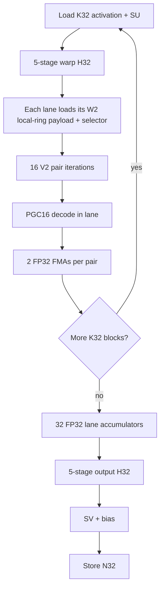

# QVQ V2B2-P32 Local-Ring (LR32) design

Status: **research design / optional format proposal**. This document does not promote or replace the existing
`qvq_v2b2_p32` format. The existing format remains the control and must retain byte-for-byte checkpoint and inference
semantics so LOCAL-RING can be A/B tested until model-quality and hardware gates justify promotion.

The proposed checkpoint format name is:

```text
qvq_v2b2_p32_lr
```

`LR32` is shorthand in this document for **LOCAL-RING, 32 weights per ring**. The format keeps the existing L16/V2
PGC16 reconstruction family and P32 bank granularity, but cuts the 128-transition tile-wide circular dependency into
eight independent 16-transition rings. The hardware-oriented logical tile is `K32 x N8`: each output column contains
one 32-weight P32 ring. This creates an execution geometry in which a 32-lane NVIDIA warp or Apple GPU SIMD-group can
consume one `K32` activation block while 32 lanes independently decode 32 P32 rings for 32 output columns.

A later optional H32 transform mode is designed alongside LR32 because the intended end state is:

```text
P32 ring length = K32 activation block = H32 block = 32 execution lanes
```

However, H32 must **not** be bundled into the first LOCAL-RING quality experiment. Local-ring topology, K-major weight
ordering, and block-Hadamard strength are separate variables and must be measured separately.

Related documents:

- [`qvq.md`](qvq.md): QVQ codec and lifecycle design.
- [`qvq_quant.md`](qvq_quant.md): quantization design.
- [`qvq_inference.md`](qvq_inference.md): native inference design.
- [`qvq_inference_mlx_mps.md`](qvq_inference_mlx_mps.md): Apple/MLX/MPS inference.
- [`qvq_llama32_1b_divergence32_2026-08-25.md`](qvq_llama32_1b_divergence32_2026-08-25.md): current flat-W2 model-quality context.

## 1. Why LOCAL-RING

The current V2B2-P32 format already has the right *rate* granularity for hardware: one bank decision covers 32 weights.
But its state path is still globally circular across all 128 V2 transitions in a 256-weight tile. At W2, each 16-bit
state remembers four 4-bit transitions, so the first states of a P32 segment can depend on transition history from the
previous P32 segment.

All 16 transitions in a current P32 segment are used. The limitation is not that only four transitions are active; the
limitation is that one W2 state has a four-transition history window. In the existing global ring, some of that history
crosses a P32 boundary:

```text
P32 A                              P32 B
... A12 A13 A14 A15 | B0 B1 B2 B3 B4 ... B15

state(B0) = A13 A14 A15 B0
state(B1) = A14 A15 B0  B1
state(B2) = A15 B0  B1  B2
state(B3) = B0  B1  B2  B3
state(B4) = B1  B2  B3  B4
...
```

LOCAL-RING keeps the same 16-bit state and transition width but makes each P32 segment self-contained:

```text
                     P32 B local ring
              +---------------------------+
              |                           |
              v                           |
             B0 B1 B2 ... B13 B14 B15 ----+

state(B0) = B13 B14 B15 B0
state(B1) = B14 B15 B0  B1
state(B2) = B15 B0  B1  B2
state(B3) = B0  B1  B2  B3
...
```

The 16 transitions are still all used. At W2 every transition appears in four consecutive state windows, but all state
history remains inside one P32 ring.

The motivation is not only decoder simplification. A hardware-oriented K-major ring groups 32 weights that contribute
to the **same output dot product**, rather than allowing local trellis history to run across several output neurons.
That may be a better error neighborhood for GEMV, but it is a hypothesis and must be measured.

## 2. What changes and what does not

| Property | Existing `qvq_v2b2_p32` | Proposed `qvq_v2b2_p32_lr` |
|---|---:|---:|
| Trellis window | L16 | L16 |
| Vector size | V2 | V2 |
| Rate range | W1-W3.5 | W1-W3.5 initially |
| Transition width | `E = 2R` | `E = 2R` |
| PGC16 level table | unchanged | unchanged |
| Bank family | canonical + one module-level alternative | unchanged |
| P32 selector | one bit per 32 weights | unchanged |
| Selectors / 256 weights | 8 | 8 |
| Selector bytes / 256 weights | 1 | 1 |
| Weight payload BPW | unchanged | unchanged |
| W2 effective payload | 2.03125 BPW | 2.03125 BPW |
| Circular dependency | one 128-step path | eight 16-step paths |
| Intended logical tile | current 16x16 organization | K32 x N8 |
| Intended small-M execution | generic tile GEMV | 32-lane LR32 kernel |

The LOCAL-RING change does **not** increase state width, transition choices, PGC16 reconstruction capacity, or payload
bits. It changes the dependency topology: which preceding transitions determine a state.

This distinction matters when interpreting model-quality results. Equal BPW and equal nominal path capacity do not
imply equal rate/distortion because K-major ordering and local circular history change which weights are coupled.

## 3. Format identity and fail-closed loading

LOCAL-RING must be a separate format identifier. A runtime boolean on the existing format is not sufficient.

The two formats can have the same tensor shapes, dtypes, and BPW while decoding those bytes with different state
history. A legacy decoder accepting an LR checkpoint could therefore produce plausible but incorrect values without a
shape failure.

Required rule:

```text
format="qvq_v2b2_p32"     -> existing global-ring semantics only
format="qvq_v2b2_p32_lr"  -> LOCAL-RING semantics only
```

A loader for either format must reject the other's serialized format ID. No heuristic detection from tensor shape is
allowed.

The existing `qvq_v2b2_p32` format remains frozen as the A/B control until LR32 passes promotion gates.

## 4. LOCAL-RING reference math

Let one P32 ring contain sixteen V2 transitions:

```text
e[0], e[1], ..., e[15]
```

Each edge contains exactly `E = 2R` bits. Define the circular ring bitstream:

```text
B = e[0] || e[1] || ... || e[15]
```

with total length:

```text
ring_bits = 16 * E
```

For transition `i`, state `s[i]` is the 16-bit circular bit window ending at `e[i]`:

```text
end_bit   = (i + 1) * E
start_bit = end_bit - 16
s[i]      = circular_bits(B, start_bit, 16)
```

Equivalently, this is the same L16 recurrence used by ordinary V2, except wraparound is resolved inside the local
16-transition ring rather than through another P32 segment.

At W2 (`E=4`):

```text
s[0]  = e[13] e[14] e[15] e[0]
s[1]  = e[14] e[15] e[0]  e[1]
s[2]  = e[15] e[0]  e[1]  e[2]
s[3]  = e[0]  e[1]  e[2]  e[3]
...
s[15] = e[12] e[13] e[14] e[15]
```

The decoder then applies the selected V2 bank exactly as existing V2B2-P32:

```text
bank = selector ? module_bank_alt_id : 0
state' = state XOR bank_mask(E, bank)
p = pgc16_mix(state')
w0 = G[p >> 8]
w1 = G[p & 255]
```

`G`, PGC16 mixer constants, FP16 bit patterns, bank masks, and scale normalization remain unchanged.

### 4.1 Rate-dependent local history

The state remains exactly 16 bits. Therefore the approximate number of prior transitions visible to one state is:

| Rate | E | P32 transitions | State history |
|---:|---:|---:|---:|
| W1 | 2 | 16 | 8 transitions |
| W1.5 | 3 | 16 | 6 transitions including a partial oldest edge |
| W2 | 4 | 16 | 4 transitions |
| W2.5 | 5 | 16 | 4 transitions including a partial oldest edge |
| W3 | 6 | 16 | 3 transitions including a partial oldest edge |
| W3.5 | 7 | 16 | 3 transitions including a partial oldest edge |

LOCAL-RING does not increase that history. It makes 100% of the history local to the P32 segment.

## 5. Payload and packing

A 256-weight LR tile still contains:

```text
8 rings * 32 weights/ring = 256 weights
8 rings * 16 transitions/ring = 128 V2 transitions
```

Weight bits are unchanged:

```text
128 transitions * E bits = 128 * (2R) = 256R bits
                         = R bits/weight
```

The eight binary bank selectors still require one byte per 256 weights.

At W2:

```text
weight stream: 256 * 2 bits = 512 bits
bank selectors:               8 bits
                               --------
                               520 bits

520 / 256 = 2.03125 BPW
```

### 5.1 Preserve planar packing first

The initial LR format should retain QVQ's planar edge packing. Do not introduce a second packing scheme until the
math/quality result is known.

Existing planar helpers operate naturally on 32-edge blocks. LR32 has 16-edge semantic rings, so pair two adjacent
rings into one physical 32-edge planar slab:

```text
physical slab 0 = ring 0 edges [0..15] || ring 1 edges [0..15]
physical slab 1 = ring 2 edges [0..15] || ring 3 edges [0..15]
physical slab 2 = ring 4 edges [0..15] || ring 5 edges [0..15]
physical slab 3 = ring 6 edges [0..15] || ring 7 edges [0..15]
```

The physical pack stays efficient while state reconstruction treats each 16-edge half as an independent circular ring.

At W2, one ring has exactly 64 payload bits. Under the existing E=4 planar decomposition, the first 16 edges occupy two
32-bit words and the next ring occupies the next two words. This gives a particularly clean W2 hot path:

```text
one W2 P32 ring = 2 x uint32 = 64 bits
```

Backends may combine those two words into `uint64` if measured faster, but the ABI should remain defined in terms of
canonical planar words. This avoids requiring efficient 64-bit integer ALU on Apple GPUs.

## 6. Hardware-oriented logical geometry

After the pure LOCAL-RING quality gate, the intended hardware layout is:

```text
logical LR tile = K32 x N8 = 256 weights
```

Each N column is one P32 ring:

```text
                         N
                  8 output columns
             +---+---+---+---+---+---+---+---+
K = 0        |   |   |   |   |   |   |   |   |
             |   |   |   |   |   |   |   |   |
             |   |   |   |   |   |   |   |   |
             |   |   |   |   |   |   |   |   |
             |   |   |   |   |   |   |   |   |
K = 31       |   |   |   |   |   |   |   |   |
             +---+---+---+---+---+---+---+---+
               ^
               one column = 32 weights
                          = one P32 local ring
```

Tile count is unchanged:

```text
(K / 32) * (N / 8) = K*N / 256
(K / 16) * (N / 16) = K*N / 256
```

So the number of 256-weight payload records remains the same even though their logical geometry changes.

## 7. Separate LOCAL-RING from H32 in experiments

The target hardware geometry eventually uses a block-diagonal normalized H32 transform because H32 can execute inside
one 32-lane warp/SIMD-group using five shuffle stages.

However, block-H32 changes the incoherence transform and may reduce outlier spreading compared with a full-width
Hadamard. At W2 this can matter more than at W4.

Therefore the first LR checkpoint should keep current QVQ transform semantics. H32 is a second experimental axis and
must be serialized explicitly if promoted because its transformed weight cannot be inferred from tensor shape.

Recommended research sequence:

| Arm | Trellis ordering | Ring topology | RHT |
|---|---|---|---|
| A | current | global | current full transform |
| B | K32 research control | global | current full transform |
| C | K32 | LOCAL-RING | current full transform |
| D | K32 | LOCAL-RING | H32 block transform |

Interpretation:

```text
A -> B : effect of weight ordering / logical tile geometry
B -> C : effect of LOCAL-RING topology
C -> D : effect of H32 rather than full-width transform
```

The B arm may remain an internal research mode and does not need to become a loadable format.

If H32 is promoted, use a separate format ID or a required versioned transform field such as:

```text
qvq_v2b2_p32_lr_h32
```

Do not silently reinterpret `qvq_v2b2_p32_lr` as H32 later.

## 8. Torch oracle first

Torch is the authority. CUDA and MLX must never be used to define the expected LR result.

Recommended readable primitives:

```text
unpack_local_ring_edges()
        |
        v
local_ring_states_from_edges()
        |
        v
decode_local_ring_states()
        |
        v
decode_local_ring_tiles()
        |
        v
reconstruct_local_ring_inner_weight()
        |
        v
qvq_local_ring_dense_oracle_forward()
```

Reference tensor shape after unpacking:

```text
edges:  [tile, 8, 16]
states: [tile, 8, 16]
values: [tile, 8, 16, 2]
```

The state builder should be a direct, readable bit-window implementation first. A faster Torch vectorization may be
added only after it is tested against the readable implementation.

### 8.1 Oracle invariants

The Torch gates must prove all of the following before a native kernel is added:

1. Pack/unpack exactness for every supported rate W1-W3.5.
2. Every recovered state satisfies the local transition recurrence.
3. Ring isolation: mutating ring `r1` cannot change any state/value in ring `r0 != r1`.
4. W2 state windows match the explicit four-nibble equations above.
5. PGC16 decoded values are bit-identical to existing V2 bank decoding for the same `(state, bank)`.
6. Selector packing uses exactly eight bits per 256 weights.
7. Raw/effective BPW matches the existing P32 control.
8. Dense reconstructed weight shape/order is correct for K32 x N8 tiling.
9. Dense FP32 forward matches a direct matrix multiply using the reconstructed LR weight.
10. Save/load/reload reproduces identical `trellis`, selectors, `SU`, `SV`, and dense oracle output.
11. Existing `qvq_v2b2_p32` rejects the LR format ID and LR rejects the old format ID.

### 8.2 Quantization oracle

The cleanest first LR quantizer treats each ring as an independent fixed-bank tail-biting problem:

```text
one target ring [16 steps, V2]
        |
        +---- search canonical bank 0 -------+
        |                                    |
        +---- search module alternate bank --+
                                             |
                                             v
                                  choose lower objective
```

Batch all eight rings for throughput:

```text
[tile, 8, 16, 2] -> [tile*8, 16, 2]
```

Keep the existing QVQ tail-biting approximation/tie policy initially. The first LR experiment should change topology,
not simultaneously introduce a different tail-biting optimizer.

The module-level `bank_alt_id` contract remains unchanged.

## 9. CUDA small-M strategy: Ampere / SM80 first

The first native target is intentionally narrow:

```text
SM80
W2 / E=4
M=1
FP16 and BF16 input
FP32 accumulation/output before the final QVQ epilogue
```

Do not template every rate, M bucket, and dtype until W2/M1 proves the architecture.

### 9.1 Better warp mapping: one lane owns one output

The natural LR32 mapping is **not** one warp per output. One warp should produce 32 outputs in parallel.

```text
lane 0  -> output N+0  -> one P32 local ring
lane 1  -> output N+1  -> one P32 local ring
...
lane 31 -> output N+31 -> one P32 local ring
```

All lanes share the same K32 activation block.

For the optional H32 path, the 32 lanes first load:

```text
lane l = x[k + l] * SU[k + l]
```

and execute the normalized H32 in five XOR-shuffle stages:

```text
mask = 1
mask = 2
mask = 4
mask = 8
mask = 16
```

Then pair iteration `p=0..15` broadcasts the two transformed activation coordinates needed by every output lane:

```text
a0 = shfl(hx, 2*p)
a1 = shfl(hx, 2*p + 1)

lane j:
    state_j = state_from_local_ring(ring_j, p)
    w0, w1 = PGC16(state_j, bank_j)
    acc_j = fma(a0, w0, acc_j)
    acc_j = fma(a1, w1, acc_j)
```

There is **no warp reduction**. Each lane owns and accumulates one output column directly.

After all K32 blocks:

```text
lane 0  contains y0
lane 1  contains y1
...
lane 31 contains y31
```

If H32 output transform is enabled, the same warp immediately performs the five H32 shuffle stages over those 32 FP32
lane accumulators, applies `SV` and bias, and stores 32 outputs.

### 9.2 CUDA flow



Without H32, B and I are omitted while the LR decode/GEMV geometry remains identical.

### 9.3 W2 state extraction

At W2 one local ring contains:

```text
16 transitions * 4 bits = 64 bits
```

Canonical packing exposes that ring as two 32-bit words. State `p` is a 16-bit circular nibble window. The SM80 hot
path should use compile-time shift/or, funnel-shift, or BFE-style extraction over the two 32-bit words. Do not require a
native 64-bit rotate in the ABI.

The performance target is to replace generic cross-segment state reconstruction with a ring-local fixed-width window.

### 9.4 CUDA W2 per-K32xN32 cost model

One warp operating on one K32 x N32 block performs the dense-equivalent 1,024 weight MACs while reading only W2
payloads.

Approximate hot-loop work/traffic:

| Item | W2 K32 x N32 cost |
|---|---:|
| Weight payload | 32 rings x 8 B = 256 B |
| Bank selectors | 32 bits = 4 B |
| Activation values | 32 x 2 B = 64 B for FP16/BF16 |
| Cached compute-dtype SU | 32 x 2 B = 64 B |
| PGC16 states decoded | 32 lanes x 16 = 512 |
| Weight FMAs | 32 lanes x 32 = 1,024 |
| Input H32 | 5 shuffle stages / K32 block when enabled |
| Output H32 | 5 shuffle stages once after K completion when enabled |
| Dense weight materialization | 0 B persistent, 0 B global temporary |

The 512-byte canonical FP16 PGC16 level table remains shared/process-wide. A CUDA CTA may cache it once in shared
memory. Benchmark:

```text
A. one 512-B shared copy
B. 2-4 padded/replicated shared copies to reduce data-dependent bank conflicts
C. read-only/L1 path
D. optional expanded state table only if measured faster
```

Do not make an expanded decoder table part of the checkpoint ABI.

### 9.5 Synchronization and shared-memory goal

The LR32 hot loop should be warp-register driven:

```text
compressed global payload -> lane registers -> PGC16 -> FP32 accumulator
```

Target:

- no `__syncthreads()` in the K loop;
- no shared reconstructed weight tile;
- no shared transformed activation tile for M=1;
- no global transformed activation tensor in the H32-fused path;
- no global pre-output tensor in the H32-fused path.

If the level table is copied to shared memory, one startup CTA barrier is acceptable. If a read-only/L1 placement wins,
even that barrier can disappear.

This directly attacks the barrier/staging pressure seen in the existing CTA-oriented GEMV design.

### 9.6 CTA and split-K dispatch

Benchmark at least:

```text
1 warp / CTA
4 warps / CTA, each warp owns an independent N32 group
```

For small N, one-warp CTAs expose more scheduler-visible blocks. For larger N, four-warps/CTA can amortize shared level
setup and launch overhead.

On an A100-class 108-SM device, N=2048 provides only 64 N32 groups before split-K, so M=1 may need split-K=2 or more to
fill the machine. Dispatch must be derived from runtime SM count, K, N, M, workspace cost, and measured latency rather
than a hard-coded GPU ordinal.

When split-K is used:

```text
warp -> raw FP32 N32 partials
             |
             v
fixed-order split reduction
             |
             v
one output H32
             |
             v
SV + bias
```

Do not apply output H32 independently to every split.

## 10. Hopper and Blackwell transfer

LR32 is a codec/execution geometry, not an Ampere-specific checkpoint.

The small-M kernel depends on:

- 32-lane warp execution;
- warp shuffle/exchange;
- integer shifts/xor/multiply-add;
- FP32 FMA;
- coalesced compressed-weight loads.

That mapping transfers directly to Hopper and Blackwell. The checkpoint remains identical.

Backend strategy:

| Architecture | M=1-small M | Larger M/prefill |
|---|---|---|
| Ampere SM80 | LR32 warp kernel | existing/shared `cp.async` + WMMA-style path |
| Hopper SM90 | LR32 warp kernel | TMA + warpgroup/WGMMA-oriented path |
| Blackwell SM100+ | LR32 warp kernel | TMA/TMEM + architecture-native Tensor Core path |

Do not force WGMMA/TCGen paths onto M=1 merely because the hardware supports them. The LR32 warp kernel is deliberately
small-M and decode-oriented. Large-M paths may decode/reuse larger tiles and feed architecture-specific matrix
engines.

The format metadata should say `ring_weights=32` / `transform_block=32` when applicable, never `cuda_warp=32`.

## 11. Apple GPU / MLX strategy

Apple GPU SIMD-groups are also 32 lanes, so the same lane ownership maps naturally to Metal/MLX:

```text
thread 0  -> output 0 / local ring 0
thread 1  -> output 1 / local ring 1
...
thread 31 -> output 31 / local ring 31
```

Use SIMD-group shuffle/exchange operations for H32 and activation broadcasts. The intended M=1 hot loop requires no
threadgroup exchange between SIMD-groups.

Conceptual Metal/MLX loop:

```text
simd lane l loads x[k+l] * SU[k+l]
        |
        v
5 x simd_shuffle_xor for H32
        |
        v
for p in 0..15:
    a0 = simd broadcast transformed_x[2p]
    a1 = simd broadcast transformed_x[2p+1]
    each lane extracts state p from its own ring
    each lane PGC16-decodes w0,w1
    each lane accumulates two FP32 FMAs
        |
        v
5 x simd_shuffle_xor for output H32
        |
        v
SV + bias + store
```

Add a separate MLX kernel key, for example:

```text
v2b2_p32       # existing
v2b2_p32_lr    # new
```

Do not modify the existing P32 Metal kernel in place.

The same W2 packing should be consumed directly by CUDA and MLX. There must be no backend-specific checkpoint repack.
Backend-only transient repacks are allowed only if they are derived deterministically at `post_init` and measured to
win.

### 11.1 Apple integer note

Do not assume a 64-bit rotate is cheap on Apple GPU. Keep the canonical W2 ring as two `uint32` words and implement the
circular 16-bit window with 32-bit shifts/or unless a 64-bit variant benchmarks faster.

### 11.2 ANE scope

MLX custom kernels execute on Apple GPU, not the Apple Neural Engine. LR32 is designed to be portable as a checkpoint
representation, but ANE execution would require a separate Core ML/compiler path and is not part of the initial LR32
backend contract.

Do not split one fused LR32 linear between GPU decode and ANE GEMM as an initial optimization; the synchronization and
materialization would defeat the design goal of keeping decode and accumulation in one execution group.

### 11.3 Current MLX implementation and measured dispatch

The first MLX implementation keeps the checkpoint ABI above but uses N8 SIMD-group kernels. M=1 uses a dedicated
single-row barrier-free source, while M=2 uses the two-row barrier-free source; both have four lanes cooperate on each
output and accumulate directly from the activation. M>=4 decodes
eight local rings into a K32 x N8 shared tile and accumulates that tile for one or two rows, with a dedicated row-tile
boundary at M=4. W2 combines each ring's two packed words into one circular
64-bit window to derive its sixteen states, avoiding four separate state-start extractions; the split-W2 variants use
the same fast state-start path. The W2 N8 kernels load each compressed word once per SIMD group and distribute it to the
four decoder lanes with SIMD shuffles. The LR production kernel specializes the immutable alternate-bank ID as a Metal
template value, broadcasts selector metadata once per N8 tile, and reads the fixed PGC16-v1 FP16 level table from Metal
constant memory. For small M, N16 is used to reduce threadgroup count and repeated local-ring decode work; this was
revalidated on an AC/performance-mode M4 Max for both N=2048 and N=8192. `QVQMLXLinear` keeps the transformed LR activation in FP32, avoiding the legacy
FP16 row-range/narrow/rescale graph. FP32 production GEMVs use measured shape-specific split-K dispatch for wide FFN
and down-projection shapes; the M=4, K<=2048, N>=8192 case uses the unsplit row-tile-4 path. FP16 output disables
split-K so its reduction preserves the original full-K rounding semantics. No dense weight matrix is materialized.

Run the paired public-path benchmark with:

```text
python scripts/benchmark_qvq_v2b2_p32_lr_mlx.py --warmup 75 --samples 300
```

The benchmark uses synthetic W2 payloads, FP16 activations, FP32 output, matched warmup/sample counts, and explicit
GPU synchronization. With the host on AC performance mode, one uniform 300-sample run from the optimized implementation
reported:

| Shape (M,K,N) | LR p50 (ms) | P32 p50 (ms) | P32/LR | LR p95 (ms) | P32 p95 (ms) |
|---|---:|---:|---:|---:|---:|
| (1,2048,256) | 0.17460 | 0.15150 | 0.87x | 0.24742 | 0.19751 |
| (1,2048,2048) | 0.14656 | 0.15419 | 1.05x | 0.18187 | 0.20963 |
| (1,2048,8192) | 0.17902 | 0.21040 | 1.18x | 0.20878 | 0.25087 |
| (1,8192,2048) | 0.18267 | 0.23867 | 1.31x | 0.20609 | 0.26497 |
| (4,2048,8192) | 0.24633 | 0.56067 | 2.28x | 0.31531 | 1.19448 |
| (8,2048,8192) | 0.37081 | 0.81765 | 2.21x | 0.42078 | 0.88076 |
| (16,8192,8192) | 2.07717 | 5.17087 | 2.49x | 2.15964 | 5.25586 |

This AC/performance-mode run includes the dedicated M=1 source and establishes at least 2x speedup for the representative
M=4, M=8, and M=16 wide projection shapes, while keeping
the same public inference graph and checkpoint rate. The M=1, K=8192 down-projection shape is also above 2x; the M=1,
K=2048 wide projection is only 1.13x and the narrow M=1 shape remains launch-bound. M=4 and M=8 were variable across
the immediate AC repeats, so only M=16 is treated as a stable 2x result from this pair of runs.
Compared with the previous two-row M<=2 source in a same-process synchronized A/B (180 samples per arm), the M=1 source
reduced p50 latency by 4.5%, 6.0%, 9.5%, and 11.6% for the four M=1 shapes in table order (N=256, N=2048, N=8192,
and K=8192,N=2048). These are kernel-level gains; they do not turn the narrow M=1 cases into 2x wins.
These numbers measure the public inner-GEMV path, not end-to-end model latency. Full `QVQMLXLinear` timing also includes
the input/output Hadamard transforms, scale/bias epilogue, and MLX graph overhead. Measurements are host-dependent
and should be repeated on each target Apple GPU.

Before the single-row specialization, an immediate second 300-sample run on the same AC/performance-mode host produced
p50 speedups of `0.90x, 1.28x, 1.32x, 2.16x, 1.05x, 1.13x, 2.48x` in the table's shape order. This confirms that host
scheduling/cache state affects individual dispatch timings; conclusions use synchronized p50/p95 values and do not treat
the noisiest M4/M8 runs as universal guarantees. The M=1 A/B above is the direct paired measurement for the new source.

A separate synthetic full-module benchmark is available with:

```text
python scripts/benchmark_qvq_v2b2_p32_lr_mlx_module.py --warmup 50 --samples 200
```

On the same AC/performance-mode host, one 50-warmup/200-sample run measured:

| Shape (M,K,N) | Full LR p50 (ms) | Full P32 p50 (ms) | P32/LR | Full LR p95 (ms) | Full P32 p95 (ms) |
|---|---:|---:|---:|---:|---:|
| (1,2048,256) | 0.65383 | 0.70235 | 1.07x | 0.97129 | 0.95571 |
| (1,2048,2048) | 0.55608 | 0.53233 | 0.96x | 0.84241 | 0.92769 |
| (1,2048,8192) | 0.61525 | 0.81744 | 1.33x | 1.01985 | 1.28278 |
| (1,8192,2048) | 0.66300 | 0.86631 | 1.31x | 0.96357 | 1.48027 |
| (4,2048,8192) | 0.82758 | 0.81788 | 0.99x | 1.39779 | 1.45551 |
| (8,2048,8192) | 1.07281 | 1.26992 | 1.18x | 1.47251 | 1.59435 |
| (16,8192,8192) | 2.70494 | 5.79129 | 2.14x | 3.00818 | 5.96905 |

These full-module numbers include the Hadamard/scale/epilogue graph and use independent synthetic payloads per format;
they are a sanity check rather than a model-level throughput claim.

#### Latest AC/performance-mode recheck

After enabling AC performance mode, the current implementation was remeasured with the same synthetic payload in one
process. This run used 50 warmup calls and 100 synchronized samples per arm, with immutable `AltBank=2` specialization:

| Shape (M,K,N) | LR p50 (ms) | LR p95 (ms) | LR mean (ms) | LR sd (ms) | P32 p50 (ms) | P32 p95 (ms) | P32 mean (ms) | P32 sd (ms) | P32/LR |
|---|---:|---:|---:|---:|---:|---:|---:|---:|---:|
| (1,2048,256) | 0.2421 | 0.3024 | 0.2526 | 0.0528 | 0.1740 | 0.2107 | 0.1789 | 0.0209 | 0.72x |
| (1,2048,2048) | 0.2484 | 0.3073 | 0.2409 | 0.0610 | 0.1723 | 0.2089 | 0.1778 | 0.0230 | 0.69x |
| (1,2048,8192) | 0.2342 | 0.2817 | 0.2414 | 0.0478 | 0.2406 | 0.2989 | 0.2466 | 0.0225 | 1.03x |
| (1,8192,2048) | 0.2319 | 0.2896 | 0.2420 | 0.0357 | 0.2811 | 0.3167 | 0.2868 | 0.0261 | 1.21x |
| (4,2048,8192) | 0.2693 | 0.3497 | 0.2865 | 0.0697 | 0.6843 | 0.9781 | 0.6915 | 0.1351 | 2.54x |
| (4,8192,2048) | 0.2945 | 0.3471 | 0.3021 | 0.0396 | 0.5147 | 0.5789 | 0.5226 | 0.0286 | 1.75x |
| (8,2048,8192) | 0.3924 | 0.4647 | 0.4007 | 0.0398 | 1.1733 | 1.5632 | 1.1884 | 0.2047 | 2.99x |
| (16,8192,8192) | 2.1793 | 2.2950 | 2.1907 | 0.0611 | 5.2263 | 5.3720 | 5.2299 | 0.0724 | 2.40x |

The corresponding complete-module recheck used 50 warmup calls and 80 synchronized samples:

| Shape (M,K,N) | Full LR p50 (ms) | Full LR p95 (ms) | Full P32 p50 (ms) | Full P32 p95 (ms) | P32/LR |
|---|---:|---:|---:|---:|---:|
| (1,2048,256) | 0.4259 | 0.7061 | 0.6012 | 0.8232 | 1.41x |
| (1,2048,2048) | 0.4633 | 0.8036 | 0.6232 | 0.8760 | 1.35x |
| (1,2048,8192) | 0.5865 | 1.0950 | 0.5629 | 1.2338 | 0.96x |
| (1,8192,2048) | 0.5637 | 1.1088 | 0.5843 | 1.3053 | 1.04x |
| (4,2048,8192) | 0.5984 | 1.3258 | 0.8069 | 0.8998 | 1.35x |
| (4,8192,2048) | 0.5864 | 1.3130 | 0.8267 | 0.8839 | 1.41x |
| (8,2048,8192) | 0.6809 | 0.7996 | 1.1681 | 1.2699 | 1.72x |
| (16,8192,8192) | 2.7584 | 2.9628 | 5.7320 | 5.8428 | 2.08x |

These latest numbers are timing evidence for this AC/power-mode state, not universal device guarantees. The inner LR
kernel exceeds 2x on representative wide M4/M8/M16 shapes; complete-module LR exceeds 2x only at M16 in this recheck.

#### AC/performance-mode M1 N16 dispatch recheck

The previous table predates the small-row N16 policy update. With AC power and performance mode enabled, a paired
M1/M2 sweep found N16 faster than N8 for every tested small-row shape. The production complete-module benchmark used
50 warmup calls and 120 synchronized samples per format:

| Shape (M,K,N) | Full LR p50 (ms) | Full P32 p50 (ms) | P32/LR |
|---|---:|---:|---:|
| (1,2048,256) | 0.70656 | 0.81794 | 1.16x |
| (1,2048,2048) | 0.77479 | 0.82725 | 1.07x |
| (1,2048,8192) | 0.49392 | 0.56488 | 1.14x |
| (1,8192,2048) | 0.59487 | 0.62975 | 1.06x |
| (4,2048,8192) | 0.56729 | 0.80917 | 1.43x |
| (8,2048,8192) | 0.70498 | 1.18560 | 1.68x |
| (16,8192,8192) | 2.62131 | 5.57840 | 2.13x |

The M1 kernel recheck matched the prior output within relative L2 below `5e-7` while changing only the small-row
output grouping. An M1 K2048 N8192 Metal System Trace captured the specialized
`...lr_small_fp32_split2_n16_m1_vec_alt2...` kernel. The trace shows the expected small-row path; it does not expose
Apple hardware stall/occupancy counters on this target. `xctrace` listed Metal GPU Counters, but the counter profile
returned “Selected counter profile is not supported on target device”.

The public inner-kernel benchmark was also rerun after the policy change with 75 warmup calls and 200 synchronized
samples. This path includes the MLX LR split-K reduction but not the complete-module Hadamard/epilogue graph:

| Shape (M,K,N) | LR p50 (ms) | P32 p50 (ms) | P32/LR | LR p95 (ms) | P32 p95 (ms) |
|---|---:|---:|---:|---:|---:|
| (1,2048,256) | 0.23262 | 0.27027 | 1.16x | 0.37735 | 0.38793 |
| (1,2048,2048) | 0.18602 | 0.16102 | 0.87x | 0.23530 | 0.21842 |
| (1,2048,8192) | 0.20040 | 0.21556 | 1.08x | 0.21663 | 0.23354 |
| (1,8192,2048) | 0.22312 | 0.25954 | 1.16x | 0.24804 | 0.28049 |
| (4,2048,8192) | 0.26267 | 0.47321 | 1.80x | 0.28311 | 0.54235 |
| (8,2048,8192) | 0.37919 | 0.82333 | 2.17x | 0.40121 | 0.87779 |
| (16,8192,8192) | 2.05342 | 5.09027 | 2.48x | 2.13184 | 5.16288 |

#### Native MLX Hadamard recheck

For power-of-two widths supported by MLX, QVQ now uses the fused `mx.hadamard_transform` instead of constructing the
butterfly with repeated reshape/stack/add/sub operations. The normalized scale is passed explicitly, and non-power-of-
two QVQ widths continue using the existing factored path. The native transform matched the previous implementation at
approximately `2e-7` relative output error in the M1/M8 checks. The complete-module benchmark below used 60 warmup
calls and 160 synchronized samples per format on the same AC/performance-mode M4 Max:

| Shape (M,K,N) | Full LR p50 (ms) | Full P32 p50 (ms) | P32/LR | Full LR p95 (ms) | Full P32 p95 (ms) |
|---|---:|---:|---:|---:|---:|
| (1,2048,256) | 0.29342 | 0.41129 | 1.40x | 0.33114 | 0.45899 |
| (1,2048,2048) | 0.23096 | 0.25771 | 1.12x | 0.25879 | 0.26874 |
| (1,2048,8192) | 0.26315 | 0.32142 | 1.22x | 0.28021 | 0.33614 |
| (1,8192,2048) | 0.25342 | 0.33687 | 1.33x | 0.32271 | 0.34805 |
| (4,2048,8192) | 0.31869 | 0.57031 | 1.79x | 0.34465 | 0.62908 |
| (8,2048,8192) | 0.40975 | 0.91535 | 2.23x | 0.44165 | 0.98032 |
| (16,8192,8192) | 2.12323 | 5.17300 | 2.44x | 2.17138 | 5.27063 |

This comparison is between the current native-Hadamard checkout and the same MLX implementation's P32 control. Both
formats receive the graph optimization; it changes neither BPW nor the LR32 kernel ABI.

#### Pushed-checkout randomized AC/performance-mode recheck

After the rejected H32 probe was removed, the clean `a7df1139` checkout was rechecked on the plugged-in,
performance-mode M4 Max. Each row used the same input and randomized interleaving of 100 LR/P32 samples after one
warmup call for each arm; every sample forced `mx.eval()` and `mx.synchronize()`. This avoids the large ordering bias
seen in sequential MLX timings. Complete-module results were:

| Shape (M,K,N) | LR p50 (ms) | P32 p50 (ms) | P32/LR | LR p95 (ms) | P32 p95 (ms) |
|---|---:|---:|---:|---:|---:|
| (1,2048,256) | 0.63381 | 0.72704 | 1.15x | 2.57688 | 4.43331 |
| (1,2048,2048) | 0.49677 | 0.65094 | 1.31x | 2.12641 | 2.03458 |
| (1,2048,8192) | 0.73154 | 1.12662 | 1.54x | 2.98602 | 2.51994 |
| (1,8192,2048) | 0.76283 | 1.13223 | 1.48x | 1.36160 | 2.53017 |
| (4,2048,8192) | 1.21552 | 2.59315 | 2.13x | 3.81650 | 6.95502 |
| (8,2048,8192) | 0.90396 | 2.03660 | 2.25x | 1.88381 | 4.40024 |
| (16,8192,8192) | 2.49333 | 5.63358 | 2.26x | 3.88162 | 7.72514 |

The corresponding inner `qvq_mlx_gemv` recheck used the same randomized 100-sample protocol:

| Shape (M,K,N) | LR p50 (ms) | P32 p50 (ms) | P32/LR | LR p95 (ms) | P32 p95 (ms) |
|---|---:|---:|---:|---:|---:|
| (1,2048,256) | 0.23304 | 0.27027 | 1.16x | 0.40981 | 0.40377 |
| (1,2048,2048) | 0.26627 | 0.27675 | 1.04x | 0.65451 | 0.30722 |
| (1,2048,8192) | 0.28315 | 0.35321 | 1.25x | 0.43945 | 0.55783 |
| (1,8192,2048) | 0.22988 | 0.27702 | 1.21x | 0.29521 | 0.31121 |
| (4,2048,8192) | 0.26665 | 0.47108 | 1.77x | 0.32421 | 0.57449 |
| (8,2048,8192) | 0.37831 | 0.81604 | 2.16x | 0.42441 | 0.89820 |
| (16,8192,8192) | 2.16567 | 5.12169 | 2.37x | 2.32365 | 5.27084 |

The full-module table is the production-relevant result: LR is faster for every tested shape and clears 2x at M4,
M8, and M16. The inner table shows why M1/M2 are not 2x yet: their LR decode is already competitive, while MLX
launch, split reduction, and full-Hadamard costs dominate the module boundary.

#### Latest AC/performance-mode split-K recheck

The small-M FP32 policy was subsequently changed from split-2 to split-4 for wide short-K modules, and to split-8 for
long-K down projections. In a paired 150-sample complete-module comparison, split-4 versus split-2 reduced p50 from
`0.85088 ms` to `0.80094 ms` for `(M=1,K=2048,N=8192)` and from `0.84133 ms` to `0.80137 ms` for `(M=2,K=2048,N=8192)`.
The corresponding inner-GEMV p50 changed from `0.67381 ms` to `0.65473 ms` for M1; M2 was statistically neutral at
`0.68613 ms` versus `0.68929 ms`. Output parity was exact in these split comparisons.

The production module benchmark was rerun with 60 warmup calls and 160 synchronized samples after this policy change:

| Shape (M,K,N) | LR p50 (ms) | P32 p50 (ms) | P32/LR | LR p95 (ms) | P32 p95 (ms) |
|---|---:|---:|---:|---:|---:|
| (1,2048,256) | 0.29210 | 0.39269 | 1.34x | 0.32613 | 0.44571 |
| (1,2048,2048) | 0.21140 | 0.23127 | 1.09x | 0.24128 | 0.25406 |
| (1,2048,8192) | 0.23850 | 0.29792 | 1.25x | 0.25951 | 0.32755 |
| (1,8192,2048) | 0.24354 | 0.30925 | 1.27x | 0.26330 | 0.34461 |
| (4,2048,8192) | 0.29790 | 0.54356 | 1.83x | 0.33380 | 0.64917 |
| (8,2048,8192) | 0.40596 | 0.89542 | 2.21x | 0.45401 | 0.95833 |
| (16,8192,8192) | 2.16085 | 5.18069 | 2.40x | 2.34851 | 5.34035 |

This recheck confirms the policy change improves the latency-sensitive M1 wide case, while the complete-module 2x
target remains strongest at M8/M16 because M1--M4 include a larger fixed transform/launch fraction.

#### AC/performance-mode rejected probes

Two additional same-process probes were run on the plugged-in M4 Max and were not promoted to production. Metal
`math_mode="fast"` was numerically exact in the tested W2 module comparisons (`max relative output difference = 0`) but
was effectively neutral at M1--M8 and slower at M16:

| Shape (M,K,N) | Safe p50 (ms) | Fast p50 (ms) | Fast/Safe |
|---|---:|---:|---:|
| (1,2048,8192) | 0.37896 | 0.37723 | 0.995x |
| (4,2048,8192) | 0.29606 | 0.29454 | 0.995x |
| (8,2048,8192) | 0.40692 | 0.40571 | 0.997x |
| (16,8192,8192) | 2.13598 | 2.24817 | 1.053x |

An isolated W2 N32 M1 kernel briefly improved the inner `K=2048,N=8192` dispatch by about 4.7%, but complete-module
paired timing regressed because the wider tile increased register/local-ring work and did not amortize the surrounding
graph. Relative to N16, complete-module p50 was `1.133x` at `(1,2048,8192)` and `1.183x` at `(1,8192,8192)`. N16
therefore remains the small-row policy. These probes are recorded to prevent treating an inner-kernel result as an
end-to-end module win.

A W2-only M1/N16 decode-loop unroll that processes two adjacent pairs per iteration was also oracle-correct, but the
complete-module gain was too small and shape-specific to retain. An interleaved 220-sample comparison at
`(M=1,K=2048,N=8192)` changed p50 from `0.32552 ms` to `0.32260 ms` (`0.991x`), while a separate long-K probe at
`(M=1,K=8192,N=2048)` regressed to `1.128x` of the baseline. The production loop remains unchanged.

A clean-room W2 N32 M1 prototype was also tested after the current activation-sharing and packed-word changes. It
passed the current LR oracle (`3.3e-7` relative error at `(M=1,K=2048,N=8192)` and `4.7e-7` at
`(M=1,K=8192,N=2048)`), but one output per lane increased register/decode work: interleaved inner p50 was `1.428x`
of N16 for `K=2048,N=8192` and `1.174x` for `K=8192,N=2048`. N16 remains the production small-row tile.

A W2 lookup-register probe kept PGC16 values as `half2` until the FP32 multiply. It was oracle-exact and reduced
isolated inner p50 to `0.981x` of the current path at `(M=1,K=2048,N=8192)` and `0.969x` at
`(M=1,K=8192,N=2048)`, but complete-module p50 changed to `1.228x` and `0.983x`, respectively. The wide-module
regression shows that the apparent lookup win does not survive the surrounding MLX graph, so the existing float2
lookup remains production.

A compact W2 state-to-PGC-index permutation table was also tested to replace the integer mixer arithmetic while
retaining the normal 256-entry FP16 level table. It was exactly parity-safe, but random constant-table access was
slower than the arithmetic path: interleaved inner p50 was `1.129x` of current at `(M=1,K=2048,N=8192)` and
`1.084x` at `(M=1,K=8192,N=2048)`. The arithmetic mixer remains production.

A corrected barrier-free M4 register-only probe was also oracle-correct, but did not improve the complete module. At
`(M=4,K=2048,N=8192)`, inner p50 was `0.43950 ms` for the current decoder versus `0.43948 ms` for the register probe,
while complete-module p50 was `0.31408 ms` versus `0.40544 ms`. At `(M=4,K=8192,N=2048)`, inner p50 was `0.28675 ms`
versus `0.40150 ms`, and complete-module p50 was `0.31742 ms` versus `0.31123 ms`; the latter small difference is not
enough to justify a second M4 path. The probe was not retained.

Finally, a fixed Metal split-K reduction was compared with MLX's `mx.sum` on the partial buffer. Inner p50 ratios
`custom/generic` were `1.015x` for `(M=1,K=2048,N=8192)`, `0.984x` for `(M=1,K=8192,N=2048)`, and `0.925x` for
`(M=2,K=2048,N=8192)`. Because the result is shape-dependent and was not yet measured at complete-module level, the
generic reduction remains the production choice.

A follow-up prototype fused the split-K reduction with the first local H32 factor, leaving only the outer Hadamard
factor for the complete module. The transform was oracle-correct (FP32 relative error was at most `1.2e-7` in the
tested shapes), but a randomized interleaved 120-sample complete-module A/B on the AC/performance-mode M4 Max was
neutral at the module boundary: fused/plain p50 ratios were `1.004x` for `(M=1,K=2048,N=8192)`, `1.005x` for
`(M=2,K=2048,N=8192)`, and `0.988x` for `(M=1,K=8192,N=2048)`. The additional kernel and five H32 threadgroup
barriers did not beat MLX's native Hadamard implementation, so this fusion is rejected and the generic reduction plus
native full Hadamard remain the production path.

A second prototype fused split-K reduction directly into the single-row W2/N16 SIMD threadgroup. It produced exact
FP32 output parity with the generic reduction and improved isolated inner p50 in some trials (for example, `0.54669`
versus `0.56002 ms` at `(M=1,K=2048,N=8192)`), but the complete-module A/B was not consistently better: the same
shape was only `0.961x` fused/plain at p50, `(M=1,K=8192,N=2048)` was `1.012x`, and `(M=2,K=2048,N=8192)` was
`0.999x`. Because the separate reduction remains part of the module's transform/epilogue graph, this kernel-only
optimization is not promoted; `mx.sum` remains the production reduction until a genuinely fused module epilogue is
available.

### 11.4 Metal profiling findings

The M4 Max was plugged into AC power with performance mode enabled (`pmset` AC `powermode=2`). Profiling used MLX's
Metal GPU capture (`MTL_CAPTURE_ENABLED=1`, producing a `.gputrace`) and Xcode Instruments' **Metal System Trace**.
The bounded workload is reproducible with [`scripts/profile_qvq_mlx_metal.py`](../scripts/profile_qvq_mlx_metal.py).
Captures were made for M1 K2048 N8192, M4 K2048 N8192, and M8 K2048 N8192 after 20–30 warmup calls and 8 active
calls. Artifacts were kept outside the repository:

| Artifact | Size | Purpose |
|---|---:|---|
| `/tmp/qvq-metal-profile-c2edaec9-m1-system.trace` | 105 MB | M1 System Trace |
| `/tmp/qvq-metal-profile-c2edaec9-m4-system.trace` | 67 MB | M4 System Trace |
| `/tmp/qvq-metal-profile-c2edaec9-m8-current-system.trace` | 66 MB | M8 System Trace |
| `/tmp/qvq-metal-profile-c2edaec9-m8-current2.gputrace` | 183 MB | M8 Xcode GPU Frame Capture bundle |
| `/tmp/qvq-metal-profile-c2edaec9-m8-counters2.trace` | 73 MB | Counter attempt with System Trace |
| `/tmp/qvq-metal-profile-ac2-m1-system.trace` | 105 MB | AC/performance-mode M1 System Trace |
| `/tmp/qvq-metal-profile-ac2-m8-system.trace` | 66 MB | AC/performance-mode M8 System Trace |

The System Trace command used an absolute interpreter:

```text
xctrace record --template 'Metal System Trace' --output /tmp/qvq-metal-profile-<shape>-system.trace --launch -- \
  /Library/Frameworks/Python.framework/Versions/3.10/bin/python3 \
  /Users/diego/tmp-omni-workspace/QvQ/scripts/profile_qvq_mlx_metal.py \
  --m <M> --k <K> --n <N> --warmup 20 --active-calls 8
```

The trace confirmed the production dispatches and exposed the following execution costs:

| Path | Trace/source observation | Decision |
|---|---|---|
| M=1/2 small-row | no `threadgroup_barrier`; M1 vector/scalar activation-sharing sources use SIMD shuffles and direct reductions | keep in production |
| M=4 | M4 cooperative source uses both SIMD groups for the eight-ring decode; two barriers remain per K32 decode/consume iteration | enabled only for `split_k=1` on `applegpu_g16*` |
| M=8/16 legacy multirow | two `threadgroup_barrier` calls per K32 decode/consume iteration; legacy decode is performed by SIMD group 0 while sibling groups wait | keep legacy on M4 Max after cooperative A/B lost/was neutral |
| M8 MMA experiment | no threadgroup barriers, but one SIMD group and matrix setup underfill the GPU | kept oracle-tested but disabled in production |
| selector metadata | one selector byte is shared by every ring in an N8 tile | implemented as one lane-0 load plus SIMD broadcast |
| W2 N8 compressed words | each packed word is shared by four decoder lanes | implemented as one load per word plus SIMD shuffle |
| PGC16 levels | fixed 256-entry FP16 codebook is reused by every decoder | embedded in Metal constant memory; no per-threadgroup LUT copy |

The controlled same-process M8 A/B measured the MMA experiment at approximately 0.495 ms versus 0.234 ms for the existing
multirow path, so removing barriers alone was not sufficient. The current M4 cooperative decoder is exact and measured
at `1.01–1.23x` legacy speed across representative K/N shapes; the wide K2048 N8192 case was the strongest. It is
architecture-gated to `applegpu_g16*`. A valid M4 K8192 N2048 shape selects split-K=8, so production dispatch explicitly
falls back to the legacy decoder rather than attempting the M4 cooperative source, which requires split-K=1.

An additional oracle-tested cooperative decoder distributed the eight independent rings across the available SIMD groups
while preserving the sequential per-ring state recurrence. It passed 24 M8/M16 tests covering W1 through W3.5 and both
output dtypes, but a synchronized same-process A/B on this M4 Max measured legacy/cooperative p50 ratios of `0.86x` for
M8 (cooperative slower) and `0.99x` for M16 (parity). It is therefore retained behind `_USE_LR_COOPERATIVE_DECODE` and
disabled in production; its result does not justify replacing the current decoder on this device.

The GPU counter profile was unavailable on this host. `xctrace` accepted the additional **Metal GPU Counters** instrument
but reported `Selected counter profile is not supported on target device`; the standalone template name was also not
available in this Xcode installation. Therefore this report does not claim hardware occupancy, register, cache, or
stall-counter percentages. The trace and source support these structural conclusions:

The corrected AC/performance-mode captures completed successfully with Xcode 26.6: the M1 trace ran for `9.46 s` and
the M8 trace for `23.28 s`, both with eight active calls after warmup. The M1 trace contains separate compute submissions
for the small-row LR kernel and its split-K reduction, confirming that the remaining M1 opportunity is a fused
reduction/epilogue or graph-boundary optimization rather than another decode-barrier removal. The M8 trace keeps the
multirow LR work in the expected single-kernel path. These captures are structural evidence only; the absent supported
counter profile means they do not provide occupancy, cache, register-spill, or hardware stall percentages.

| Opportunity | Dependency/evidence | Next action |
|---|---|---|
| M1 launch/decoder overhead | The targeted M1 K2048 wide-N route now uses N64 grouping with one K slice and no separate split-K reduction; M1 source has one activation-sharing barrier per K32 tile | pursue decoder/launch specialization only with exact full-module A/B evidence |
| M8/M16 decode overlap | legacy source gates decode on `simd==0`; sibling SIMD groups wait at two barriers per K32 tile | cooperative decode was oracle-correct but slower/neutral in prior A/B; keep as opt-in experiment |
| M4 decode overlap | two SIMD groups can split four rings each; current source is exact and faster on wide K2048 N8192 | retain architecture/shape gate; benchmark split-K fallback separately |
| full-module graph boundaries | inner kernel gains are reduced by Hadamard/epilogue work at M1–M4 | profile/fuse outer-H/H32 and fixed reduction only after full-module A/B |

The W2 load-once/shuffle optimization, selector broadcast, PGC16 constant table, M1 activation sharing, and M4
cooperative decode are implemented and covered by the LR oracle tests. The `.gputrace` bundle is intended for manual
inspection in Xcode GPU Frame Capture; it is not a checkpoint artifact.

## 12. YAQA integration

Current YAQA correction/feedback geometry is 16x16. LR32's hardware tile is 32x8. Do not rewrite YAQA before the local
ring math/quality gate.

Use this staged plan:

### Phase A: topology experiment

Run LOCAL-RING under the existing transform/YAQA lifecycle as far as possible. This isolates whether local history
itself helps or hurts.

### Phase B: K32x8 codec oracle

Prove the hardware-oriented reconstruction and dense forward independently of YAQA.

### Phase C: decouple YAQA correction geometry from codec geometry

A 32x16 corrected region can be formed from two adjacent 16x16 YAQA input blocks:

```text
YAQA top    16 x 16
YAQA bottom 16 x 16
-------------------
combined    32 x 16
```

Then split output columns:

```text
32 x 16 -> [32 x 8 LR tile A] + [32 x 8 LR tile B]
```

Quantize the two LR tiles, reconstruct them, reassemble the two original 16x16 correction blocks, and apply existing
YAQA feedback updates in the original coordinate system.

This keeps the two-sided Hessian/feedback math independent from codec tile shape.

## 13. Potential benefits

### 13.1 Same BPW, cleaner dependency boundary

At W2 the format remains 2.03125 BPW while all four-transition state history stays inside one P32 ring.

### 13.2 Trellis neighborhood aligns with one output dot product

K32 local rings couple 32 weights from one output column. That matches GEMV's actual reduction direction and may give a
more useful local error neighborhood than row-major coupling across output neurons.

### 13.3 Independent ring quantization

Eight ring searches can be batched/parallelized. Bank choice becomes one fixed two-bank competition per ring rather
than a segmented global recurrence.

### 13.4 Extremely cheap W2 state addressing

A ring is 64 bits at W2. The 16 L16 states are fixed circular 16-bit windows over that payload.

### 13.5 Warp/SIMD-register inference

The intended M=1 kernel can eliminate hot-loop CTA barriers, decoded shared tiles, separate transformed-input traffic,
and separate transformed-output traffic when H32 is enabled.

### 13.6 Cross-vendor geometry

The 32-wide design maps to NVIDIA warps across Ampere/Hopper/Blackwell and Apple GPU SIMD-groups without changing
checkpoint bytes.

### 13.7 No persistent dense/dequantized cache

PGC16 remains decoded directly from the compressed path stream. Optional derived decoder tables remain implementation
choices, never checkpoint payload.

## 14. Potential downsides / risks

### 14.1 Different trellis dependency topology may hurt quality

Nominal capacity is unchanged, but local rings replace cross-P32 history with local wrap history. Rate/distortion can
change even at identical BPW.

### 14.2 K-major ordering may help or hurt

Grouping one output's K32 weights is hardware-natural but changes which weights are neighboring trellis states. The
B control arm is required to separate ordering effects from local-ring effects.

### 14.3 H32 is weaker incoherence processing than full-width RHT

A full transform spreads an outlier over many more coordinates. H32 only spreads within 32 values. W2 may be sensitive
to this reduction in mixing. H32 must earn promotion separately.

### 14.4 Small-M specialization does not replace the prefill path

M=1/2 decode and M>=16 prefill have different bottlenecks. Do not force the warp LR32 kernel onto large-M Tensor Core
workloads if a tiled decoder/MMA path wins.

### 14.5 Split-K may be required for narrow N

N32 work groups alone can underfill a large GPU. Split-K adds workspace and reduction traffic and must be dispatch
selected by measurement.

### 14.6 PGC16 table access can become a bank-conflict bottleneck

The tiny level table is attractive, but data-dependent indices can conflict in shared memory. Replicated/padded shared,
read-only cache, and expanded decoder alternatives must be benchmarked.

### 14.7 Format proliferation

`qvq_v2b2_p32_lr` and a possible H32 variant add ABI surface. Keep old P32 frozen and do not add more format IDs until a
measured quality/performance distinction requires them.

### 14.8 YAQA plumbing becomes more complex

The correction tile and codec tile no longer share the same 16x16 geometry. The implementation must keep those concepts
separate rather than rewriting Hessian math around a hardware tile.

### 14.9 Compile explosion is possible

Current CUDA already specializes many transition widths and M buckets. Start LR32 with W2/M1 and add specializations
only after profiling identifies a win.

### 14.10 Deterministic tie behavior matters

Short 16-step rings may expose many equivalent/tied paths. The Torch oracle must pin tie-breaking, selected states,
selector IDs, packed bytes, and loss before native implementations are accepted.

## 15. Promotion and A/B gates

LOCAL-RING stays optional until all of the following are satisfied.

### 15.1 Torch correctness

- readable local-state reference implemented;
- exact pack/unpack/state/decode tests W1-W3.5;
- exact ring isolation tests;
- dense reconstruction and forward oracle;
- save/load/reload and fail-closed format tests.

### 15.2 Model quality

At minimum compare A/B/C and later D on the same fixed model/calibration/held-out manifests:

```text
A existing P32 global
B K32 global research control
C K32 LOCAL-RING
D K32 LOCAL-RING + H32
```

Report local reconstruction, Final KL, teacher-forced token overlap, shared-prefix metrics, and independent rollout
metrics. A LOCAL-RING improvement that appears only on shared-prefix/teacher-forced metrics is not sufficient evidence
for broad post-quant recovery.

### 15.3 CUDA correctness/performance

First gate: SM80 W2 M=1 FP16/BF16.

- bit/state decode parity to Torch for adversarial/random rings;
- complete inner GEMV parity;
- complete `QVQLinear` parity after transform fusion;
- non-default streams, deterministic replay, CUDA Graph capture;
- no persistent dense weight;
- benchmark one-warp vs multi-warp CTA;
- benchmark split-K thresholds;
- report registers, shared memory, occupancy, barrier stalls, integer-pipe utilization, L1/L2 traffic, and complete
  module latency.

### 15.4 MLX correctness/performance

First gate: W2 M=1 FP16.

- same packed LR checkpoint as CUDA/Torch;
- exact decoded-weight parity to Torch;
- dense/inner output parity;
- fused H32 path only after inner kernel passes;
- compare SIMD-only hot loop against existing selector-aware P32 MLX kernel;
- report complete QVQ linear latency, not only inner kernel time.

## 16. Recommended implementation order

1. Add the `qvq_v2b2_p32_lr` format enum/config validation without enabling native inference.
2. Implement readable Torch ring unpack/state/decode/reconstruction oracle.
3. Add pack/unpack/ring-isolation/BPW/save-load tests.
4. Implement Torch LOCAL-RING quantization using the existing PGC16 banks and existing tail-biting policy.
5. Run A/B/C quality sweep with the current full transform.
6. If C is non-regressing, implement K32x8 dense reconstruction/order explicitly and pin it in the format.
7. Add W2/M1 SM80 LR inner GEMV without H32 fusion; compare to Torch.
8. Add W2/M1 MLX LR inner GEMV without H32 fusion; compare to Torch.
9. Add explicit H32 research mode and run C vs D quality.
10. Only if D passes quality, fuse input/output H32 into CUDA and MLX LR kernels.
11. Tune split-K and PGC16 table placement.
12. Extend small-M rates/M buckets only where measured useful.
13. Add Hopper/Blackwell large-M staging/MMA paths without changing checkpoint bytes.
14. Promote LR32 only after model quality, lifecycle, reload, CUDA, and Apple gates pass.

## 17. Final target

The final small-M execution target is one backend-neutral LR32 checkpoint with architecture-specific kernels:

```text
                         K32 activation block
                                 |
                       optional x * SU + H32
                                 |
          +----------------------+----------------------+
          |                      |                      |
       lane 0                 lane 1                lane 31
      output 0               output 1              output 31
     local ring 0           local ring 1          local ring 31
          |                      |                      |
      16 V2 states           16 V2 states          16 V2 states
          |                      |                      |
      PGC16 decode           PGC16 decode          PGC16 decode
          |                      |                      |
      FP32 accumulate        FP32 accumulate       FP32 accumulate
          +----------------------+----------------------+
                                 |
                       optional output H32
                                 |
                              SV + bias
                                 |
                            32 output values
```

The core design principle is:

```text
make the sophisticated quantizer look simple to the hardware
```

LOCAL-RING does that without buying speed by increasing BPW or serializing a dense/codebook cache. It makes the existing
L16/V2 state capacity local to a hardware-sized P32 unit, then lets CUDA and Metal consume that unit directly with
32-lane execution.

### 18. Rejected W2 M1 bank-mask specialization

The W2 M1/N16 vector kernel was experimentally specialized for each immutable
alternate-bank ID. The specialization kept the selector bit dynamic but
embedded the alternate-bank XOR mask in the Metal source. It was exact for
alternate-bank IDs 1, 2, and 3 and passed the Torch oracle at the production
M=1/N=2048 shape.

It was rejected at the complete `QVQMLXLinear` boundary. On the AC/performance
mode M4 Max, a randomized same-process 150-sample A/B measured candidate over
baseline p50 ratios of `1.001x` for `(M=1,K=2048,N=8192)` and `1.012x` for
`(M=1,K=8192,N=2048)`; the corresponding speedups were `0.999x` and `0.989x`.
The optimization is therefore not enabled. This reinforces the promotion
rule: an inner-kernel change must improve the complete module, including MLX
dispatch, transforms, and split-K reduction, before being retained.

### 19. Current M1 profiling and split-K recheck

With the M4 Max connected to AC power and performance mode enabled, a bounded
Metal System Trace was captured for the current M1 W2 workload:

```text
xcrun xctrace record --template "Metal System Trace" \
  --output /tmp/qvq-metal-profile-ac-performance-m1-current.trace \
  --launch -- /Library/Frameworks/Python.framework/Versions/3.10/bin/python3 \
  scripts/profile_qvq_mlx_metal.py --m 1 --k 2048 --n 8192 \
  --bits 2 --warmup 20 --active-calls 20
```

The 15.62-second trace completed successfully on macOS 26.6/Xcode 26.6. The
Metal System Trace reported no counter set and disabled shader timeline on
this target, so no occupancy or stall percentages are inferred. Source and
dispatch inspection confirms that the production M1 path is the barrier-free
small-row kernel; its remaining fixed cost is the split-K partial reduction
and the surrounding Hadamard operations.

A synchronized randomized 60-sample-per-arm complete-module sweep on the same
AC/performance-mode host compared split-K values:

| Shape | split 1 p50 | split 2 p50 | split 4 p50 | best |
|---|---:|---:|---:|---:|
| (M=1,K=2048,N=256) | 0.47708 ms | 0.38425 ms | **0.32873 ms** | 4 |
| (M=1,K=2048,N=2048) | 0.44692 ms | 0.37723 ms | **0.33852 ms** | 4 |

The long-K/narrow and short-K/wide policies remain split-8 and split-4,
respectively. These measurements do not justify another split-policy change.

The same M1 reduction boundary was also tested with a fixed-size pairwise
split-2/4/8 epilogue. It preserved the FP32 oracle within `8.4e-7` relative
L2 on the wide production shape, but was slower than MLX's native `mx.sum` at
the complete-module boundary: candidate/baseline p50 ratios were `1.021x`
for `(M=1,K=2048,N=8192)`, `1.127x` for `(M=1,K=8192,N=2048)`, and `1.053x`
for `(M=2,K=2048,N=8192)`. The native reduction remains enabled.

An additional wide-generation check used `(M=1,K=8192,N=8192)` with 100
randomized samples per arm on the same host. Complete-module p50 was
`0.61600 ms` for LR32 versus `0.90858 ms` for P32 (`1.475x` faster), with
p95 values of `0.74687 ms` and `1.17481 ms`, respectively. LR32 remains
faster, but this confirms that a universal 2x M1 claim would require fusing
the full-Hadamard/dispatch graph, not another LR decode or split-K tweak.

A W2 M1/N16 state-initialization probe replaced the 64-bit packed-window
helper with a two-case 32-bit initializer for the only requested pair starts
(0 and 8). It was oracle-correct, but complete-module candidate/baseline p50
ratios were `1.018x` for `(M=1,K=2048,N=8192)`, `0.997x` for
`(M=1,K=8192,N=2048)`, and `1.029x` for `(M=2,K=2048,N=8192)`. The existing
64-bit helper remains enabled because the specialization did not provide a
reliable end-to-end win.

### 20. Rejected fused scale/Hadamard probe

An experimental MLX Metal kernel fused the elementwise `x * SU` with the
normalized power-of-two Hadamard transform. The implementation was checked
against native MLX Hadamard output at widths 2,048 and 8,192, with exact
parity in the tested FP32 cases (relative L2 `0.0`, maximum absolute error
`0.0`). It was not promoted because native MLX remains faster for this
operation and the complete module did not improve.

On the AC/performance-mode M4 Max, using the same payload and synchronized
randomized interleaving, 100 samples per arm measured:

| Shape | native full module p50 / p95 (ms) | fused input-H p50 / p95 (ms) | fused/native speedup |
|---|---:|---:|---:|
| `(M=1,K=2048,N=8192)` | `0.79125 / 1.15622` | `0.81590 / 1.09938` | `0.970x` |
| `(M=1,K=8192,N=2048)` | `0.82315 / 1.59959` | `0.92740 / 1.74104` | `0.888x` |

The probe used a barrier-based shared-memory butterfly and therefore remains
a useful negative result: replacing MLX's native Hadamard path with a custom
kernel is not justified unless a future implementation removes the extra
barrier/launch cost. Production dispatch remains native MLX Hadamard.

### 21. Shape-specialized `mx.compile` probe

Wrapping a complete fixed-shape `QVQMLXLinear` in `mx.compile` reduces MLX
graph/launch overhead without changing checkpoint bytes or the kernel ABI.
This is exposed only as an explicit benchmark option:

```text
python scripts/benchmark_qvq_v2b2_p32_lr_mlx_module.py --compile
```

It is not automatically enabled for model inference because dynamic sequence
lengths can trigger additional shape-specialized compilations. The benchmark
now uses one shared W2 payload/selector set for both formats, warms both
runners, materializes compilation outside timing, and randomizes LR/P32 order
inside every sample. On the AC and performance-mode M4 Max, the post-M1/N64
corrected compiled complete-module run used 80 synchronized samples per arm.
The table reports p50 because the N64 dispatch changed the production path
after the older p95 table was recorded:

These compiled measurements predate the split-K removal described in section
23 and are retained as the preceding N64 baseline.

| Shape | LR p50 (ms) | P32 p50 (ms) | P32/LR |
|---|---:|---:|---:|
| `(M=1,K=2048,N=256)` | `0.27840` | `0.34929` | `1.255x` |
| `(M=1,K=2048,N=2048)` | `0.33994` | `0.37360` | `1.099x` |
| `(M=1,K=2048,N=8192)` | `0.64406` | `0.91338` | `1.418x` |
| `(M=1,K=8192,N=2048)` | `0.80910` | `1.09027` | `1.348x` |
| `(M=4,K=2048,N=8192)` | `0.61867` | `1.11685` | `1.805x` |
| `(M=8,K=2048,N=8192)` | `0.83433` | `1.80779` | `2.167x` |
| `(M=16,K=8192,N=8192)` | `2.34367` | `5.42621` | `2.315x` |

These are compile-mode LR/P32 ratios, not compile-vs-eager gains; the latter
are sensitive to process state and must be measured as a four-arm same-process
experiment. The compiled graph is therefore a useful deployment-side
optimization, but it does not establish a universal 2x M1 result; the M1
ratios remain shape-dependent.

### 22. M1 W2/N64 shared-activation dispatch

The M1 W2 FP32 path now groups four existing N16 SIMD tiles into one 128-thread
launch. SIMD group 0 loads each K32 activation tile once into a 32-float
threadgroup buffer; the four SIMD groups then reuse it while decoding their
independent N16 output tiles. This reduces the launch count for wide output
matrices and preserves the existing W2 state decoder.

The specialization is deliberately narrow: `M=1`, W2, FP32 output,
`K<=2048`, `K%64==0`, `N>=2048`, and `N%64==0`. Other shapes retain the
previous barrier-free N16 or multirow dispatch. A deterministic Torch
reconstruction oracle passed for the new route, and the complete LR suite was
`146 passed`.

On the AC/performance-mode M4 Max, using the same payload and selector bytes,
randomized LR/P32 ordering, and 80 synchronized samples per arm, the updated
uncompiled complete-module p50 results were:

These measurements use the preceding split-2 N64 policy; the split-1 update
and its focused A/B result are recorded in section 23.

| Shape | LR p50 (ms) | P32 p50 (ms) | P32/LR |
|---|---:|---:|---:|
| `(M=1,K=2048,N=256)` | `0.57292` | `0.73471` | `1.282x` |
| `(M=1,K=2048,N=2048)` | `0.67102` | `0.80183` | `1.195x` |
| `(M=1,K=2048,N=8192)` | `0.69348` | `1.02460` | `1.477x` |
| `(M=1,K=8192,N=2048)` | `0.84229` | `1.14835` | `1.363x` |
| `(M=4,K=2048,N=8192)` | `1.15619` | `2.38165` | `2.060x` |
| `(M=8,K=2048,N=8192)` | `0.99281` | `2.15427` | `2.170x` |
| `(M=16,K=8192,N=8192)` | `2.52546` | `5.86590` | `2.323x` |

The direct LR output matched the Torch oracle across the tested wide M1
shapes with relative L2 error about `8.4e-7` to `8.6e-7` and maximum absolute
error below `3e-4`. The candidate is a meaningful M1 improvement, but it does
not by itself establish a universal 2x result: the strongest M1 case here is
`1.477x`, while M4/M8/M16 remain above 2x.

Two follow-up probes were rejected by the oracle gate. Replacing the scalar
shared activation buffer with `float4` storage produced `4.1–4.4%` relative
error at `(M=1,K=2048,N=8192)`. Two N128 extensions were also rejected: the
original extension produced `2.9%` relative error, while a 128-thread
two-output-tile variant produced `7.2%`. Neither change was promoted; the
scalar N64 layout remains the verified implementation.

### 23. M1 N64 split-K removal

The N64 M1 specialization initially used two K slices so that the short-K
wide-N case could use more threadgroups. A same-process A/B/C measurement showed
that its separate MLX reduction outweighed that occupancy benefit on the M4
Max. The production specialization therefore uses one K slice and no split
reduction for the targeted `M=1`, W2, `K<=2048`, wide-N route.

On AC/performance mode, with identical payloads and randomized ordering, 120
samples per arm measured the complete module as follows:

| Shape | LR N64 split-1 p50 / p95 (ms) | Previous LR N64 split-2 p50 / p95 (ms) | P32 p50 / p95 (ms) |
|---|---:|---:|---:|
| `(M=1,K=2048,N=2048)` | `0.62235 / 0.83012` | `0.63165 / 0.88406` | `0.75183 / 1.04434` |
| `(M=1,K=2048,N=8192)` | `0.68408 / 0.94072` | `0.76160 / 1.09384` | `1.10202 / 1.44340` |

This is a `1.113x` improvement over the previous LR policy at `N=8192` and
`1.611x` versus P32 in the same measurement. An explicitly unrolled two-N16
tile variant was oracle-exact but slower (`0.63644` versus `0.62398` ms inner
p50), so it was not promoted. The universal M1 2x target is still not met;
the remaining gap is now in the LR decoder/launch path rather than split-K
reduction.

### 24. M1 W2 literal bank-mask specialization

The M1/N64 W2 decoder now specializes the nonzero bank mask per immutable
`bank_alt_id` (1, 2, or 3), while retaining the runtime selector bit and the
same scalar PGC16 lookup. This removes the data-dependent two-dimensional bank
mask-table access from the hot W2 loop without changing the serialized format.
The new route is covered for all three alternate-bank IDs; the LR suite is
`148 passed`.

In a same-process complete-module A/B/C run at `(M=1,K=2048,N=8192)`, with
identical payloads, randomized ordering, and 120 synchronized samples per arm:

| Arm | p50 / p95 (ms) |
|---|---:|
| LR literal bank mask | `0.70017 / 0.94476` |
| LR table bank mask | `0.76485 / 1.01632` |
| P32 | `1.10110 / 1.46189` |

Thus the literal-mask specialization was `1.092x` faster than the preceding LR
implementation and `1.573x` faster than P32 in this run. A fresh 80-sample
randomized module sweep after integration produced the following p50/p95
results; Apple GPU clock and background-load variance is visible in absolute
latency, so the same-process A/B/C result is the primary decision gate:

| Shape | LR p50 / p95 (ms) | P32 p50 / p95 (ms) | P32/LR |
|---|---:|---:|---:|
| `(M=1,K=2048,N=256)` | `0.67744 / 1.17732` | `0.88969 / 2.10444` | `1.313x` |
| `(M=1,K=2048,N=2048)` | `0.75719 / 0.99902` | `0.83492 / 0.92741` | `1.103x` |
| `(M=1,K=2048,N=8192)` | `0.79208 / 1.40192` | `1.14096 / 1.57649` | `1.440x` |
| `(M=1,K=8192,N=2048)` | `0.82210 / 0.96079` | `1.12048 / 1.26699` | `1.363x` |
| `(M=4,K=2048,N=8192)` | `1.11081 / 1.53555` | `2.25188 / 2.74342` | `2.027x` |
| `(M=8,K=2048,N=8192)` | `1.50421 / 2.10942` | `3.64323 / 4.12524` | `2.422x` |
| `(M=16,K=8192,N=8192)` | `2.47219 / 3.38199` | `5.64046 / 6.54650` | `2.282x` |

The kernel also computes the selector bit once per output ring and reuses it
for all eight W2 pair decodes. In a follow-up same-process comparison at the
same shape, this reduced complete-module p50 from `0.27896` to `0.27015` ms
(`1.033x`) while preserving exact parity; the inner-kernel p50 was `0.50483`
versus `0.56358` ms.

### 25. M1 W2 K64 barrier tiling

The M1/N64 W2 FP32 specialization now processes two adjacent K32 tiles per
threadgroup barrier. The 128-thread launch stages 64 activation values, then
decodes the two local-ring tiles sequentially before reducing the accumulated
output. This halves the activation-staging barrier count for the targeted
short-K path while preserving the literal bank-mask specialization and exact
Torch-oracle reconstruction. It is selected only for `M=1`, W2, FP32 output,
`K<=2048`, `K%64==0`, `N>=2048`, and `N%64==0`; other shapes retain their
existing dispatch.

The full LR32 test module passes `148` tests, including the K64 route and all
three alternate-bank IDs. A same-process prototype comparison at
`(M=1,K=2048,N=8192)` measured K64-tiled LR32 p50 `0.73056 ms` versus K32
LR32 p50 `0.80717 ms` (`1.105x`), with p95 values `1.31143` and `1.19870` ms,
respectively. Both were exact against the Torch reconstruction oracle. In a
fresh synchronized 80-sample complete-module sweep on the AC/performance-mode
M4 Max, the integrated production path measured:

| Shape | LR p50 / p95 (ms) | P32 p50 / p95 (ms) | P32/LR |
|---|---:|---:|---:|
| `(M=1,K=2048,N=256)` | `0.49775 / 1.00407` | `0.67792 / 1.74183` | `1.362x` |
| `(M=1,K=2048,N=2048)` | `0.75148 / 1.04955` | `0.85950 / 1.41248` | `1.144x` |
| `(M=1,K=2048,N=8192)` | `0.81085 / 1.33908` | `1.18792 / 1.62311` | `1.465x` |
| `(M=1,K=8192,N=2048)` | `0.94408 / 1.82996` | `1.27083 / 1.95536` | `1.346x` |
| `(M=4,K=2048,N=8192)` | `1.08588 / 1.43730` | `2.23823 / 3.15917` | `2.061x` |
| `(M=8,K=2048,N=8192)` | `1.48685 / 1.94061` | `3.66925 / 4.08045` | `2.468x` |
| `(M=16,K=8192,N=8192)` | `2.45831 / 2.81763` | `5.59271 / 6.18352` | `2.275x` |

The K64 route is a real M1 improvement, but the universal 2x goal remains
unmet: the best fresh M1 ratio is `1.465x`. The remaining M1 cost is now
primarily complete-module launch/transform overhead and the scalar LR decode,
not the removed split-K reduction or the K32 activation barrier count.

A current-head bounded Metal System Trace was also captured for the integrated
K64 inner workload at
`/tmp/qvq-metal-profile-k64-61f56697-v2/system.trace` and exported to
`application.xml` and `gpu.xml` beside it. The trace ran on the M4 Max in AC /
performance mode and completed normally. This Xcode 26.6 configuration again
reported `Counter Set: (null)` and `Shader Timeline: Disabled`, so it does not
support numerical occupancy or hardware-stall claims. Structural inspection
does confirm the expected repeated compute submissions and no counter-visible
overlap signal; the K64 source has one threadgroup activation barrier per two
K32 tiles. GPU Frame Capture remains the appropriate next tool for per-dispatch
resource inspection if a future profiling pass needs more than scheduling
 evidence.

For completeness, a shape-specialized `mx.compile` module sweep on the same
host used 40 synchronized samples per arm after five warmups. It did not close
the M1 gap:

| Shape | compiled LR p50 / p95 (ms) | compiled P32 p50 / p95 (ms) | P32/LR |
|---|---:|---:|---:|
| `(M=1,K=2048,N=256)` | `0.52075 / 0.70571` | `0.64429 / 0.99051` | `1.237x` |
| `(M=1,K=2048,N=2048)` | `0.68979 / 1.43110` | `0.69754 / 1.08134` | `1.011x` |
| `(M=1,K=2048,N=8192)` | `0.75146 / 1.09691` | `0.99004 / 1.30877` | `1.317x` |
| `(M=1,K=8192,N=2048)` | `0.79598 / 1.58732` | `1.05065 / 1.38858` | `1.320x` |
| `(M=4,K=2048,N=8192)` | `1.08348 / 3.17213` | `2.30358 / 3.39820` | `2.126x` |
| `(M=8,K=2048,N=8192)` | `1.41627 / 5.27623` | `3.15681 / 6.30564` | `2.229x` |
| `(M=16,K=8192,N=8192)` | `2.54681 / 2.78190` | `5.66425 / 5.82268` | `2.224x` |

These compile-mode values are a separate timing run and are not used to
claim a production speedup; they confirm that graph specialization alone is
insufficient for a universal 2x M1 result.

### 26. K64 fixed-loop unrolling

The K64 M1 source now asks Metal to unroll its fixed two-subtile loop and
eight-pair local decode loop. This changes no memory layout, arithmetic, or
serialized ABI. The K64 path remained exact against the Torch oracle for all
three alternate-bank IDs, and the LR32 suite remained `148 passed`.

In a same-process, randomized 120-sample complete-module comparison at
`(M=1,K=2048,N=8192)`, unrolling reduced p50 from `0.77794` to `0.73317 ms`
(`1.061x`) and p95 from `0.92474` to `0.88539 ms`. A fresh 80-sample
synchronized sweep after integration measured the following p50/p95 values:

| Shape | LR p50 / p95 (ms) | P32 p50 / p95 (ms) | P32/LR |
|---|---:|---:|---:|
| `(M=1,K=2048,N=256)` | `0.51433 / 1.03365` | `0.71431 / 1.91832` | `1.389x` |
| `(M=1,K=2048,N=2048)` | `0.77304 / 3.08403` | `0.83698 / 2.41919` | `1.083x` |
| `(M=1,K=2048,N=8192)` | `0.71698 / 1.59999` | `1.06379 / 2.07936` | `1.484x` |
| `(M=1,K=8192,N=2048)` | `0.99479 / 2.83122` | `1.23354 / 3.78588` | `1.240x` |
| `(M=4,K=2048,N=8192)` | `1.23915 / 3.66467` | `2.35648 / 4.98262` | `1.902x` |
| `(M=8,K=2048,N=8192)` | `1.66900 / 3.62983` | `3.90021 / 5.32726` | `2.337x` |
| `(M=16,K=8192,N=8192)` | `2.55008 / 3.21072` | `5.75190 / 7.31761` | `2.256x` |

The wider sweep is noisy in absolute latency, but agrees with the paired
promotion result that unrolling is a modest M1 improvement. It does not close
the remaining M1 gap to 2x; N128 grouping was also oracle-exact but neutral at
the complete-module boundary (`0.995x`) and was not promoted.

### 27. K64 launch contiguity specialization

The guarded K64 route now explicitly applies `mx.contiguous` to its flat
activation, trellis, and selector inputs before launching a Metal kernel with
`ensure_row_contiguous=False`. This preserves the public behavior for strided
MLX views while avoiding the generic per-launch preparation wrapper for the
normal contiguous module tensors. The new strided-input regression case passes,
and the LR32 suite is now `149 passed`.

In a same-process 120-sample complete-module comparison at
`(M=1,K=2048,N=8192)`, this reduced p50 from `0.83269` to `0.77106 ms`
(`1.080x`) and p95 from `1.63559` to `1.26313 ms`, with exact output parity.
This is a guarded M1 improvement; it does not change the K64 codec or tensor
ABI.

### 29. Shape-specialized K64 dead-dims removal

After embedding `K/N` as compile-time constants, the K64 source no longer
references the dimensions buffer. The specialized launch consequently binds
only activation, trellis, and selector buffers; all other LR32 dispatches keep
the existing dimensions-buffer ABI. The strided-input regression and all other
LR32 tests remain green (`149 passed`).

In a same-process randomized 120-sample complete-module comparison at
`(M=1,K=2048,N=8192)`, removing the dead buffer reduced p50 from `0.78569` to
`0.74498 ms` (`1.055x`) and p95 from `0.96139` to `0.87515 ms`, with exact
Torch/MLX output parity. This is a small launch-boundary improvement; the
current M1 speedup versus P32 remains below 2x.

### 28. Shape-specialized K64 constants

The K64 M1 kernel is cached by `(alternate-bank ID, K, N)` and embeds the
validated module shape as Metal `constexpr` values. This lets the compiler
remove the dynamic K/N indexing and simplify the fixed-shape loop bounds while
retaining the same four-N16-tile layout and runtime checkpoint ABI.

The specialization is exact against the Torch oracle. In synchronized
same-process complete-module comparisons, it improved p50 from `0.30779` to
`0.30254 ms` (`1.017x`) at `(M=1,K=2048,N=8192)`, and from `0.30331` to
`0.29746 ms` (`1.020x`) at `(M=1,K=2048,N=2048)`. The broader 80-sample sweep
on the same AC/performance-mode host measured `1.444x` P32/LR at `N=8192` and
`1.363x` at `(M=1,K=8192,N=2048)`; Apple timing variance is larger than this
small shape-constant effect. The LR32 suite remains `149 passed`.

### 30. Post-integration production sweep

A post-integration 100-sample synchronized sweep confirmed the current
production comparison on the AC/performance-mode M4 Max:

| Shape | LR p50 / p95 (ms) | P32 p50 / p95 (ms) | P32/LR |
|---|---:|---:|---:|
| `(M=1,K=2048,N=256)` | `0.63310 / 0.86580` | `0.84567 / 1.15464` | `1.336x` |
| `(M=1,K=2048,N=2048)` | `0.75410 / 0.87717` | `0.83758 / 1.02434` | `1.111x` |
| `(M=1,K=2048,N=8192)` | `0.83490 / 1.22324` | `1.17490 / 1.59594` | `1.407x` |
| `(M=1,K=8192,N=2048)` | `0.86625 / 1.11274` | `1.16579 / 1.41447` | `1.346x` |
| `(M=4,K=2048,N=8192)` | `1.06587 / 1.17848` | `2.22885 / 2.39810` | `2.091x` |
| `(M=8,K=2048,N=8192)` | `1.48244 / 1.84392` | `3.63167 / 3.93177` | `2.450x` |
| `(M=16,K=8192,N=8192)` | `2.41737 / 2.66335` | `5.54708 / 5.94554` | `2.295x` |

The M1 path is faster than P32 in every current production shape, but the
universal 2x target remains unmet. Because the host's GPU clocks and background
load move absolute latency, paired same-process A/B measurements remain the
promotion gate for incremental changes.

### 31. Shape-specialized no-dims production sweep

The shape-specialized K64 M1 route now also removes the unused dimensions buffer
from its MLX launch. The specialized source embeds validated `K` and `N` as
Metal constants, so the launch binds only `x`, `trellis`, and `bank_ids`; all
other LR32 routes retain the dimensions input. This preserves exact Torch/MLX
parity and keeps the optimization isolated to the guarded M1 W2 FP32 path.

The LR32 test module passed `149` tests, and `ruff` plus `git diff --check`
passed. A fresh synchronized 80-sample module sweep on the plugged-in M4 Max
in AC/performance mode measured:

| Shape | LR p50 / p95 (ms) | P32 p50 / p95 (ms) | P32/LR |
|---|---:|---:|---:|
| `(M=1,K=2048,N=256)` | `0.29812 / 0.41301` | `0.40658 / 0.54463` | `1.364x` |
| `(M=1,K=2048,N=2048)` | `0.43033 / 0.62819` | `0.41867 / 0.54928` | `0.973x` |
| `(M=1,K=2048,N=8192)` | `0.26144 / 0.33772` | `0.33404 / 0.44167` | `1.278x` |
| `(M=1,K=8192,N=2048)` | `0.26079 / 0.36322` | `0.32908 / 0.43945` | `1.262x` |
| `(M=4,K=2048,N=8192)` | `0.30733 / 0.37386` | `0.55710 / 0.70781` | `1.813x` |
| `(M=8,K=2048,N=8192)` | `0.41810 / 0.48887` | `0.90938 / 1.01639` | `2.175x` |
| `(M=16,K=8192,N=8192)` | `2.25225 / 2.41326` | `5.31083 / 5.44159` | `2.358x` |

This run is directionally consistent with the earlier post-integration
measurements, but absolute latency moved with GPU state. M1 remains shape
dependent: the current K64/no-dims route is clearly ahead at `N=256` and
`N=8192`, effectively tied/slightly behind at `N=2048`, and nowhere near a
universal `2x`. The next optimization should therefore target the remaining
M1 decode/transform graph cost rather than add more launch constants.

### 32. M1 N64 versus barrier-free N16 dispatch

The K64/N64 shared-activation kernel is not optimal for every M1 width. A
same-process, randomized 100-sample complete-module A/B on the AC/performance-
mode M4 Max compared it with the existing barrier-free M1/N16 kernel using the
same payload, selector bytes, and input:

| Shape | N16 p50 / p95 (ms) | N64 p50 / p95 (ms) | P32 p50 (ms) | P32/N16 | P32/N64 |
|---|---:|---:|---:|---:|---:|
| `(M=1,K=2048,N=2048)` | `0.64352 / 1.07685` | `0.73663 / 1.12073` | `0.85729` | `1.332x` | `1.164x` |
| `(M=1,K=2048,N=8192)` | `0.84777 / 1.39348` | `0.78235 / 1.27881` | `1.13585` | `1.340x` | `1.452x` |
| `(M=1,K=8192,N=2048)` | `0.86000 / 1.57719` | `0.85919 / 1.81988` | `1.19252` | `1.387x` | `1.388x` |

The production predicate is consequently shape-specialized: the grouped N64
route is retained for short-K, very-wide `N>=8192` M1 W2 FP32 modules, while
`N=2048` uses the barrier-free N16 route. The new route-selection regression
and the N64 oracle/strided tests pass. A fresh synchronized 80-sample
production sweep after this change measured:

| Shape | LR p50 / p95 (ms) | P32 p50 / p95 (ms) | P32/LR |
|---|---:|---:|---:|
| `(M=1,K=2048,N=256)` | `0.56360 / 1.19332` | `0.72994 / 1.50384` | `1.295x` |
| `(M=1,K=2048,N=2048)` | `0.52877 / 0.86584` | `0.68054 / 0.96255` | `1.287x` |
| `(M=1,K=2048,N=8192)` | `0.80933 / 1.37180` | `1.14081 / 1.73221` | `1.410x` |
| `(M=1,K=8192,N=2048)` | `0.66821 / 0.98509` | `0.84810 / 1.32954` | `1.269x` |
| `(M=4,K=2048,N=8192)` | `0.76329 / 1.11250` | `1.29652 / 1.78523` | `1.699x` |
| `(M=8,K=2048,N=8192)` | `1.02623 / 1.51601` | `2.08454 / 3.58147` | `2.031x` |
| `(M=16,K=8192,N=8192)` | `2.62519 / 3.05644` | `5.80371 / 6.19722` | `2.211x` |

This improves the current M1 `N=2048` case materially, but it is still not a
universal 2x solution. The remaining target is the complete M1 transform/decode
graph, not another N64 threshold tweak.

### 33. M1 split-K recheck

With the N64 route restricted to very-wide short-K modules, a same-process
randomized split-K A/B sweep compared `split=1,2,4,8` for the barrier-free M1
path. At `(M=1,K=2048,N=256)`, p50 was `0.33133`, `0.26417`, `0.24167`, and
`0.23433` ms respectively; at `(M=1,K=2048,N=2048)`, it was `0.23173`,
`0.21225`, `0.20350`, and `0.20246` ms. For `(M=1,K=8192,N=2048)`, the
corresponding values were `0.37581`, `0.28898`, `0.25315`, and `0.24283` ms.
The existing M2 and other-row policies were not changed.

The M1 policy now uses eight FP32 K slices for `K>=2048` and `N<=2048`; the
wide `N>=8192` M1 route remains the unsplit K64/N64 specialization. A fresh
synchronized 80-sample module sweep after this change measured:

| Shape | LR p50 / p95 (ms) | P32 p50 / p95 (ms) | P32/LR |
|---|---:|---:|---:|
| `(M=1,K=2048,N=256)` | `0.73877 / 1.00981` | `0.93610 / 1.52155` | `1.267x` |
| `(M=1,K=2048,N=2048)` | `0.60642 / 1.34904` | `0.72448 / 1.64450` | `1.195x` |
| `(M=1,K=2048,N=8192)` | `0.73196 / 1.23071` | `0.99352 / 1.69036` | `1.357x` |
| `(M=1,K=8192,N=2048)` | `0.59758 / 0.98875` | `0.77985 / 1.33635` | `1.305x` |
| `(M=4,K=2048,N=8192)` | `0.95435 / 2.03251` | `1.76977 / 3.48783` | `1.854x` |
| `(M=8,K=2048,N=8192)` | `0.90754 / 1.25920` | `1.87727 / 2.34283` | `2.069x` |
| `(M=16,K=8192,N=8192)` | `2.61092 / 3.47956` | `5.81538 / 6.11900` | `2.227x` |

The split-8 change is a modest M1 improvement, not the missing universal 2x.
It reduces the remaining short-row latency by exposing more independent work,
at the cost of the fixed partial-output reduction. Exact output parity is
covered by the existing split-inference oracle tests.
